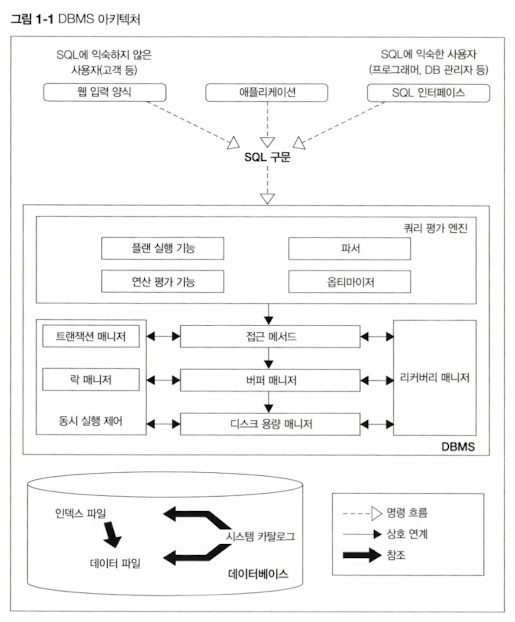

<!-- Date: 2025-01-11 -->
<!-- Update Date: 2025-01-11 -->
<!-- File ID: 22369ec9-b6cb-4cf0-a632-9c9e12885ef0 -->
<!-- Author: Seoyeon Jang -->

# 개요

현재 RDBMS(Relational Database) 제품은 굉장히 많다. Oracle, MySQL 등... 이러한 제품은 각각의 특징이 있다.
따라서 내부 아키텍처들이 조금씩 다르다.

하지만 RDB로써 기능을 제공한다는 목적은 모두 동일하다. 모두 관계 모델이라는 수학적인 이론을 바탕으로 한다.
결국 기본적인 구조 자체는 모두 같다. 이런 공통적인 구조를 이해한다면 각각의 DBMS가 가지는 특징도 이해할 수 있을 것이다.

여기서 전달된 SQL구문은 중간에 있는 DBMS를 통해 다양한 처리를 수행한다. 그리고 저장 장치에 있는 데이터에 접근해 데이터를 읽고 쓰게 된다.

관심을 가질 부분은 DBMS에서 일어나는 '다양한 처리'이다. 그럼 DBMS 내부에는 어떤 기능이 있는지 살펴보자.

## 1. 쿼리평가 엔진

쿼리 평가 엔진은 사용자로부터 입력받은 SQL구문을 분석하고, 어떤 순서로 기억장치의 데이터에 접근할지를 결정한다.
이때 결졍되는 계획을 '실행계획'이라고 부른다. 이런 실행 플랜에 기반을 둬서 데이터에 접근하는 방법을 '접근 메서드(access method)'라고 부른다.
한마디로 쿼리평가엔진은 계획을 세우고 실행하는 DBMS의 핵심 기능을 담당하는 모듈이다. 성능과도 깊은 관련이 있는 모듈이다.

## 2. 버퍼 매니저

DBMS는 버퍼라는 특별한 용도로 사용하는 메모리 영역을 확보해둔다. 이 메모리 영역을 관리하는 것이 바로 버퍼매니저이다.
버퍼매니저는 곧이어 설명할 디스크를 관리하는 디스크 용량 매니저와 함께 연동되어 작동한다. 이러한 매커니즘도 성능과 중요한 관련이 있다.

## 3. 디스크 용량 매니저

데이터베이스는 프로그램 중에서도 가장 많은 데이터를 다루는 소프트웨어이다. 웹서버나 웹애플리케이션 서버는 실행되는 동안만
데이터를 저장하면되지만, 데이터베이스는 영구적으로 저장해야 한다. 디스크 용량 매니저는 어디에 어떻게 데이터를 저장할지 관리하며,
데이터의 읽고 쓰기를 제어한다.

## 4. 트랜잭션 매니저와 락 매니저

상용 시스템에서 데이터베이스를 사용하는 사람은 한 명이 아니다. 수백에서 수천의 사람이 동시에 데이터베이스에 접근해서 사용한다.
이때 각각의 처리는 DBMS 내부에서 **트랜잭션이라는 단위로 관리된다.**
이러한 트랜잭션의 정합성을 유지하면서 실행시키고, 필요한 경우 데이터에 락을 걸어 다른 사람의 요청을 대기시키는 것이 트랜잭션 매니저와 락 매니저의 역할이다.

## 5. 리커버리 매니저

DBMS가 저장하고 있는 데이터 중에는 절대 잃어버리면 안되는 데이터가 있다. 하지만 시스템은 언제나 장애가 발생할 수 있다.
따라서 이러한 상황을 대비하려면 데이터를 정기적으로 백업하고, 문제가 일어났을 때 복구해줘야 하는데, 이런 기능을 수행하는 것이 **리커버리 매니저.**

# 정리

어쨌거나 성능이라는 관점에서 가장 중요한 것은 **'쿼리 평가 엔진'(또는 쿼리 평가 엔진이 세우는 '실행계획')이다.**
실행계획들을 살펴보며, 어떤 SQL구문이 왜 느린지(또는 왜 빠른지) 살펴보자.
버퍼매니저도 성능과 밀접한 관련을 가지는데, DBMS와 기억장치의 관계를 알면 된다.

사실 SQL의 성능에서 '트랜잭션 매니저'와 '락 매니저'도 굉장히 중요하다.
하지만 이러한 것들은 '하나의 SQL 구문을 처리하는 때'가 아니라 '여러 SQL 구문을 동시에 실행하는 때'의 성능과 관련
있는 매커니즘이다.

이 책에서는 하나의 SQL 구문을 독립적으로 실행하는 때의 성능을 중심으로 설명한다. 따라서 SQL 구문을 동시에 실행할 때 발생하는
충돌과 같은 관점은 살펴보지 않는다.

