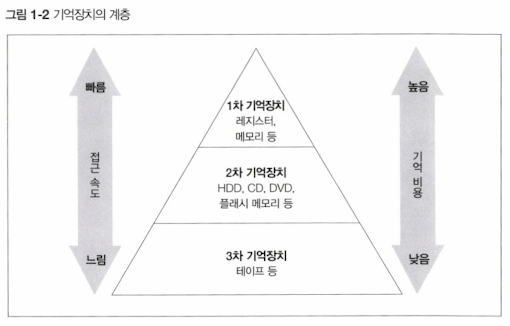
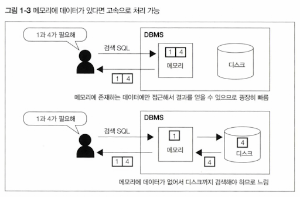
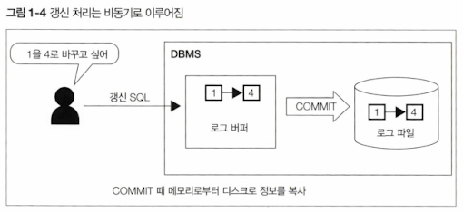
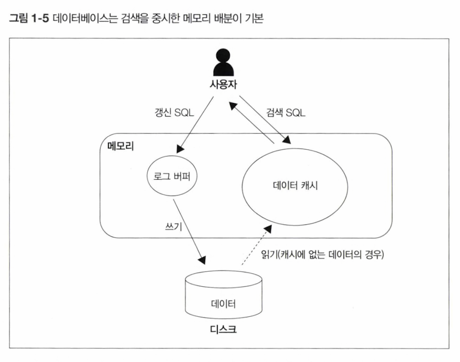
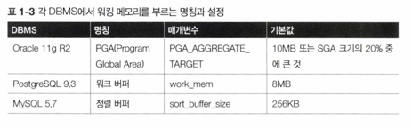
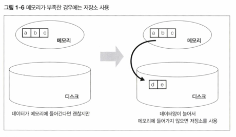

<!-- Date: 2025-01-11 -->
<!-- Update Date: 2025-01-12 -->
<!-- File ID: 86b43e27-b501-47ae-adb0-e0a2dbcb1734 -->
<!-- Author: Seoyeon Jang -->

# 개요

DBMS의 버퍼 매니저가 어떤 기능을 수행하는지 알아보자. 버퍼는 성능에 중요한 역할을 미친다.
메모리는 한정된 자원이지만 데이터베이스가 메모리에 저장하고자 하는 데이터는 너무나 많다.
따라서 데이터를 버퍼에 어떠한 식으로 확보할 것인가 하는 부분에서 트레이드오프가 발생한다.

## 1. 공짜 밥은 존재할까?

일반적으로 기억정치는 기억비용에 따라 1차부터 3차까지 계층으로 분류한다.
많은 데이터를 영속적으로 저장하려하면 속도를 잃고, 속도를 얻고자 하면 많은 데이터를 영속적으로 저장하기 힘들다는
트레이트오프가 발생한다. 한마디로 시스템의 세계에는 공짜밥이라는 것이 없다.
이런 것이 저장소와 관련되어 나타나는 첫번째 트레이드오프다!

## 2. DBMS와  기억장치의 관계

DBMS는 데이터 저장을 목적으로 하는 미들웨어이다. 따라서 기억 장치와 떨어질 수 없다. DBMS가 사용하는
대표적인 기억장치는 다음 2가지다.

- **하드디스크(HDD)**
    - DBMS가 데이터를 저장하는 매체(저장소)는 현재 대부분 HDD다. 물론 하드디스크 이외에도 SSD 등 선택 사항이 있다만,
      용량, 비용, 성능의 관점에서 대부분 하드디스크를 선택하고 있다.
    - 하드디스크는 기억장치 계층에서 2차 기억장치로 분류된다. 2차 기억장치는 크게 좋은 장점도 없으나 크게 나쁜 단점도 없는 매체다.
    - 그렇다고 해서 DBMS가 데이터를 디스크 외의 장소에 저장하지 않는다는 말은 아니다.
    - 오히려 일반적인 DBMS는 항상 디스크 이외에도 데이터를 올려놓는데, 바로 1차 계층인 메모리이다.
- **메모리**
    - 메모리는 디스크에 비해 기억 비용이 굉장히 비싸다.
    - 따라서 하드웨어 1대에 탑재할 수 있는 양이 크지 않다.
    - 일반적인 데이터베이스 서버의 경우 탑재되는 메모리 양은 한두자리(많아도 100GB를 넘는 경우는 거의 없음)
    - 테라바이트의 용량을 가지는 하드디스크와 비교하면 매우 작은 크기
    - 따라서 규모있는 상용 시스템의 데이터베이스 내부 데이터를 모두 메모리에 올리는 것은 불가능

- **버퍼를 이용한 속도 향상**
    - DBMS가 일부라도 메모리에 데이터를 올리는 것은 성능향상 때문
    - 한마디로 SQL 구문을 빠르게 하기 위함
    - 같은 SQL구문을 실행한다해도 디스크에서 가져올 필요 없이 메모리에서 읽어 반환할 수 있기 때문.
    - 
    - 이렇게 성능 향상을 목적으로 데이터를 저장하는 메모리를 **버퍼** 또는 **캐시** 라고 부름
    - 이러한 고속 접근이 가능한 버퍼에 '데이터를 어떻게, 어느정도의 기간동안 올릴지'를 관리하는 것이 DBMS의 버퍼매니저의 역할.

## 3. 메모리 위에 있는 두 개의 버퍼

DBMS가 데이터를 유지하기 위해 사용하는 메모리에는 크게 다음 두가지 종류가 있다.

- **데이터 캐시**
- **로그 버퍼**

대부분의 DBMS는 이러한 두개의 역할을 하는 메모리 영역을 가지고 있다. 이러한 버퍼는 사용자가 용도에 따라
크기를 변경하는 것이 가능하다.

### 데이터 캐시

데이터 캐시는 디스크에 있는 데이터의 일부를 메모리에 유지하기 위해 사용하는 메모리 영역이다. 만약 방금 실행한 SELECT 구문에서
선택하고 싶은 데이터가 운좋게 데이터 캐시에 있다면, 디스크와 같은 저속 저장소에 접근하지 않고 처리가 수행되기에 매우 빠르게 응답한다.

반대로 운 나쁘게 버퍼에서 데이터를 찾을 수 없다면, 저속 저장소까지 데이터를 가지러 가야한다. 따라서 응답이 느려진다.

### 로그 버퍼

로그 버퍼는 **갱신처리와 관련이 있다.(INSERT, DELETE, UPDATE, MERGE)** 와 관련이 있다.
DBMS는 갱신과 관련된 SQL구문을 사용자로부터 받으면, 곧바로 저장소에 있는 데이터를 변경하지 않는다.
**일단 로그 버퍼 위에 변경 정보를 보내고 이후 디스크에 변경을 수행한다.**
즉 커밋 때 메모리로부터 디스크로 정보를 복사하는 것이다.

이처럼 데이터베이스의 갱신처리는 SQL 구문의 실행 시점과 저장소에 실제 갱신하는 시점에 차이가 있는 비동기처리이다.
SQL 구문을 실행할 때 단순히 저장소 상의 파일을 바로 변경해버리는 편이 간단할텐데 왜 DBMS는 이러한 시점차이를 둘까?
역시 성능을 높이기 위함이다. 저장소는 검색뿐만 아니라 갱신을 할 때도 상당한 시간이 소모된다.
따라서 저장소 변경이 끝날때까지 기다리면 사용자는 장기간 대기하게 된다.
따라서 한 번 메모리에 갱신 정보를 받은 시점에서 사용자에게는 해당 SQL 구문이 '끝났다'라고 통지하고, 내부적으로 관련된 처리를 계속 수행하는 것이다.

이러한 두 개의 버퍼 설명을 읽고 나면 알 수 있겠지만, 결국 DBMS는 '저장소의 느림을 어떻게 보완할 것인가'라는 것을 계속해서 고민해온 미들웨어이다.
이 고민에 대한 답으로 복잡한 버퍼 매커니즘을 탑재하게 되었다.
어쨌거나 반대로 저장소의 속도가 빨랐다면 이런 귀찮은 구조를 사용하지 않아도 되었을 것이다.

## 4. 메모리의 성질이 초래하는 트레이드오프

앞에서 '메모리가 가진 단점은 가격이 비싸서 보유할 수 있는 데이터 양이 적은 것이다'라고 했는데, 이 외에도
몇가지 단점이 더 있다.

- **휘발성**

메모리에는 데이터의 영속성이 없다. 하드웨어의 전원을 꺼버리면 메모리 위에 올라가 있는 모든 데이터가 사라져버린다.
이러한 성질을 휘발성이라고 부른다.
DBMS를 껐다 켜면 버퍼 위에 있는 모든 데이터가 사라진다.
DBMS에 어떤 장애가 발생해서 프로세스가 죽으면, 메모리 위에 있는 모든 데이터가 날아간다. 결국 메모리 가격이 엄청 싸진다 해도,
영속성이 없는 이상 기능적으로 디스크를 대체하는 것은 불가능하다.

- **휘발성의 문제점**

휘발성의 가장 큰 문제점은 장애가 발생했을 때 메모리에 있던 데이터가 모두 사라져버려 데이터 부정합을 발생시키는 것이다.
데이터캐시라면 메모리위에 데이터가 사라져버려도 원본 데이터는 디스크 위에 남아있으니까 괜찮다. 진짜 문제는 로그 버퍼 위의 데이터가 날아가는 것이다.
만약 로그버퍼 위에 존재하는 데이터가 디스크 위의 로그 파일에 반영되기 전에 장애가 발생해서 사라져버린다면?
**해당 데이터가 완전히 사라져서 복구조차 불가능해진다.** 이는 사용자가 수행했던 갱신 정보가 사라진다는 의미다.
이런 문제는 비즈니스적 관점에서 굉장히 심각한 문제다. 은행 입출금 또는 카드 인출이 데이터베이스에 반영되지 않을 수 있다.
이렇게 되면 그 회사는 큰 혼란에 빠질 것이다.

DBMS가 갱신을 비동기로 하는 이상, 언제든 발생할 수 있는 문제다.
따라서 DBMS는 커밋 시점에 반드시 갱신정보를 로그파일(이는 영속적인 저장소 위에 존재)에 씀으로써,
장애가 발생해도 정합성을 유지할 수 있게 한다.

커밋이란 갱신처리를 '확정'하는 것인데, **DBMS는 커밋된 데이터를 영속화한다.**

이는, 커밋 때는 반드시 디스크에 동기접근이 일어난다는 소리다. 결국 여기서 지연이 발생할 가능성이 있다.
디스킁케 동기처리를 한다면 데이터 정합성은 높아지지만 성능이 낮아진다. 반대로 성능을 높이려면 데이터 정합성이 낮아진다.

## 5. 시스템 특성에 따른 트레이드오프

- **데이터 캐시와 로그 버퍼의 크기**

DBMS에서는 공통적으로 데이터캐시에 비해 로그 버퍼의 초기값이 굉장히 작다. 1MB남짓.

데이터베이스가 2개의 버퍼에 대해 이렇게 극단적으로 비대칭적인 크기를 할당한데는 명확한 이유가 있다.
이는 데이터베이스가 기본적으로 검색을 메인으로 처리한다고 가정하기 때문이다.

검색 처리를 할 때는 검색 대상 레코드가 수백만에서 수천건에 달하는 경우가 많다. 하지만 갱신 처리를 할 때는
갱신 대상이 많아봤자 트랜잭션마다 한 건에서 수만 건 정도밖에 안된다.(물론 트랜잭션 규모에 따라 다르다.)
따라서 갱신처리에 값비싼 메모리를 사용하는 것보다는, 자주 검색하는 데이터를 캐시에 올려두는 것이 좋다고 생각하는 것이다.

실제로 많은 DBMS가 물리 메모리에 여유가 있다면 데이터 캐시를 되도록 많이 할당할 것을 추천하고 있다.

## 6. 추가적인 메모리 영역 '워킹 메모리'

DBMS는 앞에서 설명했던 2개의 버퍼 외에도, 일반적으로 메모리 영역을 하나 더 가지고 있다.
이는 `정렬` 또는 `해시` 관련 처리에 사용되는 작업용 영역으로 **워킹 메모리(working memory)** 라고 부른다.
정렬은 ORDER BY 구, 집합 연산, 윈도우 함수 등의 기능을 사용할 때 실행된다.
반면 해시는 주로 테이블 등의 결합에서 해시 결합이 사용될 때 실행된다.

이 메모리 영역의 이름과 관리 방법은 DBMS에 따라 다르다.

이 작업용 메모리 영역은 SQL에서 정렬 또는 해시가 필요할 때 사용되고, 종료되면 해제되는 임시 영역으로,
일반적으로는 데이터캐시와 로그 버퍼와는 다른 영역으로 관리되는 경우가 많다.
이 영역이 성능적으로 중요한 이유는, 만약 이 영역이 다루려는 데이터양보다 작아 부족해지는 경우가 생기면 대부분의 DBMS가 저장소를 사용하기 때문이다.
이는 OS동작에서 말하는 스왑(swap)과 같은 것이다.

이전에 말했던 것처럼 저장소는 메모리에 비해 굉장히 느리다. 따라서 그런 곳에 접근하게 되면 당연히 전체적인 속도가 느려진다.
물론 메모리가 부족하다고 처리가 멈추거나 에러가 발생하는 것처럼 심각한 문제가 생기는 것은 아니다.
메모리가 부족해지는 순간 갑자기 느려지는 게 문제인 것이다.

또한 이 영역은 **여러 개의 SQL구문들이 공유해서 사용하므로, 하나의 SQL구문을 실행하고 있을 때는 메모리에 잘 들어가지만
여러 개의 SQL구문을 동시에 실행하면 메모리가 넘치는 경우가 있다.**

DBMS의 이러한 매커니즘이 굉장히 성가시다고 생각할 수 있다. 하지만 이는 다시 생각해보면, DBMS는 '메모리가 부족하더라도 무언가를 처리하려고 계속 노력하는 미들웨어'
라고 생각할 수 있다.
사실 DBMS도 워킹메모리가 부족할 때 곧바로 SQL 구문 처리를 중단하게 만들 수도 있었다. 예를 들어 자바는 heap 크기가 부족하면 메모리 부족(out of memory)
라는 오류를 발생시켜 모든 처리를 중단시켜버린다. **하지만 데이터베이스는 그런 선택을 하지 않는다.**
메모리가 부족하다는 이유로 에러를 내뱉지 않는다.
비록 느려지는 상황이 발생하더라도 상관없으니 어떻게든 끝까지 처리하려 노력한다.
**이는 DBMS가 운영체제 정도 급으로 처리 계속성을 담보하려 하기 때문이다.**

# 정리

