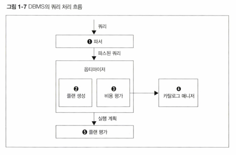

<!-- Date: 2025-01-12 -->
<!-- Update Date: 2025-01-12 -->
<!-- File ID: 1249b9f2-2828-4a46-9340-1de19e327eb3 -->
<!-- Author: Seoyeon Jang -->

# 개요

RDB를 조작할 때는 SQL이라는 전용 언어를 사용한다. 사용자 또는 개발자가 데이터베이스에서 의식적으로 사용하는 것은
SQL레벨까지이다. 이후의 모든 것은 SQL을 읽어들인 DBMS가 알아서 처리하고 결과를 제공한다.
따라서 사용자는 데이터가 있는 곳을 알 필요도 없고, 데이터에 접근하는 방법도 따로 생각하지 않는다. 모든 것은 DBMS에 맡긴다.

이런 과정은 보통 '프로그래밍'이라고 말하는 것과 거리가 멀다. 데이터를 검색 또는 갱신하는 처리를 일반적인 프로그래밍 언어로 한다면,
어디에 있는 데이터를 어떻게 찾고 처리할지 등의 **절차적인 세부 사항을 모두 작성해줘야 한다.** 그런데 SQL은 그러한
절차적인 것을 전혀 기술하지 않고 사용한다.

## 1. 권한 이양의 죄악

이런 태도의 차이는 좋다/나쁘다 구분할 수 없다. 그저 **언어의 설계 사상의 차이일 뿐.**
C, 자바 같은 절차가 기초가 되는 언어는 사용자가 데이터에 접근하기 위한 절차(How)를 책임지고 기술하는 것이 전제이다.
반면 비절차적인 RDB는 그러한 모든 일을 사용자가 아니라 시스템에 맡겼다. 따라서 사용자가 하는 일은 대상(what)을 기술하는 것으로 축소되었다.

RDB가 이렇게 대담하게 권한 이양을 감행한 데는 정당한 이유가 있었다. 바로 **그렇게 하는 것이 비즈니스 전체의 생산성 향상을 가져오기 때문**이다.
물론 현재 상황을 놓고 보면 이 말은 반은 맞고 반은 틀렸다.
틀린 이유는, 여전히 우리가 RDB를 다루기 어려워한다는 점에 있다.
SQL은 초기에 생각했던 것처럼 그렇게 간단한 언어가 아니다. 또한 **How를 의식하지 않고 사용하는 것 때문에 성능 문제로 고생하는 경우도 꽤 있다.**

RDB가 숨기고 있는 내부 절차를 들여다봐야하는 것은 이와 같은 이유때문이다.

## 2. 데이터에 접근하는 방법은 어떻게 결정할까?

RDB에서 데이터 접근 절차를 결정하는 모듈은 쿼리 평가 엔진이라고 부른다. 쿼리 평가 엔진은 사용자로부터 입력받은 SQL구문(쿼리)을 처음
읽어들이는 모듈이기도 하다.
쿼리 평가 모듈은 추가로 파서 또는 옵티마이저와 같은 여러 개의 서브 모듈로 구성된다.

쿼리가 어떻게 처리되고, 실제로 데이터 접근은 다음과 같이 이뤄진다.

- **파서(parser)**

파서의 역할은 말 그대로 구문분석하는 것이다. 사용자로부터 입력받은 SQL구문이 항상 구문적으로 올바르다는 보장이 없으므로
검사를 하는 것이다. 사용자가 쉼표 쓰는 것을 잊거나, FROM 구에 존재하지 않는 테이블 이름을 쓰거나 했을때는 서류 심사에서 미리 떨어뜨리는 것이다.
또한 파서는 SQL구문을 정형적인 형식으로 변환해준다. 그렇게 해야 DBMS내부에서 일어나는 후속 처리가 효율화된다.

- **옵티마이저(optimizer)**

서류 심사를 통과한 쿼리는 옵티마이저로 전송된다. 옵티마이저의 번역은 '최적화'이다. 이때 최적화의 대상은 **데이터의 접근법(실행계획)** 이다.
옵티마이저가 바로 DBMS 두뇌의 핵심이다.

옵티마이저는 인덱스 유무, 데이터 분산 또는 편향 정도, DBMS 내부 매개변수 등의 조건을 고려해서, 선택 가능한 많은 실행계획을 작성하고(2),
이들의 비용을 연산하고(3), 가장 낮은 비용을 가진 실행계획을 선택한다.

접근법의 수가 많이 나온다면 그 비용을 계산하고 비교해야하는데, 사람이 하기에는 번거로운 일이다.
RDB가 데이터 접근의 절차 지향 결정을 자동화하는 이유는 이런 귀찮은 일을 기계적으로 처리해주기 위해서이다.

- **카탈로그 매니저(catalog manager)**

옵티마이저가 실행계획을 세울 때 옵티마이저에게 중요한 정보를 제공하는 것이 카탈로그 매니저(4)이다.
카탈로그란 DBMS의 내부 정보를 모아놓은 테이블들로, 테이블 또는 인덱스의 통계정보가 저장되어있다.
이러한 카탈로그 정보를 간단하게 '통계정보'라고 부르기도 한다.

- **플랜 평가(plan evaluation)**

옵티마이저가 SQL구문에서 여러 개의 실행계획을 세운뒤 최적의 실행결과를 최종적으로 선택하는 것이 플랜평가(5)이다.
실행계획이라는 것은 곧바로 DBMS가 실행할 수 있는 형태의 코드가 아니다. 오히려 인간이 읽기 쉽게 만들어진 문자 그대로의 '계획서'이다.
따라서 성능이 좋지 않은 SQL 구문이 있을 때 실행계획을 읽고, 수정 방안 등을 고려할 수 있다.

이렇게 해서 하나의 실행계획을 선택하면, 이후에 DBMS는 실행계획을 절차적인 코드로 변환하고 데이터 접근을 수행한다.

## 3. 옵티마이저와 통계 정보

플랜 선택을 옵티마이저에게 맡기는 경우, 실제로 최적의 플랜이 선택되지 않는 경우가 많다.
옵티마이저가 실패하는 패턴이 몇가지 있는데, 통계정보가 부족한 경우가 대표적인 원인이다.

구현에 따라 차이는 있지만 카탈로그에 포함되어있는 통계정보는 다음과 같은 것들이다.

- 각 테이블의 레코드 수
- 각 테이블의 필드 수와 필드의 크기
- 필드의 카디널리티(값의 개수)
- 필드값의 히스토그램(어떤 값이 얼마나 분포되어있는가)
- 필드 내부에 있는 NULL 수
- 인덱스 정보

이러한 정보를 활용함으로써 옵티마이저는 실행계획을 만든다. 문제가 생기는 경우는 이러한 카탈로그 정보가 테이블 또는 인덱스의 
실제와 일치하지 않을 때이다.
테이블에 데이터 삽입/갱신/제거가 수행될 때 카탈로그 정보가 갱신되지 않는다면, 
옵티마이저는 오래된 정보를 바탕으로 실행계획을 세우게 된다. 옵티마이저는 과거 정보밖에 가지고 있지 않으므로
어쩔수 없이 잘못된 계획을 세울수 밖에 없다.

극단적인 예로, 테이블을 하나 만들면 일단 레코드 0개의 상태로 카탈로그 정보가 저장된다. 그런데 이후에 1억건의 데이터를 올리고
카탈로그 정보를 갱신하지 않는다면 옵티마이저는 데이터 0개를 기준으로 플랜을 생성하게 된다.
이것으로는 최적의 플랜을 절대 기대할 수 없다.
"Garbage In, Gargage Out"이기 때문이다.

## 4. 최적의 실행계획이 작성되게 하려면
올바른 통계정보가 모이는 것은 SQL성능에 있어 굉장히 중요하다. 따라서 테이블의 데이터가 많이 바뀌면 
카탈로그의 통계정보도 함꼐 갱신해야 한다는 것은 DB 엔지니어의 상식이다.
통계정보 갱신은 대상 테이블 또는 인덱스의 크기와 수에 따라 몇십분에서 몇시간이 소요되기도 하는 실행비용이 높은 작업이다.
하지만 DBMS가 최적의 플랜을 선택하려면 필요한 조건이므로 갱신 시점을 확실하게 검토해야 한다.

# 정리

