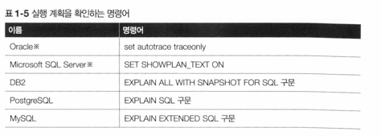
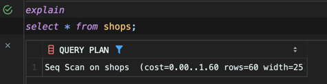
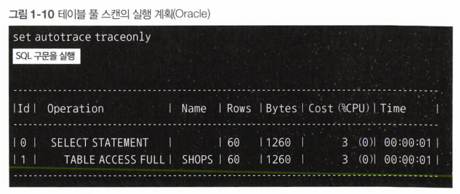
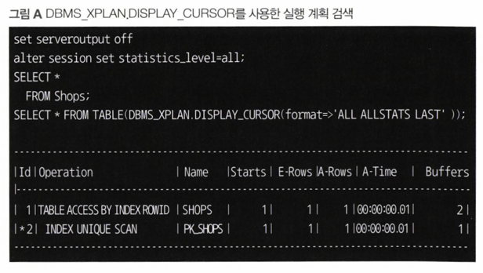
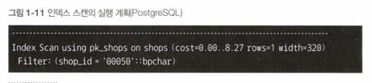
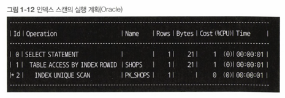
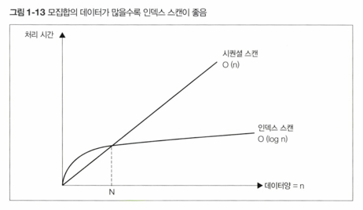

<!-- Date: 2025-01-12 -->
<!-- Update Date: 2025-01-12 -->
<!-- File ID: 45ea95b4-1106-4234-8a67-5781d2f74e40 -->
<!-- Author: Seoyeon Jang -->

# 개요

실행계획이 만들어지면 DBMS는 그것을 바탕으로 데이터 접근을 수행한다. 하지만 데이터양이 많은 테이블에 접근하거나 복잡한
SQL구문을 실행하면 지연이 발생하는 경우가 있다. 이는 통계 정보가 부족한 경우도 있겠지만, 이미 최적의 경로가 설정되어 있는데도 느린
경우가 있다. 또한 통계정보가 최신이라도 SQL구문이 너무 복잡하면 옵티마이저가 최적의 접근방법을 선택하지 못할 수도 있다.

## 1. 실행계획 확인 방법

SQL구문의 지연이 발생했을 때 제일 먼저 실행 계획을 살펴봐야 한다.
모든 DBMS는 실행계획을 조사하는 수단을 제공한다.


지금부터 다음 3개의 기본적인 SQL 구문의 실행계획을 살펴보겠다.

1. 테이블 풀 스캔(Full Scan)의 실행계획
2. 인덱스 스캔의 실행계획
3. 간단한 테이블 결합의 실행계획

## 2. 테이블 풀 스캔의 실행 계획




실행계획의 출력 포맷이 완전히 같지는 않지만, 두 가지 DBMS에 모두 공통적으로 나타나는 부분이 있다.
바로 다음 3가지다.

- 조작 대상 객체
- 객체에 대한 조작의 종류
- 조작 대상이 되는 레코드 수

이러한 3가지 내용은 거의 모든 DBMS의 실행계획에 포함되어 있다. 그만큼 중요하기 때문.

- **조작 대상 객체**

첫번째로 조작 대상 객체를 살펴보면, PostgreSQL은 `on` 이라는 글자 뒤에, Oracle은 `Name` 필드에 테이블이 출력된다.
현재 SQL구문이 Shops 라는 테이블만 사용하고 있으므로 지금은 전혀 헷갈리지 않지맘ㄴ, 여러 개의 테이블을 사용하는 SQL 구문에서는 어떤
객체를 조작하는지 혼동하지 않게 주의가 필요하다.

또한 이 부분은 테이블 이외에도 인덱스, 파티션, 시퀀스처럼 SQL구문으로 조작할 수 있는 객체라면 무엇이라도 올 수 있다.

- **객체에 대한 조작의 종류**

객체에 대한 조작의 종류는 실행 계획에서 가장 중요한 부분이다.
PostgreSQL은 문장의 앞부분에 나오며, Oracle에서는 `Operation` 필드로 나타난다.
PostgreSQL의 `Seq Scan`은 '순차적인 접근(Sequantial Scan)'의 줄임말로 '파일을 순차적(Seqential)으로 접근해서 해당
테이블의 데이터 전체를 읽어낸다'는 의미이다.
Oracle의 'TABLE ACCESS FULL'은 '테이블의 데이터를 전부 읽어들인다'라는 의미이다.

> **실행계획의 실행비용과 실행 시간**
>
> `객체 이름` 또는 `레코드 수`라는 지표에 비해, `실행비용(Cost)` 라는 지표는 평가하기가 조금 어려운 항목이다.
> 이름만 보면 작은게 좋긴 하나, 물론 대부분 그렇다. 하지만 이를 절대 평가의 지표로 쓰는 것은 곤란하다. 예를 들어 "이 SQL 구문은 Cost가 5000밖에 되지 않으니,
> 1초 이내로 끝나겠다"라는 추측은 할 수 없다.
>
> 또한 Oracle이 출력하는 Time필드도 어디까지나 추정되는 실행시간이므로, 절대 지표로 사용할 수 없다.
> 이렇게 실행계획에 출력되는 비용, 실행시간, 처리 레코드 수는 추정값이므로 절대 지표로 사용해서는 안된다.
>
> 다만 구현에 따라 실제 값을 검색하는 방법을 준비한 DBMS도 있다.
>
> 예를 들어 Oracle에서는 SQL 구문의 실행시간을 검색하는 방법(`DBMS_XPLAN.DISPLAY_CURSOR`)이 있다.
> 이 방법을 사용하면 조작마다 걸린 실행시간을 출력할 수 있다.
>
> 
> 각각의 필드는 다음과같은 의미이다.
>
> - E-Rows: 추정되는 조작 레코드 수
> - A-Rows: 실제 조작 레코드 수
> - A-Time: 실제 실행 시간

사실 엄밀하게 말해서 두 가지가 같은 것은 아니다. 테이블에서 데이터를 모두 읽는 방법으로 반드시 시퀀셜 스캔을 선택할 이유는 없기 때문이다.
따라서 PostgreSQL의 출력이 좀 더 물리적 차원에 가까운 출력이라고 볼 수 있다. 하지만 실질적으로 Oracle도
테이블 풀 스캔을 할 때는 내부적으로 시퀀셜 스캔을 수행하므로 같다고 해도 상관은 없다.
따라서 이러한 형태의 접근법을 이 책에서는 모두 '테이블 풀 스캔'이라고 부르겠다.

- **조작 대상이 되는 레코드 수**

세번째로 중요한 항목은 조작 대상이 되는 레코드 수이다. 이는 두 가지 DBMS 모두 Rows 라는 항목에 출력된다.
결합 또는 집약이 포함되면 1개의 SQL구문을 실행해도 여러 개의 조작이 수행된다.
그러면 각 조작에서 얼마만큼의 레코드가 처리되는지가 SQL 구문 전체의 실행비용을 파악하는 데 중요한 지표가 된다.

이 숫자와 관련해서 자주 오해를 사는 것이 있다. 이 숫자는 옵티마이저가 실행계획을 만들 때 **카탈로그 매니저로부터 얻은 값이다.**
따라서 통계정보에서 파악한 숫자이므로, 실제 SQL구문을 실행한 시점의 테이블 레코드 수와 차이가 있을 수 있다.(물론 JIT을 사용한 경우는 차이가 없다.)

> 물론 SQL 구문을 실행할 때마다 JIT 처리를 수행해서 레코드 수를 구하면 된다고 생각할 수도 있으나,
> 1억개 정도의 레코드라 들어있는 레코드에 JIT처리를 수행하면 이것으로도 수십분이 결리는 경우가 있기 때문에 그러지
> 않는 것이다.

예를 들어 Shops 테이블의 모든 레코드를 삭제하고, 실행계획을 다시 검색하면 어떻게 될까?

Oracle과 PostgreSQL 모두 그대로 **60이라는 값이 출력된다.**

이는 옵티마이저가 **어디까지나 통계라는 메타정보를 믿기 때문에, 실제 테이블을 보지 않는다는 증거이다.**

## 3. 인덱스 스캔의 실행 계획

이번에는 이전에 실행했던 SQL구문에 WHERE 조건을 추가해보자.

```sql
SELECT *
FROM shops
WHERE shop_id = '00050';
```

실행계획을 살펴보자.




이번 실행계획에는 재미난 변화가 보인다. 이전과 마찬가지로 **3개의 부분으로 나누어** 살펴보자.

- **조작 대상이 되는 레코드 수**

일단 두 DBMS 모두 `Rows`가 1로 바뀌었다. WHERE 구에서 기본키가 '00050' 인 점포를 지정했으므로,
접근 대상은 반드시 레코드 하나이기 때문.(PK이기 때문) 이는 당연하다.

- **접근 대상 객체와 조작**

이 부분에 변화가 있다. PostgreSQL에서는 'Index Scan', Oracle 에서는 'INDEX UNIQUE SCAN'이라는 조작이 나타난다.
**이는 인덱스를 사용해 스캔을 수행한다는 것이다.**

Oracle에서는 'TABLE ACCESS FULL'이 'TABLE ACCESS BY INDEX ROWID'로 바뀌었고, 추가적으로 내역을 보면 `Id = 2` 의 레코드에
`INDEX UNIQUE SCAN`, Name(대상 객체)에 `PK_SHOPS`가 출력된다. 이 PK_SHOPS는 기본 키의 인덱스 이름이다.

인덱스와 관련된 내용은 10장에서 자세하게 설명하지만, 일반적으로는 스캔하는 모집합 레코드 수에서 선택되는 레코드 수가 적다면 테이블 풀 스캔보다 빠르게
접근을 수행한다. 이는 풀 스캔이 모집합의 데이터 양에 비례해서 처리 비용이 늘어나는 것에 반해 인덱스를 사용할 때 활용되는 B-tree가 모집합의 데이터 양에 따라
대수함수적으로 처리 비용이 늘어나기 때문이다. 간단하게 말해서, 인덱스의 처리 비용이 완만하게 증가한다는 뜻으로,
특정 데이터양(N)을 손익분기점으로 인덱스 스캔이 풀 스캔보다도 효율적인 접근을 하게 된다는 것이다.



현재는 레코드가 60개뿐이므로, 데이터에 순차적으로 접근하는 것과 인덱스로 랜덤 접근하는 것의 차이가 크지 않다.
(사실 60개 정도 분량의 레코드는 WHERE구에 기본 키를 지정해도 인덱스 스캔을 사용하지 않고 풀스캔을 하는 경우도 있다.)
하지만 **레코드 수가 많아지면 차이가 굉장히 커질 것이다.**

## 4. 간단한 테이블 결합의 실행계획
마지막으로 결합을 수행하는 쿼리의 실행계획을 살펴보자.
SQL에서 지연이 일어나는 경우는 대부븐 결합과 관련된 것이다. 결합을 사용하면 실행계획이 상당히 복잡해지므로,
옵티마이저도 최적의 실행계획을 세우기 어렵다.
따라서 결합 시점의 실행계획 특성을 공부하는 것은 굉장히 중요한 의미가 있다. 결합의 실행계획을 이해하는 것이 이 책의 목적 중 하나이기도 하다.

결합을 수행하려면 테이블이 두개 이상 필요하므로 shops 테이블 이외에 예약 관리 테이블(reservation)을 추가한다.

실행계획을 검색할 대상 SQL은 다음과 같다. 예약이 존재하는 점포를 select 하는 구문이다.

```sql
SELECT shop_name FROM shops s
INNER JOIN reservations r 
ON s.shop_id = r.shop_id;
```

상세한 내용은 6장에서 설명하겠지만, 일반적으로 DBMS는 결합을 할 때 세가지 종류의 알고리즘을 사용한다.


# 정리


