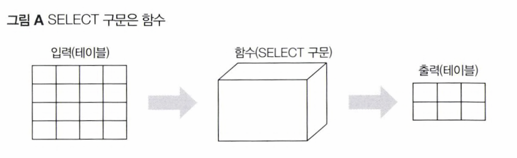
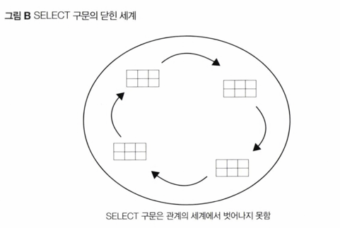

<!-- Date: 2025-01-13 -->
<!-- Update Date: 2025-01-13 -->
<!-- File ID: 5b5068ab-504c-4457-b87f-b7a26495cd7c -->
<!-- Author: Seoyeon Jang -->

# 개요
SELECT 구문의 기능은 절차 지향 언어에서의 '함수'와 같다는 것을 알 수 있다.
함수라는 것은 모두 알고 있는 것처럼, 입력을 받고 관련된 처리를 수행한 뒤에 리턴하는 것이다.
SELECT 구문도 **테이블이라는 입력을 FROM 구로 받아, 특정 출력을 리턴한다는 점에서 같은 방식으로 작동한다.**

이때 입력이 되는 테이블에는 변경이 일어나지 않으므로, SELECT 구문은 일종의 '읽기 전용'함수라고 말할 수 있다.

일반적인 절차 지향형 언어의 함수는 매개변수와 리턴값의 자료형이 정수 자료형 또는 문자열 자료형처럼 결정되어 잇다.
SELECT 구문의 경우에도 마찬가지로 자료형이 결정되어 있다.

그런데 SELECT 구문의 입력과 출력 자료형은 무엇인가?

답은 '테이블(관계)'이다. 따라서 입력도 출력도 모두 2차원 표이다.
이 외에는 어떠한 자료형도 존재하지 않는다.
이러한 성질 때문에 관계가 닫혀있다는 의미로 폐쇄성이라고 부른다.
단순하게 SELECT 구문만 본다면 이런 성질에 무슨 의미가 있는지 모르지만, 뷰와 서브쿼리를 함께 이해할 때는 
이런 개념이 굉장히 중요하다.

# 정리

