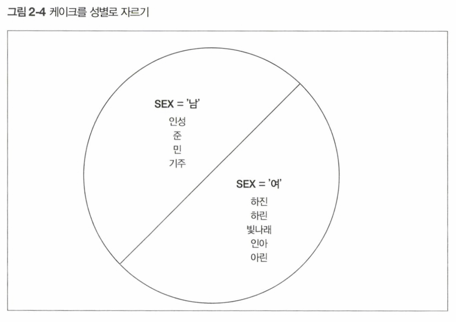
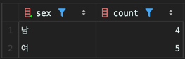
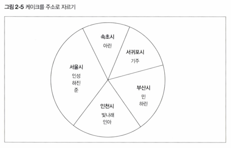
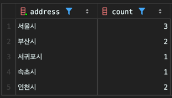
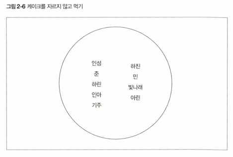
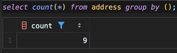

<!-- Date: 2025-01-13 -->
<!-- Update Date: 2025-01-21 -->
<!-- File ID: adbba9c0-e8b9-40b8-9349-a04e5141d698 -->
<!-- Author: Seoyeon Jang -->

# 개요

RDB는 데이터를 관계(relation)이라는 형식으로 저장한다.
구현으로는 **이를 테이블**이라고 한다.
SQL은 프로그래머가 아닌 사람도 사용할 수 있게 하자는 의도로 설계되어, 자연 언어인 영어와 비슷한 구문으로 되어있어
직관적으로 사용할 수 있다.

그렇다고 해도 사실 SQL은 복잡하다. 복잡한 작업을 수행할 때는 '자연 언어를 사용하는 것처럼' SQL을 조작한다고 말하기 힘들다.(게다가 최근
SQL표준에는 굉장히 복잡한 기능이 많이 들어가서...)
또한 내부적인 움직임을 제대로 이해하지 못하면 성능이 안나온다.

현재의 SQL은 RDB를 처음 설계했던 때처럼 쉬운 언어가 아니게 되었다.

어쩄거나, SQL 구문 기초를 알아보자.

## GROUP BY 구

GROUP BY 구를 사용하면, 테이블에서 단순하게 데이터를 선택하는 것뿐만 아니라 합계 또는 평균 등의 집계 연산을 SQL구문으로 할 수 있다.

GROUP BY 구의 기능을 쉽게 표현하면 '테이블을 홀 케이크처럼 다룬다'라고 할 수 있다. 홀케이크는 생일 등에 먹는 둥근 형태의 큰 케이크이다.
GROUP BY 구는 이때 케이크를 자르는 칼과 같은 역할을 한다.

그럼 일단 Address 테이블을 하나의 생일 케이크라고 생각해보자. 물론 무리가 있을 수 있겠지만 최대한 열심히 상상해보자.(파이팅)
대충 그림을 머릿속에 떠올렸다고 하자. 그럼 이제 그 케이크를 칼로 잘라보자.
케이크를 자를 때의 기준은 바로 '필드'이다.
일단 성별을 사용해 남자와 여자라는 두 개로 나눠 잘라보자.



- **그룹을 나누었을 때의 장점**

예쁘게 두 조각으로 잘렸다. 그런데 대체 케이크를 자르면 뭐가 좋은 걸까? 일단 잘라진 케이크 조각을 **그룹**이라고 부른다.
그리고 이러한 그룹은 다양한 숫자 관련 함수를 사용한 집계가 가능하다.

어떤 집계가 가능한지 SQL의 대표적 함수를 5개 살펴보자.

- COUNT: 레코드 개수 계산
- SUM: 숫자를 더함
- AVG: 숫자의 평균을 구함
- MAX: 최댓값을 구함
- MIN: 최솟값을 구함

예를 들어 남자 그룹과 여자 그룹에 각각 몇 명이 있는지를 구하고 싶다면 다음과 같은 SELECT 구문을 사용한다.

```sql
SELECT sex, COUNT(sex)
FROM address
GROUP BY sex;
```


그럼 이번에는 케이크를 자르는 기준을 변경해보자. 살고 있는 지역을 기준으로 케이크를 자른다면 다음과 같이 될 것이다.


지역마다 살고 있는 사람 수가 다르기 때문에 케이크가 좀 이상하게 생기긴 했지만, 이전과 다르지 않다.
앞에서와 마찬가지로 수를 세어 해당 지역에 몇 명이 살고 있는지 구해보자.

```sql
select address, count(address)
from address
group by address;
```



이전에 '홀 케이크를 혼자 먹지는 않을 것이다'라고 했는데, 혼자 먹는 경우도 있을 수 있다. SQL에서 이런 상황이 일어나면 어떻게 해야할까?
문제 없다. SQL에서도 케이크를 자르지 않고 그냥 먹어버릴 수 있다. 자르고 싶지 않다면 GROUP BY 구를 사용할 때 키를 지정하지 않으면 된다.
이렇게 하면 테이블 전체(= 케이크 전체)를 하나의 조각으로 생각해서 함수를 적용할 수 있다.



```sql
select count(*)
from address
group by ();
```


GROUP BY 구의 '()'는 키를 지정하지 않는다는 뜻이다. 보통 이런 경우에는 GROUP BY 를 생략하는 경우가 많다.
하지만 '자르는 기준이 없다'라는 것을 명시적으로 지정하는 것이 의미적으로 좋긴 하다. 논리적으로 이해하기 쉽기 때문이다.

필자는 지금도 GROUP BY가 생략된 SQL구문을 보면 머릿속으로 'GROUP BY ()'를 붙여서 생각하는 습관이 있다.

## HAVING 구

GROUP BY 를 사용하여 주소별 사람수를 구하는 SELECT 구문을 살펴보자. 해당 구문을 실행한 결과 5개의 집합을 얻었다. SQL은 그러한 결과집합에 또다시 **조건을 걸어 선택하는 기능**이 있다.
사용방법은 WHERE 구로 레코드를 선택하는 것과 거의 같다. 다만 이번에는 HAVING 이라는 영어단어를 사용할 뿐이다.

예를 들어 살고 있는 사람 수(레코드 수)가 한명뿐인 주소필드를 선택하고 싶다면 다음처럼 작성한다.

```sql
SELECT address, count(*)
from addresses
GROUP BY address
HAVING count(*) = 1;
```

이처럼 HAVING 구를 사용하면 선택된 결과 집합에 또다시 조건을 지정할 수 있다. **즉 WHERE 구가 '레코드'에 조건을 지정한다면, HAVING 구는 '집합'에 조건을 지정하는 기능이라고 할 수 있다.**

## ORDER BY 구

지금까지 SELECT 구문과 관련된 몇가지 예제와 결과를 살펴봤다. 그런데 그 결과 레코드들은 대체 어떤 순서로 출력되는가?

간단하게 말하면 '엉터리로 출력한다'이다. 즉 뭐.. 딱히 정해진 규칙은 없다는 말이다. DBMS에 따라서 특정한 규칙을 가지고 정렬될 수 있겠지만, SQL의 일반적인 규칙에서는 정렬과 관련된 규약이 없다. 따라서
어떤 DBMS에서 순서를 가지고 출력된다해도, 다른 DBMS에서는 그렇게 출력되지 않을 수도 있다.

모든 DBMS에서 SELECT 구문의 결과 순서를 보장하려면 **명시적으로 순서를 지정해줘야 한다.** 이때 ORDER BY 구를 사용한다.

오름차순의 경우 SQL의 기본 설정이므로 ASC 라는 키워드를 따로 사용할 필요는 없다. 이는 모든 DBMS의 공통 규칙이다.

```sql
select name, phone_nbr, address, sex, age
from address
order by age desc;
```

만약 age 가 같은 로우가 있다면, 이들의 순서도 DBMS마다 다를 수 있다. 이 순서도 맞추고 싶다면 정렬 키를 추가해서 정렬 순서를 지정해줘야 한다.

```sql
select name, phone_nbr, address, sex, age
from address
order by age desc, phone_nbr asc;
```

이렇게 하면 나이로 정렬한 후, 전화번호로 정렬을 하게 된다.

## 뷰와 서브쿼리

지금까지 다양한 형태의 SELECT 구문을 사용해봤다. 데이터베이스를 사용하다보면 SELECT 구문 중에서도 자주 사용하는 것과 거의 사용하지 않는 것이 나온다. 이때 자주 사용하는 SELECT 구문은 텍스트 파일에
따로 저장해놓긴 한다. 하지만 사용자가 직접 텍스트 파일을 관리한다면 파일 수정이나 삭제 등 위험한 요소가 있다.

이럴 때 SELECT 구문을 데이터베이스 안에 저장할 수 있다면 편리할 것이다. 그 기능이 바로 뷰(View)이다. 뷰는 데이터베이스 안에 저장한다는 점은 테이블과 같다. 하지만 테이블과 달리 내부에 데이터를
보유하지는 않는다. **어디까지나 뷰는 'SELECT' 구문을 저장한 것 뿐이다.**

- 뷰 만드는 방법

뷰를 만드려면 저장하고 싶은 SELECT 구문을 다음 문장에 이어서 작성한다.
예를 들어 주소별 사람 수를 구하는 SELECT 구문을 뷰로 저장해보자.

```sql
CREATE VIEW CountAddress (v_address, cnt)
AS
SELECT address, count(*)
FROM address
GROUP BY address;
```

```sql
select *
from countaddress;
```

이렇게 만들어진 뷰는 일반적인 테이블처럼 SELECT 구문에서 사용할 수 있다. 이렇게 뷰라는 것은 '테이블의 모습을 한 SELECT 구문'이라고 할 수 있다.

- 익명 뷰

뷰는 사용 방법이 테이블과 같지만 내부에는 데이터를 보유하지 않는다는 점이 테이블과 다르다. 따라서 뷰에서 데이터를 선택하는 SELECT 구문은 실제로는 내부적으로 '추가적인 SELECT 구문'을 실행하는 중첩(
nested)구조가 되는 것이다.

```sql
-- 뷰는 실행할 때 SELECT 구문으로 전개
select v_address, cnt
from (select address AS v_address, count(*) AS cnt
      from address
      group by address);
```

이렇게 FROM 구에 직접 지정하는 SELECT 구문을 **서브쿼리**라고 부른다.
1장에서 설명했듯, 쿼리는 SELECT 구문의 다른 이름이다.

- 서브쿼리를 사용한 편리한 조건 지정

그럼 서브쿼리를 사용할 때 중요한 것을 한가지 살펴보자. 바로 WHERE 구의 조건에 서브쿼리를 사용하는 방법이다. 일단 Address 테이블과 같은 구조를 가진 Address2 테이블을 만들어보자. 단 보유하는
데이터는 Address 테이블과 다르다.

이 Address2 테이블에는 Address 테이블과 공통되는 데이터도 들어있다. 이 두 테이블을 사용해 'Address 테이블에서 Address2 테이블에 있는 사람을 선택'하는 쿼리를 만들어보자. 이런 처리를
매칭(matching)이라고 부른다.

# 정리


