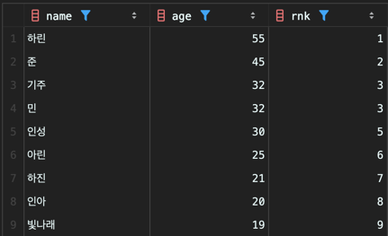

<!-- Date: 2025-01-24 -->
<!-- Update Date: 2025-01-24 -->
<!-- File ID: 3906ee39-0558-4908-a433-0f28d3c62fd7 -->
<!-- Author: Seoyeon Jang -->

# 개요

SQL의 집합 연산을 마무리했다. 이어서 소개하는 윈도우 함수도 중요한 기능이다. 윈도우 함수는 데이터를 가공하게 해준다는 점에서도 중요하지만, 이 책의 주제인 성능과 큰 관계가 있다.

**윈도우 함수의 특징을 한마디로 정리하면, '집약 기능이 없는 GROUP BY 구'이다.** 이 전에 살펴보았던 GROUP BY 구는 자르기와 집약이라는 두 개의 기능으로 구분된다.
윈도우 함수는 여기서 자르기 기능만 있는 것이다.

구체적인 예제를 살펴보자. 이전에 주소별 사람수를 구하는 SELECT 구문이다.

```sql
select address, count(*)
from address
group by address;
```

이 SQL은 일단 address 필드로 테이블을 케이크처럼 🍰 자르고, 이어서 잘라진 조각 개수만큼의 레코드 수를 더해 결과를 출력한다. 이때 출력 결과의 레코드 수는 address 테이블에 포함되어있는 지역 수인
5개가 된다.

윈도우 함수도 테이블을 자르는 것은 GROUP BY와 같다. 윈도우 함수는 이를 'PARTITION BY'라는 구로 수행한다. **차이점이 있다면 자른 후에 집약하지 않으므로 출력 결과의 레코드 수가 입력되는
테이블의 레코드 수와 같다는 것이다.**

윈도우 함수의 기본적인 구문은 집약 함수 뒤에 OVER 구를 작성하고, 내부에 자를 키를 지정하는 PARTITION BY 또는 ORDER BY를 입력하는 것이다. PARTITION BY 구와 ORDER BY 구는 둘
중에 하나만 입력해도 되고, 둘다 입력해도 상관없다. 작성하는 장소는 SELECT 구라고만 생각해도 문제 없다.

```sql
select address,
       count(*) over (partition by address)
from address;
```

GROUP BY 의 결과와 비교해보자. 속초시에 1명, 인천시에 2명이라는 지역별 사람수는 양쪽 모두 같다. 하지만 **출력되는 결과의 레코드 수가 다르다.**

윈도우 함수에는 테이블의 레코드 수와 같은 9개이다. **이는 집약 작업이 수행되지 않았기 때문이다.** 이제야 '윈도우 함수는 GROUP BY에서 자르기 기능만 있는 것'이라는 게 바로 이 의미이다.

윈도우 함수로 사용할 수 있는 함수로는 COUNT 또는 SUM 같은 일반 함수 이외에도, 윈도우 전용 함수로 제공되는 **RANK** 또는 **ROW_NUMBER** 등의 순서 함수가 있다. 예를 들어 RANK
함수는 이름 그대로 지정한 키로 레코드에 순위를 붙이는 함수이다. 예를 들어 나이가 많은 순서대로 순위를 붙이면 다음 구분을 사용한다.

```sql
select name,
       age,
       rank() over (order by age desc ) as rnk
from address;
```


rank 함수는 숫자가 같으면 같은 순위로 표시하므로 32세인 기주와 민이 함께 3순위로 순위가 매겨진다. 그리고 4위를 건너뛰고 인성이 5위가 되는데, 만약 이런 건너뛰는 작업 없이 순위를 구하고 싶을 때는 *
*DENSE_RANK** 함수를 사용해야 한다.

```sql
select name,
       age,
       dense_rank() over (order by age desc ) as dense_rnk
from address;
```

윈도우 함수에는 이 외에도 RANGE 또는 ROWS 등의 여러 세부 옵션을 지정하는 방법이 있다. 하지만 일단 이 정도로만 PARTITION BY 와 ORDER BY의 사용법만 기억해도 충분하다.

# 정리


