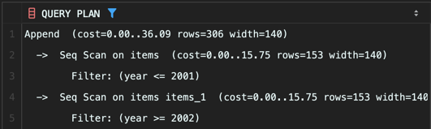

<!-- Date: 2025-01-24 -->
<!-- Update Date: 2025-01-24 -->
<!-- File ID: 0db7b627-bc06-48b2-9d78-01f19b265b9f -->
<!-- Author: Seoyeon Jang -->

# 개요

UNION을 사용한 조건분기는 SQL 초보자가 좋아하는 기술 중 하나이다. 일반적으로 이러한 조건 분기는, WHERE 구만 조금씩 다른 여러 개의 SELECT 구문을 합쳐서, 복수의 조건에 일치하는 하나의 결과
집합을 얻고 싶을 때 사용한다. 이러한 방법은 큰 문제를 작은 문제로 나눌 수 있다는 점에서 생각하기 쉽다는 장점이 있다. 따라서 조건 분기와 관련된 문제를 접할 때 가장 처음 생각할 수 있는 기본적인 방법이다.

하지만 이 방법은 성능적 측면에서 굉장한 단점이다. 외부적으로는 하나의 SQL 구문을 실행하는 것처럼 보이지만, 내부적으로는 여러 개의 SELECT 구문을 실행하는 실행계획으로 해석되기 때문이다. **따라서 테이블에
접근하는 횟수가 많아져서 I/O 비용이 크게 늘어난다.** (물론 예외도 있다. 즉 UNION을 사용하는 것이 성능적으로 더 좋은 경우말이다.)

SQL에서 조건 분기를 할 때 UNION을 사용해도 좋을지 여부는 신중히 검토해야 한다. 아무 생각 없이 무조건 UNION을 사용해서는 안된다. 이번 메모에서는 UNION과 CASE를 사용한 조건 분기를 비교하면서,
어떤 경우에 어떤 것을 사용하는 것이 좋을지 알아보자.

## 1. UNION을 사용한 조건 분기와 관련된 간단한 예제


조금 어색한 예이긴 하지만, 일단 상품을 관리하는 테이블 Items가 있다. 이 테이블은 각각의 상품에 대해 세금이 포함된 가격과 포함되자 않은 가격을 모두 저장한다. 그런데 2002년부터 법이 개정되면서 세금을
포함된 가격을 표시하는 게 의무가 되었다. 따라서 2001년까지는 세금이 포함되지 않은 가격을, 2002년부터는 세금이 포함된 가격을 'price' 필드로 표현해보자.

```sql
select item_name, year, price_tax_ex as price
from items
where year <= 2001
UNION ALL
select item_name, year, price_tax_in as price
from items
where year >= 2002;
```

조건이 배타적이므로 중복된 레코드가 발생하지 않는다. 쓸데없이 정렬 등의 처리를 하지 않아도 되므로 UNION ALL을 사용했다. 하지만 포인트는 다른 곳에 있다. 이 코드는 **굉장히 큰 문제점을 안고 있다.**
첫번째 문제는 쓸데없이 길다는 것이다. 거의 같은 두 개의 쿼리를 두번이나 실행하고 있다. 이는 SQL을 쓸데없이 길고, 읽기 힘들게 만들 뿐이다. 또한 두번째 문제는 성능이다.

### UNION을 사용했을 때의 실행 계획 문제

UNION을 사용한 쿼리의 성능 문제를 명확히 하기 위해 실행계획을 살펴보자.



UNION 쿼리는 Items 테이블에 2회 접근한다는 것을 알 수 있다. 그리고 그때마다 TABLE ACCESS FULL이 발생하므로, 읽어들이는 비용도 테이블의 크기에 따라 선형으로 증가하게 된다. 물론 데이터
캐시에 테이블의 데이터가 있으면 어느정도 그런증상이 완화되겠지만, 테이블의 크기가 커지면 캐시 히트율이 낮아지므로 그러한 것도 기대하기 힘들어진다.

### 정확한 판단 없는 UNION 사용 회피

간단하게 레코드 집합을 합칠 수 있다는 점에서 UNION은 굉장히 편리한 도구이다. 따라서 UNION을 조건 분기를 위해 사용하고 싶은 유혹에 사로잡히는 것도 무리는 아니다. 하지만 이는 굉장히 위험한 생각이다.
정확한 판단 없이 SELECT 구문 전체를 여러번 사용해서 코드를 길게 만드는 것은 쓸데없는 테이블 접근을 발생시키며 SQL의 성능을 나쁘게 만든다. 또한 물리자원(저장소의 I/O비용)도 쓸데없이 소비하게 된다.

## 2. WHERE 구에서 조건 분기를 하는 사람은 초보자

# 정리


