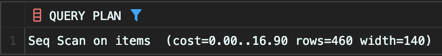

<!-- Date: 2025-01-25 -->
<!-- Update Date: 2025-01-25 -->
<!-- File ID: 37b2874e-2dd5-4cc1-a3f5-8cc6de861e49 -->
<!-- Author: Seoyeon Jang -->

# 개요

시스템 개발의 세계에서는 앞선 사람들의 지혜와 노하우가 간단한 격언처럼 남아있다. 예를 들어, "GOTO 는 사용하지 않는 것이 좋다" 등...

SQL에도 이러한 격언들이 있다. 그 중에서 "조건 분기를 WHERE 구로 하는 사람은 초보자다. 잘하는 사람은 SELECT 구만으로 조건 분기를 한다"라는 말이 있다. 앞서 살펴본 UNION과 WHERE 절을
사용핸 문제도 SELECT 구만으로 조건 분기를 하면 다음과 같이 최적화할 수 있다.

```sql
select item_name, year, price_tax_ex as price
from items
where year <= 2001
UNION ALL
select item_name, year, price_tax_in as price
from items
where year >= 2002;

-- 개선된 쿼리
select item_name,
       year,
       case
           when year <= 2001 then price_tax_ex
           when year >= 2002 then price_tax_in end as price
from items;
```

이 쿼리도 UNION을 사용한 쿼리와 같은 결과를 출력한다. 하지만 성능적으로 이번 쿼리가 훨씬 좋다.(테이블의 크기가 커질수록 명확하게 드러남)

## SELECT 구를 사용한 조건 분기의 실행계획

CASE 식을 사용한 쿼리의 실행계획은 다음과같다.

Items 테이블에 대한 접근이 1회로 줄어든 것을 확인할 수 있다. 이전의 UNION을 사용한 구문보다 성능이 2배 좋아졌다고 말할 수 있다. 또한 SQL의 구문 자체의 가독성도 굉장히 좋아졌다.

> NOTE: 성능이 2배? 사실 버퍼 캐시의 영향도 생각해야하고, 사실 I/O 비용과 실행시간은 선형 관계에 있지 않으므로 단순하게 결론내는 건 불가능하다.

이처럼 SQL 구문의 성능이 좋은지 나쁜지는 반드시 **실행계획의 레벨에서 판단해야 한다.** 이유는 1장에서 설명했던 것처럼, SQL 구문에는 어떻게 데이터를 검색할지를 나타내는 접근 경로가 쓰여있지 않기
때문이다. 이를 알려면 실행계획을 보는 수밖에 없다.

사실 이는 좋은게 아니긴 하다. "사용자가 데이터에 접근 경로라는 물리 레벨의 문제를 의식하지 않도록 하고 싶다" 라는 것이 RDB와 SQL의 컨셉이기 때문이다. 하지만 아직 이런 뜻을 이루기에 현재의 RDB와
SQL(그리고 하드웨어)는 역부족이다. 따라서 은폐하고 있는 접근 경로를 엔지니어가 체크해줘야 한다. 미래에 하드웨어와 DBMS가 충분히 발달하는 날이 온다면 굳이 이런 일을 안해도 되곘지.

**어쨌거나, UNION 과 CASE 의 쿼리를 구문적인 관점에서 비교하면 재미난 것이 있다.** UNION을 사용한 분기는 SELECT '구문'을 기본 단위로 분기하고 있다. 구문을 기본 단위로 사용하고 있다는 점에서, 아직 절차 지향형의 발상을 벗어나지 못한 방법이라고 말할 수 있다. 반면 CASE 식을 사용한 분기는 문자 그대로 '식'을 바탕으로 하는 사고이다. 이렇게 '구문'에서 '식'으로 사고를 변경하는 것이 SQL을 마스터하는 열쇠 중 하나이다.

처음부터 그런 변경을 쉽게 실현하기는 힘들다. 요령을 하나 말하자면, 어떤 문제가 있을 때 스스로 "문제를 절차 지향형 언어로 해결한다면 **어떤 IF 조건문을 사용해야할까?"라고 사고할 때마다 "이것을 SQL의 CASE로는 어떻게 해결할 수 있을까?" 라는 것을 꾸준히 의식하는 것이다.** 이것만으로도 큰 도움이 될 것이다.

# 정리


