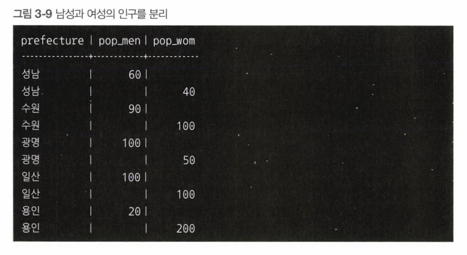
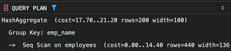

<!-- Date: 2025-01-25 -->
<!-- Update Date: 2025-01-30 -->
<!-- File ID: 740ea35e-c34d-42f3-a345-d5c809c8e177 -->
<!-- Author: Seoyeon Jang -->

# 개요

집계를 수행하는 쿼리를 작성할 때, 쓸데없이 길어지는 경우를 자주 볼 수 있다. 예를 들어 지역별로 남녀 인구를 기록하는 population 테이블을 생각해보자. 이 테이블은 남성과 여성의 인구가 로우로 저장되어
있는데, 이를 `남성인구`와 `여성인구`라는 컬럼이 있는 레이아웃으로 변경하여 조회하려면 어떻게 해야할까?

| prefecture(지역이름) | sex(성별) | pop(인구) |
|------------------|---------|---------|
| 성남               | 1       | 60      |
| 성남               | 2       | 40      |
| 수원               | 1       | 90      |
| 수원               | 2       | 100     |
| 광명               | 1       | 100     |
| 광명               | 2       | 50      |

원하는 결과는 다음과 같다.

| prefecture | pop_men | pop_wom |
|------------|---------|---------|
| 성남         | 60      | 40      |
| 수원         | 90      | 100     |  
| 광명         | 100     | 50      |

## 1. 집계 대상으로 조건 분기

- UNION을 사용한 방법

이 문제를 풀 때 절차 지향적인 사고방식을 가진다면, 일단 남성의 인구를 지역별로 구하고, 여성의 인구를 지역별로 구한 뒤, merge 하는 방법을 생각할 것이다.

```sql
select prefecture, sum(pop_men) as pop_men, sum(pop_wom) as pop_wom
from (select prefecture, pop as pop_men, null as pop_wom
      from population
      where sex = '1'
      union
      select prefecture, null as pop_mem, pop as pop_wom
      from population
      where sex = '2') TMP
group by prefecture;
```



서브쿼리 TMP는 남성과 여성의 인구가 별도의 레코드에 나온다. 따라서 외측에 있는 GROUP BY 구를 사용해 하나의 레코드로 집약하는 것이다. 물론 아무 오류 없이 원하는 결과가 나온다.

하지만 이러한 쿼리의 가장 문제는 WHERE 구에서 sex 필드로 분기를 하고, 결과를 UNION으로 머지한다는 절차 지향적인 구성에 있다.


실행계획을 보면, population 테이블에 풀 스캔이 2회 수행되는 것을 확인할 수 있다.

> 사실 이러한 경우 몇가지 조건이 충족된다면, UNION을 사용하는 것이 CASE를 사용하는 것보다 성능적으로 좋을 수 있다. 바로 sex 필드에 인덱스가 존재한다는 조건이다. 이러한 경우에는 CASE 식으로
> 수행되는 테이블 풀 스캔 1회보다, UNION 식으로 수행되는 인덱스 스캔 2회가 더 빠르게 작동할 가능성이 있다.

## 2. 집계의 조건 분기도 CASE 식을 사용

사실 이 문제는 CASE 식의 응용 방법으로 굉장히 유명한 표측/표두 레이아웃 이동 문제이다. 표두(head, column)는 이차원 표의 상부 제목을 의미하고, 표측(stub, row)는 좌측의 제목을 나타낸다.
데이터 집계 분야에서 자주 사용되는 용어이다. 원래 SQL은 이러한 결과 포맷팅을 목적으로 만들어진 언어가 아니다. 하지만 실무에서 자주 사용되니 알아두자. CASE 식을 집약 함수 내부에 포함시켜 '남성인구'와 '
여성인구' 필터를 만든다.

```sql
select prefecture,
       sum(case when sex = '1' then pop else 0 end) as pop_men,
       sum(case when sex = '2' then pop else 0 end) as pop_wom
from population
group by prefecture;
```

덧붙이자면 SELECT 에서 CASE 를 사용한 조건 분기의 경우 쿼리가 굉장히 간단해진다는 것이다.

중요한 건, 외관이 간단해질 뿐만 아니라 성능도 향상된다는 것이다. 외관뿐만 아니라, 실행계획도 굉장히 간단하다.


population 테이블로의 풀 스캔이 1회로 감소한 것을 확인할 수 있다. 따라서 UNION을 사용한 경우의 2회에 비해(캐시 등을 고려하지 않는다면) I/O비용이 절반으로 감소한다는 의미이다.

이렇게 CASE 식으로 조건 분기를 잘 사용하면 UNION 을 사용하지 않을 수 있다. 그렇게 되면 테이블에 대한 접근을 줄일 수 있다. CASE 식은 SQL에서 굉장히 중요한 도구이다. 다양한 표현을 할 수 있는
것은 물론 성능적으로도 큰 힘을 발휘하기 때문이다.

## 3. 집약 결과로 조건 분기

집약에 조건 분기를 적용하는 또 하나의 패턴으로, 집약 결과에 조건 분기를 수행하는 경우가 있다.


이 테이블에서 다음 조건에 맞춰 결과를 만드는 것을 생각해보자.

1. 소속된 팀이 1개라면 해당 직원은 팀의 이름을 그대로 출력
2. 소속된 팀이 2개라면 해당 직원은 '2개를 겸무'라는 문자열 출력
3. 소속된 팀이 3개라면 해당 직원은 '3개 이상을 겸무'라는 문자열 출력

### 1. UNION을 사용한 조건분기

```sql
select emp_name, max(team) as team
from employees
group by emp_name
having count(*) = 1
union
select emp_name, '2개를 겸무' as team
from employees
group by emp_name
having count(*) = 2
union
select emp_name, '3개 이상을 겸무' as team
from employees
group by emp_name
having count(*) = 3;
```

이 문제에서 재미있는 것은, 조건분기가 레코드값이 아닌, 집합의 레코드 수에 적용된다는 것이다. 따라서 조건 분기가 WHERE 구가 아니라 HAVING구에 지정되었다. 하지만 UNION으로 머지하고 있는 이상, 구문
레벨의 분기일 뿐이다. 따라서 WHERE 구를 사용할 때와 크게 다르지 않다.

#### UNION의 실행계획


3개의 쿼리를 머지하는 쿼리이므로, 예상대로 employees 테이블에 대한 접근도 3번 발생한다.

### CASE 식을 사용한 조건 분기

이 문제를 푸는 최적의 방법은 역시 SELECT 구문과 CASE 식을 사용하는 것이다.

```sql
select emp_name,
       case
           when count(*) = 1 then max(team)
           when count(*) = 2 then '2개를 겸무'
           when count(*) >= 3 then '3개 이상을 겸무' end as team
from employees
group by emp_name;
```

이렇게 case 식을 사용하면 테이블에 대한 접근 비용을 3분의 1로 줄일 수 있다. 이것이 가능한 이유는 집약결과(COUNT 함수의 리턴값)를 CASE 식의 입력으로 사용했기 때문이다. COUNT 또는 SUM 과
같은 집약 함수의 결과는 1개의 레코드로 압축된다. 다르게 말하면 집약 함수의 결과가 스칼라(더 이상 분할 불가능한 값)가 되는 것이다. 따라서 CASE 식의 매개변수에 집약 함수를 넣을 수 있다.

### CASE 식을 사용한 조건 분기의 실행계획



앞서 'WHERE 구에서 조건 분기를 하는 사람은 초보자'라고 했었는데, 마찬가지로 'HAVING 구에서 조건분기를 하는 사람도 초보자'라는 것을 명심하자.

# 정리


