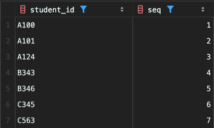
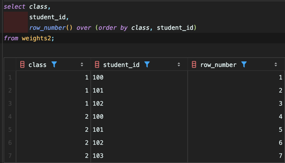
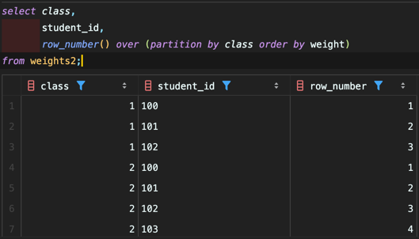
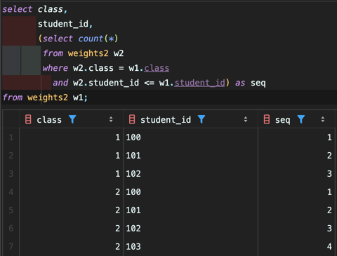
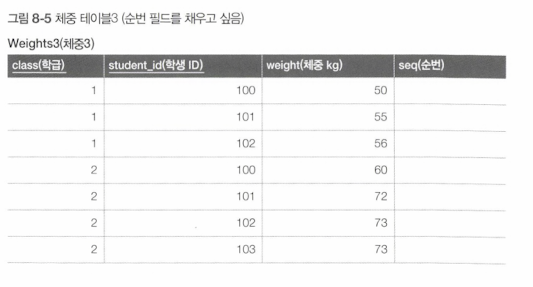
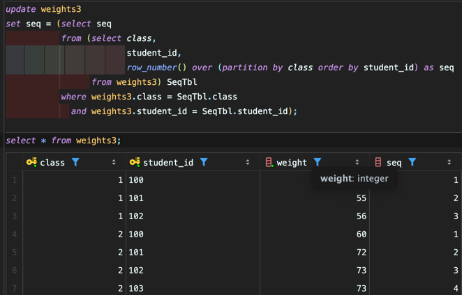

<!-- Date: 2025-01-30 -->
<!-- Update Date: 2025-02-01 -->
<!-- File ID: 6d5530f0-1481-4b11-8717-f179968d454e -->
<!-- Author: Seoyeon Jang -->

# 개요

일단 순서 조작의 기초로, 레코드에 순번을 붙이는 방법을 살펴보자.

## 1. 기본 키가 한 개의 필드인 경우

### 방법 1. 윈도우 함수를 사용

학생 ID를 오름차순으로 순번을 붙여보자. ROW_NUMBER 함수를 사용할 수 있는 환경이라면 다음처럼 간단하게 구현할 수 있다.

```sql
select student_id,
       row_number() over (order by student_id) as seq
from weights;
```



### 방법 2. 상관 서브쿼리를 사용

MySQL처럼 ROW_NUMBER 함수를 사용할 수 없는 환경이라면 상관 서브쿼리를 사용해야 한다.

```sql
select student_id,
       (select count(*)
        from weights w2
        where w2.student_id <= w1.student_id) as seq
from weights w1;
```

1. `FROM weights wq`
    - 테이블 weights 의 모든 student_id 에 대해 한번씩 반복하며 w1 이라는 별칭을 부여

2. `(select count(*)
   from weights w2
   where w2.student_id <= w1.student_id)`
    - 서브쿼리가 실행되는데, w2 라는 같은 테이블의 별칭을 하나 더 만들어 사용
    - W1.student_id = 101 → 서브쿼리 실행 (W2 테이블에서 101 이하 개수 조회)
    - W1.student_id = 102 → 서브쿼리 실행 (W2 테이블에서 102 이하 개수 조회)
    - W1.student_id = 103 → 서브쿼리 실행 (W2 테이블에서 103 이하 개수 조회)

순번을 생성할 때 자주 사용하는 트릭이다.

ROW_NUMBER와 서브쿼리 트릭은 기능적으로는 동일하지만, 성능 측면에서는 윈도우 함수를 사용하는 것이 좋다. 윈도우 함수에서는 스캔 횟수가 1회이다. 또한 인덱스 온리 스캔을 사용하므로 테이블에 직접적인 접근을
회피한다. 반면 상관 서브쿼리를 사용하는 방법에서는 2회(w1과 w1) 의 스캔이 실행된다.

## 2. 기본 키가 여러 개의 필드로 구성되는 경우

class 와 student_id 두 개의 컬럼이 기본키일때는?

### 방법 1. 윈도우 함수를 사용

ROW_NUMBER 를 사용하는 경우 머리를 굴릴 필요가 없다. ORDER BY 의 키에 필드를 추가하기만 하면 된다.

```sql
select class,
       student_id,
       row_number() over (order by class, student_id)
from weights2;
```



### 방법 2. 상관 서브쿼리를 사용

다중 필드 비교를 사용한다.

```sql
select class,
       student_id,
       (select count(*)
        from weights2 w2
        where (w2.class, w2.student_id) <= (w1.class, w1.student_id)) as seq
from weights2 w1;
```

## 2. 그룹마다 순번을 붙이는 경우

이번에는 학급마다 순번을 붙이는 경우이다. 테이블을 그룹으로 나누고 그룹마다 내부 레코드에 순번을 붙이는 것이다.

### 방법 1. 윈도우 함수를 사용

윈도우 함수로 이를 구현하려면 class 필드에 PARTITION BY 를 적용하면 된다.



### 방법 2. 서브쿼리를 사용

```sql
SELECT class,
       student_id,
       (SELECT COUNT(*)
        FROM Weights2 W2
        WHERE W2.class = W1.class
          AND W2.student_id <= W1.student_id) AS seq
FROM Weights2 W1;
```



## 4. 순번과 갱신

마지막으로 검색이 아니라 갱신에서 순번을 매기는 법을 살펴보자.

### 방법 1. 윈도우 함수를 사용



```sql
update weights3
set seq = (select seq
           from (select class,
                        student_id,
                        row_number() over (partition by class order by student_id) as seq
                 from weights3) SeqTbl
           where weights3.class = SeqTbl.class
             and weights3.student_id = SeqTbl.student_id);
```


### 방법 2. 상관 서브쿼리를 사용
```sql
update weights3
set seq = (select count(*)
           from weights3 w2
           where w2.class = weights3.class
             and w2.student_id <= weights3.student_id);
```

참고로 MySQL은 갱신 SQL 내부의 서브쿼리에서 테이블 자기 참조가 불가능하다.

이렇게 SQL에서 순번을 붙이는 방법을 살펴보았다. 이어서 순번을 사용하는 실무적인 예제를 살펴보자.


# 정리


