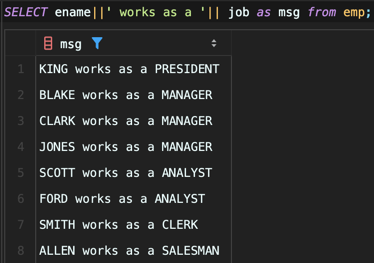
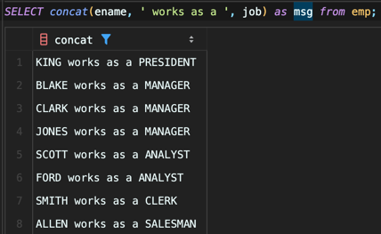

<!-- Date: 2025-01-06 -->
<!-- Update Date: 2025-01-06 -->
<!-- File ID: 79f4b6d1-1877-4d29-ab2e-9c8d333c1b05 -->
<!-- Author: Seoyeon Jang -->

# 개요

문제: 여러 열의 값을 하나의 열로 반환하려고 한다.

```shell
CLARK works as a MANAGER
KING works as a PRESIDENT
MILLER works as a CLERK
```

해법: DBMS에서 제공하는 내장함수(build-in function)를 사용하여 여러 열 값을 연결한다.

**DB2, Oracle, PostgreSQL**

이들 데이터베이스는 이중 수직선 (||)을 연결 연산자로 사용한다.



**MySQL**



**SQLServer**

```sql
select ename + ' works as a ' + job as msg
from emp;
```

설명: **CONCAT** 함수를 사용하여 여러 열 값을 연결한다. `||`는 DB2, Oracle 및 PostgresSQL에서 CONCAT함수를 위한 단축 기호이다.
`+`는 SQL Server의 단축 기호이다.

# 정리


