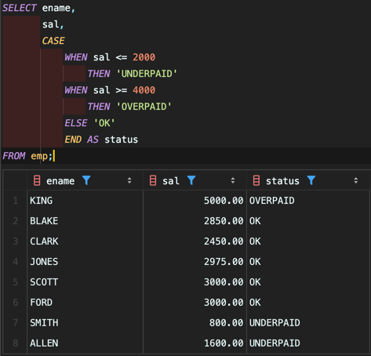

<!-- Date: 2025-01-06 -->
<!-- Update Date: 2025-01-06 -->
<!-- File ID: dcbb21ca-7825-4710-94e3-8c7454e32f84 -->
<!-- Author: Seoyeon Jang -->

# 개요

문제: SELECT 문의 값에 대해 `IF-ELSE` 연산을 수행하려 한다.
예를 들어 사원이 2,000달러 이하의 급여를 받는다면 'UNDERPAID' 메시지가 반환되고, 4,000달러 이상의
급여를 받는다면 'OVERPAID' 메시지가 반환된다.
이들 사이의 급여는 'OK'가 반환되도록 결과 셋을 생성하라.

**CASE**식을 사용하면 쿼리로 반환된 값에 대한 조건식을 수행할 수 있다. **CASE**식에 별칭을 제공하여
더 읽기 쉬운 결과셋을 반환할 수 있다. 해법에서는 **CASE**식의 결과에 지정된 별칭 status 를 볼 수 잇다.
**ELSE**절은 선택사항이다. **ELSE**절을 생략하면 **CASE**식은 조건에 부합하지 않는 행에 대해 NULL 을 반환한다.

# 정리

