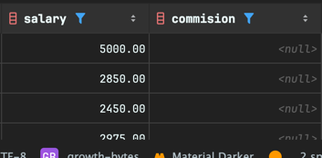

<!-- Date: 2025-01-03 -->
<!-- Update Date: 2025-01-03 -->
<!-- File ID: 98c2e810-ddc3-4623-afc0-23d424f65ab0 -->
<!-- Author: Seoyeon Jang -->

# 개요

## 1.1 테이블의 모든 행과 열 검색하기

문제: 테이블의 모든 데이터를 보려고 한다.

해법: 대상 테이블에 `*` 문자를 사용하여 SELECT 를 실행한다.

```sql
SELECT *
FROM emp;
```

설명: `*` 문자는 SQL에서 특별한 의미를 가진다. 이 옵션을 사용하면 지정한 테이블의 모든 열이 반환된다.
WHERE 절을 지정하지 않았으므로 모든 행이 반환된다. 대체 해법은 각 열을 개별적으로 나열하는 것이다.

```sql
SELECT empno,
       ename,
       job,
       sal,
       mgr,
       hiredate,
       comm,
       deptno
FROM emp;
```

대화형으로 즉석에서 실행하는 쿼리라면 `*` 을 사용하는 게 더 좋을수도 있다.
그러나, 프로그램 코드를 작성할 때는 각 열을 개별 지정하는 게 좋다.
쿼리에서 어떤 열을 반환하는지 명확하게 알 수 있기 때문이다.
`SELECT *`은 컬럼 순서가 변경되면 결과에 영향을 미칠 수 있다.
하지만 각 컬럼을 명시적으로 지정하면 필드 순서가 변경되어도 쿼리 결과가 영향을 받지 않으므로 더 안정적이고
예측 가능한 동작이 보장된다.
만약 컬럼이 새로 추가되는데, 기존 열들의 사이에 새로 추가가 되는 경우라면,
클라이언트 애플리케이션이나 다른 쿼리에서 순서에 의존하여 데이터를 처리하고 있었다면, 이제 순서가 바뀌면서
잘못된 값을 처리할 위험이 있다.

## 1.2 테이블에서 행의 하위 집합 검색하기

문제: 테이블에서 특정 조건을 충족하는 행만 보려고 한다.

해법: WHERE 절로 가져올 행을 지정한다. 예를 들어 부서번호(`deptno`)가 10에 속한 모든 사원을 보려면
다음 쿼리를 실행한다.

```sql
SELECT *
FROM emp
WHERE deptno = 10
```

설명: `WHERE` 절을 사용하면 관심있는 행만 검색할 수 있다.
`WHERE` 절의 식이 해당 행에 대해 참이면 해당 행이 반환된다.

대부분의 벤더는 =, <, >, <=, >=, !, <> 와 같은 일반 연산자를 지원한다.
여러 조건을 만족하는 행을 가져오길 원한다면 AND, OR 및 괄호를 지정하여 수행할 수 있다.

## 1.3 여러 조건을 충족하는 행 찾기

문제: 여러 조건을 충족하는 행을 반환한다.

해법: OR 및 AND 절과 함께 WHERE 절을 사용한다.
예를 들어 부서 번호 10번의 모든 사원, 커미션을 받는 사원, 최대 2,000달러를 받는 부서 번호 20의 사원을 찾으려면
다음과 같이 쿼리를 실행한다.

```sql
select *
from emp
where deptno = 10
   or comm is not null
   or sal <= 2000 and deptno = 20;
```

AND, OR 및 괄호 조합을 사용하여 여러 조건을 만족하는 행을 반환할 수 있다.
위 쿼리에서 WHERE 절은 다음과 같은 행을 찾는다.

- deptno 가 10이다
- comm 이 NULL 이 아니다
- deptno 가 20인 사원 중 급여가 2000 달러 이하이다 (`AND`는 `OR`보다 우선순위가 높기 때문)

괄호가 있으면 괄호 안의 조건을 함께 평가한다.

```sql
select *
from emp
where (
    deptno = 10
        or comm is not null
        or sal <= 2000)
  and deptno = 20;
```

결과에는 where 괄호 조건에 해당하는 deptno 가 20인 행만 나오게 된다.

## 1.4 테이블에서 열의 하위 집합 검색하기

문제: 테이블에서 모든 열이 아닌, 특정 열의 값만 보고 싶다.

해법: 관심있는 열을 지정한다. 예를 들어, 사원명, 부서번호 및 급여만 보려면 다음 쿼리를 실행한다.

```sql
select ename, deptno, sal
from emp;
```

설명: SELECT 절에 열을 지정하면 불필요한 데이터가 반환되지 않는다. 이는 불필요한 데이터 검색에 드는 시간 낭비를 방지하므로,
네트워크를 통해 데이터를 검색할 때 특히 중요할 수 있다.
DB서버는 로컬 환경이 아닌 외부 DB 서버에 접속해야 하는 경우가 많다.

DB클라이언트 프로그램에서 SQL쿼리를 실행하면 **대부분의 경우 네트워크를 통해 데이터베이스 서버에 접속**하여 데이터를 조회한다.
따라서 **SQL쿼리 콘솔에서 실행하더라도 네트워크를 타게 된다.**

### DB클라이언트에서 네트워크를 타는 경우

- **로컬 환경**이 아닌 **외부 DB서버에 접속**하는 경우
    - DB클라이언트(예: DBeaver 등) -> 네트워크 -> DB서버
    - localhost, 127.0.0.1 이 아닌 IP주소나 도메인으로 접속하는 경우
- 사내 DB서버에 연결하는 경우도 내부 네트워크를 통해 통신
- 데이터가 많을 경우, **네트워크 부하가 발생할 수 있음**

### 네트워크를 타지 않는 경우

- **DB서버가 현재 PC에 설치된 경우**
    - 예: 로컬에 MySQL, PostgreSQL, Oracle 등 DB를 직접 설치하고 그 DB에 접속하는 경우
    - localhost 나 117.0.0.1 을 통해 접속 -> 네트워크를 거치지 않지만 **TCP/IP**통신은 발생
    - 하지만 물리적으로 네트워크 외부를 거치지 않으므로 속도 저하가 거의 없음

## 1.5 열에 의미 있는 이름 지정하기

문제: 쿼리에서 반환된 열의 이름을 더 알아보기 쉽고 이해하기 쉽게 변경하려고 하는 법

해법: 쿼리 결과의 이름을 변경하려면 **`원래 이름` AS `새로운 이름`** 형식으로 AS 키워드를 사용해야 한다.
일부 데이터베이스에는 AS 를 쓸 필요가 없기도 하다.

```sql
SELECT sal AS salary, comm AS commision
from emp;
```



설명: AS 키워드를 사용하여 쿼리에서 반환된 열에 새 이름을 지정하는 것을 **열의 별칭 지정**(aliasing)이라고 하며,
사용자가 지정한 새 이름을 **별칭**(aliase)라고 한다.
좋은 별칭을 만들면 쿼리와 그 결과를 다른 사람이 이해하는 데 큰 도움이 된다.

## 6. WHERE 절에서 별칭이 지정된 열 참조하기

문제: 더 의미있는 열 이름을 제공하고자 결과 셋에 별칭을 적용하고 `WHERE` 절을 사용하여 일부 행을 제외하려고 한다.
하지만 WHERE 절에서 별칭 이름을 참조하려다가 실패한다.

```sql
select sal as salary, comm as commission
from emp
where salary < 5000;
```

해법: 쿼리를 인라인 뷰로 감싸서 별칭이 지정된 열을 참조할 수 있다.

```sql
select *
from (select sal as salary, comm as commission
      from emp) x
where salary < 5000;
```

사실 이 간단한 예에서는 인라인 뷰를 피하고 WHERE 절에서 직접 comm 또는 sal 을 참조하여 같은 결과를 얻을 수도 있다.
이 해법은 WHERE 절에서 다음 중 하나를 참조하려고 할 때 해야 할 작업이기도 하다.

- 집계함수
- 스칼라 서브쿼리
- 윈도우 함수
- 별칭

별칭이 있는 쿼리를 인라인 뷰에 배치하면 외부 쿼리에서 별칭 열을 참조할 수 있다.
근데 이렇게 하는 근본적인 이유가 무엇일까?
**WHERE 절은 SELECT 절을 실행하기 전에 판단되므로** '문제' 쿼리의 WHERE 절을 평가할 때는 아직 salary 와 commission 이 존재하지 않는다.
따라서 이러한 별칭은 WHERE 절 처리가 완료될 때까지 처리할 수 없다.
**그러나 FROM 절은 WHERE 절보다 먼저 평가된다.**
원래 쿼리를 FROM 절에 배치하면 해당 쿼리의 결과가 가장 바깥쪽 WHERE 절 이전에 생성되고 가장 바깥쪽 WHERE 절이 별칭 이름을 '확인'한다.
이 기법은 테이블의 열 이름이 이해하기 쉽도록 적절히 지정되지 않은 경우에 특히 유용하다.

> **TIP**
> 이 해법의 인라인 뷰는 별칭 X 이다. 모든 데이터베이스가 명시적으로 별칭 지정을 위해 인라인 뷰가
> 필요한 것은 아니지만, 일부 데이터베이스에서는 별칭 지정이 필요하다. 모든 데이터베이스에서는 별칭 지정을
> 모두 허용한다.


