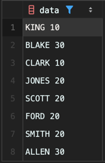

<!-- Date: 2025-01-19 -->
<!-- Update Date: 2025-01-19 -->
<!-- File ID: cbbea89d-e78b-45cc-81bc-05da9399eef8 -->
<!-- Author: Seoyeon Jang -->

# 개요

혼합 영숫자(alphanumeric)데이터가 있을 때 데이터의 숫자 또는 문자 부분을 기준으로 정렬하려고 한다.
emp 테이블에서 만든 다음 뷰를 살펴보자.

```sql
create view V
as
select ename || ' ' || deptno as data
from emp;

select *
from V;

```



이 데이터에서 deptno 또는 ename 으로 결과를 정렬하려면 어떻게 해야할까?

# 해답
이 해법은 `Oracle, SQL Server, PostgreSQL`, `MySQL` 로 구분된다.

**Oracle, SQL Server, PostgreSQL**
REPLACE 및 TRANSLATE 함수를 사용하여 정렬할 문자열을 수정한다.

```sql
/* ENAME 으로 정렬하기*/
select data from V
order by replace(translate(data, '0123456789', '#########'), '#', '');
```

**MySQL**
현재 플랫폼에서는 TRANSLATE 함수를 지원하지 않는다.

# 정리


