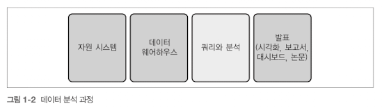
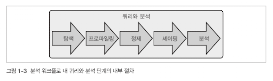

<!-- Date: 2025-01-25 -->
<!-- Update Date: 2025-02-01 -->
<!-- File ID: 017467e8-07e7-493a-a56a-eeeea9f823b0 -->
<!-- Author: Seoyeon Jang -->

# 개요

지금까지 SQL이 무엇이고 장점은 무엇인지, 다른 언어와는 어떻게 다른지 알아봤다. 이제 데이터 분석 중 어느 과정에서 SQL을 사용하는지 이야기해보자. 분석 업무는 항상 질문을 던지는데서 시작한다. 예를 들어, '
신규 고객이 얼마나 유입됐는가?', '판매 추이가 어떠한가?', '왜 어떤 고객은 한번 서비스를 이용한 후 다시 돌아오지 않는 반면, 어떤 고객은 지속해서 서비스를 사용하는가?' 등의 질문이 생기고 나면 데이터가
어디에서 나오고 어디에 저장되는지, 분석 계획은 무엇이며 어떻게 발표할지 생각해야 한다. 다음은 이러한 과정의 각 단계를 보여준다. 이 책에서는 쿼리 및 분석 단계를 주로 살펴본다.

첫번째 단계로 **자원시스템(source system)** 에서 데이터가 생성된다. 데이터베이스에 기록되는 구매이력, 이벤트-스트리밍 시스템에 기록되는 웹사이트 클릭 로그 등. 자원 시스템은 다양한 타입과 형식의 데이터를 생성할 수 있으며, 데이터 타입에 따른 분석에 관해서는 2장에서 자세히 다룬다.

두번째는 분석을 위해 데이터를 데이터베이스로 옮기는 단계이다. 여러 조직의 데이터를 하나의 중앙 저장소에 통합한 데이터베이스를 **데이터 웨어하우스** 라고 하며, 쿼리를 보낼 수 있는 모든 종류의 데이터 저장 시스템은 **데이터 스토어** 라고 한다. 
이 외의 다른 용어로는 데이터웨어하우스의 서브셋 또는 좁은 의미의 데이터웨어하우스를 의미하는 **데이터 마트**, 파일 저장시스템에 데이터를 저장하거나 데이터웨어하우스에서 주로 사용하는 형태로 변환되지 않은 채로 데이터를 저장한 데이터베이스를 의미하는 **데이터 레이크** 가 있다. 

중요한 것은 분석하고자 하는 데이터를 한 곳에 모아는 일이다.

>NOTE: 데이터를 웨어하우스에 저장하는 일은 주로 개인이나 팀이 담당한다. 이 과정을 ETL(추출, 변환, 로드)이라고 한다. 추출은 자원 시스템에서 데이터를 가져오는 일을 한다. 변환은 필요시 데이터의 구조를 바꾸거나 데이터를 정제하는 일이다. 로드는 데이터를 데이터베이스에 저장하는 일을 말한다. 
> 
> 이 과정은 ELT 라고 부르기도 하는데, 이때 차이점은 데이터를 저장하기 전에 변환하기보다는 데이터를 저장한 후에 (주로 SQL을 사용해) 원하는 형태로 변환하는 과정이다. ETL에서 자원(source)과 목표(target)라는 용어가 사용된다. 자원은 데이터를 가져오는 출처를 말하며 목표는 데이터베이스 및 그 안의 테이블과 같이 데이터를 저장할 공간을 의미한다.

데이터베이스에 데이터가 저장됐으면 다음 단계는 쿼리와 분석이다. 이 단계에서는 SQL로 `탐색`, `프로파일링`, `정제`, `셰이핑`, `분석을` 수행한다.

- `탐색`
  - 데이터와 관련된 주제는 무엇인지, 데이터가 어디에서 생성됐는지, 저장된 테이블은 뭉멋인지 등을 알아가는 과정
- `프로파일링`
  - 데이터셋에서 고유한 값은 무엇이며 값의 분포는 어떠한지 확인하는 과정
- `정제`
  - 틀리거나 불완전한 데이터를 수정하고 카테고리를 추가하거나 결측값을 다루는 과정
- `셰이핑`
  - 데이터를 분석 목적에 따라 행과 열로 저장하는 과정
- `분석`
  - 트렌드를 파악하고 결론을 내린 후 인사이트를 찾아내기 위해 데이터를 검토하는 과정

전체 워크플로 내 마지막 단계는 데이터를 최종 결과물 형태로 가공해 발표하는 일이다. 사업가는 나에게 SQL 코드 파일을 기대하지 않는다. 내가 그래프, 차트 등을 동원해 분석한 결과로부터 도출한 인사이트를 잘 정리해 보여주기를 기대한다. 커뮤니테이션은 다른 사람과 분석 결과를 공유할 방법이자 분석 결과에 임팩트를 줄 중요한 키이다. SQL로 가능한 범위를 넘어 더 정교한 통계적 방법이나 머신러닝 알고리즘을 사용해야할 때가 있다. 대부분의 보고서와 시각화 도구, 통계 소프트웨어나 머신러닝에 사용되는 프로그래밍 언어는 SQL 커넥터를 제공한다. 테이블에서 데이터를 가져와 추가 분석을 수행할 수 있다.

2장에서는 자원 시스템의 종류와 여기에서 생성되는 데이터의 타입을 알아본다.

# 정리

