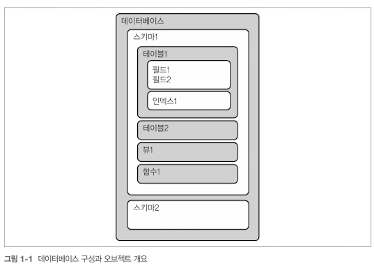

<!-- Date: 2025-01-25 -->
<!-- Update Date: 2025-01-25 -->
<!-- File ID: 110c4234-dd82-41d7-bd2c-bb1621d71118 -->
<!-- Author: Seoyeon Jang -->

# 개요
SQL은 데이터베이스에 접근하고 데이터를 가져와서 처리하는 데 사용한다. 데이터베이스에는 데이터베이스의 구성요소이자 다른 오브젝트를 포함하는 하나 이상의 스키마가 있다. 데이터 분석에 주로 사용되는 스키마의 오브젝트는 테이블, 뷰, 함수이다. 테이블에는 데이터를 저장하는 **필드**와 하나 이상의 **인덱스**가 있다.

최근 몇 년 사이에 컴퓨팅 성능은 급성장했고 데이터 웨어하우스와 데이터 인프라스트럭쳐는 이러한 컴퓨팅 성능을 최대한 활용하도록 발전해왔다. 최신 클라우드 데이터베이스에서는 속도 향상을 위해 대용량 데이터를 메모리에 로드해 쿼리를 실행하기도 한다. 이제 쿼리 결과를 기다리느라 몇분 혹은 몇시간을 기다리는 일은 사라지고 분석가가 빠른 처리를 위해 더 복잡한 쿼리를 작성하는 일만 남게 될 것이다.

데이터베이스와 인터랙션하고 데이터를 불러오는 작업에서는 사실상 SQL이 표준이다. SQL은 완전한 형태의 프로그래밍 언어는 아니지만 데이터변환, 문제해결을 위한 복잡한 연산 수행 등 많은 것을 해낸다.

끝으로 SQL은 배우기가 상대적으로 쉽다. 기본 키워드와 구조를 학습하고 다양한 데이터셋을 다루면서 경험을 쌓아나가면 된다. 세상에 수많은 데이터셋에 존재하고 데이터로 매우 다양한 문제를 해결할 수 있다는 점을 고려하면 SQL을 활용하는 방법은 무궁무진하다. 따라서 데이터분석을 위해 관계형 데이터베이스에 데이터를 저장하는 것은 합리적인 선택이다.

## SQL VS R, 파이썬
**데이터가 저장되고 구성되는 방식이 다르다.** 관계형 데이터베이스는 데이터를 테이블에 행과 열로 구분해 저장하므로 SQL로 쿼리를 작성할 때는 모든 데이터가 이 구조에 맞게 저장돼 있다고 가정한다. 반면에 R과 파이썬은 변수, 리스트, 딕셔너리 등 다양한 방법으로 데이터를 저장한다. R은 데이터베이스의 테이블과 비슷하게 행과 열의 구조로 데이터를 저장하는 데이터프레임을 사용해 분석을 수행하며 파이썬에는 판다스라는 패키지를 사용해 이러한 데이터프레임을 사용할 수 있다. 이렇듯 테이블 구조는 데이터 분석에 유용하게 쓰인다.

**또 다른 주요 차이점은 반복의 유무이다.** 반복은 특정 조건을 만족할 때까지 지정된 명령을 계속해서 되풀이하는 것을 의미한다. SQL 집계함수는 반복을 위한 코드가 따로 없어도 내부적으로 데이터셋을 반복한다. 이 책의 뒷부분에서는 SQL에서 필드를 명시적으로 반복하는 기능이 없어 데이터 피벗/언피벗 수행시 SQL문이 얼마나 길어지는지 알아본다. 이러한 한계로 오라클의 PL/SQL, 마이크로소프트의 T-SQL과 같이 기존 SQL의 기능을 확장해 반복 기능을 구현한 데이터베이스도 있다.

SQL사용시 단점도 존재한다. R이나 파이썬은 파일에서 데이터를 읽어와 로컬에 저장하거나 서버나 웹사이트에 저장된 파일에 쉽게 접근할 수 있어 일회성 프로젝트에서도 사용하기 편리하지만, SQL은 데이터가 데이터베이스에 저장돼 있어야 한다.

R과 파이썬은 고수준의 통계 함수를 내장하고 있거나 패키지로 제공한다. SQL도 평균이나 표준편차를 계산하는 함수를 제공하긴 하지만 실험결과분석(7장)에서 사용되는 p-값 및 통계적 유의성등을 계산할 수는 없다. 고수준의 통계 및 머신러닝은 SQL이 아닌 다른 코딩 언어에서 더 잘 지원한다.

# 정리

