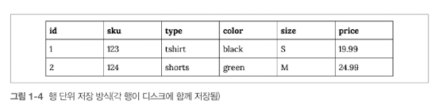

<!-- Date: 2025-02-01 -->
<!-- Update Date: 2025-02-02 -->
<!-- File ID: 7804bb9c-5fbc-4670-9649-862b9198f171 -->
<!-- Author: Seoyeon Jang -->

# 개요

SQL은 데이터베이스에서 사용하는 언어다. 데이터베이스 타입에는 오픈소스와 상용 데이터베이스, 행기반과 열기반 등 여러가지가 있다. 온프렘 데이터베이스와 클라우드 데이터베이스 등! 그리고 데이터베이스는 아니지만
SQL로 쿼리를 보낼 수 있는 데이터 스토어도 있다.

데이터베이스는 타입마다 특성이 다르며 데이터 분석시 각기 다른 장단점이 있다.

데이터 분석 업무에 적합한 두가지 데이터베이스 카테고리는 행 기반 방식과 열 기반 방식이다. 이 메모에서는 이 두가지 방식의 데이터베이스를 소개하고 둘의 유사점과 차이점을 설명한다. 마지막으로, 주로 사용하게 될
데이터베이스 이외에 몇가지 데이터 인프라스트럭쳐 유형까지 소개하며 마무리하겠다.

## 행 기반 데이터베이스

트랜잭션 데이터베이스라고도 불리는 행 기반(row-store) 데이터베이스는 INSERT, UPDATE, DELETE 와 같은 트랜잭션을 효율적으로 처리하기 위해 설계됐다. 널리 알려진 행기반 데이터베이스로는
MySQL, PostgreSQL, Oracle 등이 있다. 이 데이터베이스들이 분석에 최적화돼있지는 않지만, 행 기반 데이터베이스는 오랫동안 데이터 웨어하우스를 구축하는 유일한 방법이었다. 행 기반 데이터베이스를
분석에 활용하려면 섬세한 튜닝과 스키마 설계가 필요하다. 행 기반 데이터베이스가 인기있는 이유에는 데이터베이스 관리자들에게 이미 익숙하다는 점이다. 기관에서는 데이터 인프라스트럭쳐 구축 시 운영 데이터베이스를 행
기반 데이터베이스로 복제하는 경우가 많다. 이러한 이유로 데이터 분석가와 데이터 과학자는 데이터 분석을 행 기반 데이터베이스에서 하는 경향이 있다.

테이블은 행과 열로 이루어져 있지만 행 기반 데이터베이스에서는 데이터가 행 순서대로 저장된다. 쿼리는 하드디스크에서 필요한 데이터를 검색하는데, 하드디스크는 크기가 고정된 블록(block)으로 이뤄져있다. 하드디스크
스캐닝은 시간과 자원을 소모하므로... 쿼리 결과를 가져올 때 스캐닝이 필요한 디스크의 양을 최소화해야 한다. 행 기반 데이터베이스는 이러한 문제를 행 순서대로 데이터를 저장하는 방식으로 해결한다. 다음은 행 단위
데이터 저장의 예이다. 쿼리가 실행되면 전체 행을 읽어 메모리에 로드한다. 특정 열(column)만 필요한 경우에도 모든 행(row)를 읽어야 하므로 불필요한 I/O가 발생하여 성능이 저하된다. 예를 들어 "월별
매출 합계"를 계산할 때, 매출 컬럼 하나만 필요한데도 전체 행을 로드해야 한다는 단점이 있다.

테이블 내 열 개수를 줄이기 위해 행 기반 데이터베이스는 **제3정규형** 으로 모델링되는 경우가 많다. 중복을 피하고 일관성을 확보하는 데이터베이스의 설계 접근법이다. 이는 트랜잭션 처리에는 효율적이지만 단 몇
개의 열로만 이뤄진 수많은 테이블을 만들게 된다. 이렇게 여러 테이블로 쪼개어 저장된 데이터를 분석하려면 JOIN 연산이 많이 필요하며, 개발자가 아닌 사람에게는 테이블이 서로 어떻게 연관되고 데이터들이 어떻게
저장돼있는지 이해하기가 여럽다. 따라서 데이터를 분석할 때는 주로 비정규화를 수행하거나 데이터를 한곳에 모으게 된다.

인덱스를 사용하면 테이블에서 특정 레코드를 더 빠르게 찾거나 해당 열에 대한 JOIN을 더 빠르게 수행할 수 있다. 인덱스는 적용된 필드의 값과 해당 값이 저장된 행을 가리키는 포인터를 저장하며, 전체 테이블보다
크기가 작아 더 빠르게 읽을 수 있다. 주로 기본 키가 인덱스인 경우가 많지만 다른 필드나 필드 그룹도 인덱스가 될 수 있다. 행 기반 데이터베이스를 사용할 때 테이블에서 어떤 필드가 인덱스를 갖고 있는지 미리 알면
분석에 유용하다. 인덱스를 추가하면 JOIN을 더 빠르게 수행할 수 있다.

단, 인덱스가 만능은 아니다. 데이터를 삽입하거나 수정할 때 인덱스를 업데이트해야 하는데 드는 시간이 들기 때문이다.

스타 스키마 모델링은 행 기반 데이터베이스를 분석에 사용하기 더 편리하도록 만들 목적으로 개발되었다. 스타스키마의 기본에 대해 알고 싶다면 **데이터 웨어하우스 툴킷** 책을 참고하자. 해당 책은 데이터를 팩트(
fact) 테이블과 차원(dimension) 테이블로 모델링하는 기법을 소개한다. 팩트 테이블은 거래 내역과 같은 이벤트를 표현하며 차원 테이블은 고객 이름이나 상품 유형과 같은 기술어(descriptor)를
포함한다. 데이터가 항상 팩트와 차원 중 한 카테고리에 딱 맞지는 않으므로 이를 위해 차원 스스로가 또 다시 차원을 갖는 스노우플레이크 스키마(혹은 눈송이 스키마)라는 확장 버전이 있다.

## 열 기반 데이터베이스

열 기반 데이터베이스는 행 기반 데이터베이스만큼이나 오래됐지만 21세기 초에 들어서야 인기를 끌기 시작했다. 열 기반 데이터베이스는 행의 값 대신 열을 저장하는 방식으로, 여러 행에 저장된 값을 가져와야 하지만 모든
열을 가져올 필요는 없을 때 쿼리를 최적화하기 위해 설계되었다. 잘 알려진 열 기반 데이터베이스로는 아마존 레드시프트, 스노우플레이크 등이 있다.

열 기반 데이터베이스는 **압축 기술**을 사용해 대용량 데이터를 저장할 때 효율적이다. 결측값이나 계속 반복되는 값들은 그 값 대신에 아주 작은 값으로 따로 표시된다. 예를 들어, 'United Kingdom'이
수만번 반복된다면 열기반 데이터베이스는 이를 아주 작은 값으로 대체해 저장한다. 그러면 'United Kingdom'이 백번 반복될 경우 반복되는 값 백 개를 모두 저장할 때보다 저장 공긴이 훨씬 절약된다.

열 기반 데이터베이스에는 기본키가 꼭 필요하지 않으며 인덱스도 없다. 데이터가 여러 테이블에 분산돼 있지 않으므로 JOIN 도 필요하지 않고, 데이터가 한 곳에 모여있어 스키마도 분석 쿼리에 잘 맞춰진다.

한 행도 여러 열로 분산돼 저장되므로 대부분의 열 기반 데이터베이스에서 UPDATE와 DELETE연산시 많은 비용이 든다. 따라서 매우 큰 테이블은 UPDATE와 DELETE를 사용할 수 없도록 쓰기 전용으로
사용되기도 한다. 데이터를 읽을 때는 압축을 해제해야할 때도 있어 읽기 속도가 느려질 수 있다.

데이터 분석을 빠르게 하려면 열 기반 데이터베이스가 더 나은 선택이다. 열 기반 데이터베이스에서도 SQL표준 및 데이터베이스의 확장 SQL을 사용하며, 여러 면에서 열 기반과 행 기반 데이터베이스의 쿼리 사이에는
차이가 없다. 필자는 열 기반 데이터베이스에서 수백만, 수십억 레코드에 대한 집계 연사이 단 몇 초만에 수행되는 모습도 본적이 있다고 한다. 실로 엄청난 생산성!

## 데이터 인프라스트럭쳐 유형

**데이터를 데이터베이스에만 저장할 수 있는 것은 아니다.** 데이터를 분석하고 활용하기 위한 다양한 데이터 저장 방법이 생겨나고 있다. 데이터 레이크 같은 파일 저장 시스템은 데이터웨어하우스 대신 데이터를 저장하는
대표적인 대안이다. NoSQL데이터베이스와 검색 기반 데이터 저장 시스템은 지연 시간이 낮아서 로그 파일을 빠르게 검색한다. 이러한 새로운 유형의 인프라스트럭쳐가 처음에는 SQL 데이터베이스의 한계를 극복하기 위해
등장했음에도 불구하고, 결국 많은 인프라스트럭쳐에서 데이터베이스에 쿼리를 수행하기 위해 SQL인터페이스를 구현했다는 사실이다.

하둡(HDFS)이라는 오픈소스 파일 시스템은 데이터 저장 및 컴퓨팅 성능활용에 들어가는 비용이 예전보다 많이 저렴해졌다는 점을 잘 활용한다. 파일은 블록으로 쪼개지고 하둡은 이를 클러스터의 노드 혹은 컴퓨터에 저장된
파일 시스템으로 분배한다. 연산을 수행하기 위한 코드는 각 노드로 전달돼 병렬로 수행된다. 하둡의 큰 특징은 대용량 데이터를 저비용으로 저장한다는 점이다. 엄청난 양의 비정형 데이터를 소유한 인터넷 기업들은 전통적인
데이터베이스에 비해 비용을 절약하고 저장공간의 한게를 극복할 방안으로 하둡을 찾게 됐다. 하둡의 초기 버전은 두가지 단점이 있었다. 첫번째는 SQL과 호환되지 않아 데이터를 가져와서 처리하려면 전문적인 코딩 스킬이
필요하다는 점, 두번째는 실행 시간이 매우 길다는 점이었다. 하지만 하둡은 계속 진화했으며, SQL 처럼 데이터에 접근할 수 있고 빠르게 쿼리를 실행하는 다양한 도구가 개발되었다.

최근 몇년간 SQL쿼리 기술 뿐만 아니라 저렴한 데이터 저장 비용과 인메모리 데이터 프로세싱만큼 빠른 수행 속도를 갖춘 상용 및 오픈소스 제품이 등장하기 시작했다. 

NoSQL은 비관계형 데이터 모델링을 위한 기술이다. 지연 속도가 매우 낮은 저장 및 검색에 최적화돼있어 많은 온라인 애플리케이셩네서 유용하게 사용된다. NoSQL의 종류로는 키값쌍 저장소, 노드 엣지 형식으로 데이터를 저장하는 그래프 데이터베이스 저장소, 문서 저장소가 있다. 카산드라, 카우치베이스, 다이나모DB, Memcached, Neo4j등이 있다. 초기에는 NoSQL이 SQL을 대체하겠다고 호기롭게 등장했지만 최근에는 NoSQL 이 Not Only SQL의 약자라고 불리는 상황이 되었다. NoSQL은 한번에 많은 레코드에 쿼리를 수행하는 작업에는 최적화돼있지 않으므로 데이터를 분석하려면 NoSQL에서 키-값 형태로 저장된 데이터를 먼저 불러와서 전통적인 SQL데이터웨어하우스에 저장해야 한다. 그래프 데이터베이스는 네트워크 분석 등의 애플리케이션을 내장하므로, 특수한 쿼리 언어를 사용해 분석 업무를 직접 수행할 수 있다. 언젠가는 SQL로 그래프데이터베이스의 데이터를 분석할 날도 올 것이라 생각한다.

검색 기반의 데이터 스토어로 엘라스틱 서치와 스플렁크가 있다. 엘라스틱 서치와 스플렁크는 주로 로그 데이터와 같이 머신에서 생성된 데이터를 분석하는 데 사용된다. 검색 기반 데이터 스토어에서는 SQL이 아닌 다른 쿼리 언어를 사용하기도 하지만 SQL 의 인기에 힙입어 엘라스틱 서치를 비롯한 몇몇 데이터스토어에서는 SQL 쿼리 인터페이스를 지원하기도 한다. 검색 기반 데이터 스토어는 본래 목적인 데이터 검색에는 유용하지만 이 책에서 다루는 분석 업무에는 적합하지 않다. 검색 기반 데이터 스토어는 사막에서 바늘구멍 찾기에는 유용해도 사막 자체를 조사하는 데는 적합하지 않다.

**데이터베이스 타입이나 데이터 저장 기술과 상관없이 분명한 분석 트렌드가 있다. 데이터는 커지고 분석 방법은 복잡해졌짐만 SQL이 여전히 데이터 접근을 위한 표준 도구로 자리잡고 있다는 사실이다.** 
# 정리

