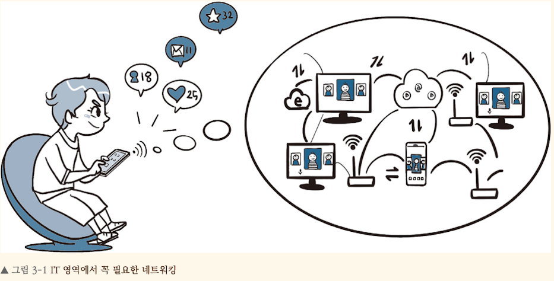
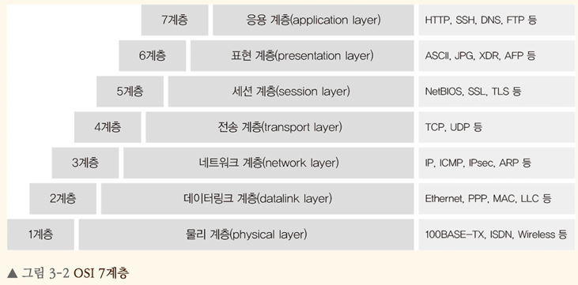

<!-- Date: 2025-01-18 -->
<!-- Update Date: 2025-01-19 -->
<!-- File ID: 85e38f71-a08b-4acb-967b-8f052e4603e5 -->
<!-- Author: Seoyeon Jang -->

# 네트워킹 정의

IT에서는 IT자원 간 연결하여 통신하는 환경을 의미한다. 어떤 IT 서비스를 제공하고자 한다면, 그 전에 먼저 다양한 IT 자원이 통신할 수 있는 네트워킹 환경이 구성되어야 한다.

인터넷을 이용하여 어떤 IT 서비스를 받는 것은 네트워킹을 통해 자연스럽게 이루어지는 과정이기 때문에 우리는 그 과정을 쉽게 인지하기 어렵다. 실제 네트워킹을 수행한다는 것은 굉장히 다양한 요소가 유기적으로 연결되고
복잡한 과정을 거치는 것이다. 이번 메모에서는 AWS 클라우드 네트워킹을 이해하는 데 필요한 주요 네트워킹 요소들을 알아볼 것이다.


# 네트워킹 요소

IT 자원들이 통신할 때는 다양한 네트워킹 요소 간에 복잡한 과정을 거친다. 이런 복잡한 과정을 좀 더 쉽게 이해할 수 있도록 계층별로 분류하는 모델이 여러 개 있다. 그 중 대표적인 모델은 국제표준화기구(ISO)
에서 개발한 OSI 7계층 모델로, 네트워킹 통신 구조를 계층 일곱개로 분류하는 방식이다.



- 1계층 - 물리계층: 네트워크 하드웨어 전송 기술을 이루는 계층으로, 물리적으로 연결된 매체가 서로 데이터를 송수신할 수 있게 연결하고 유지하는 역할을 한다.
- 2계층 - 데이터링크 계층: 물리 계층에서 송수신되는 정보의 오류와 흐름을 제어한다.
- 3계층 - 네트워크 계층: 데이터를 목적지까지 전달하는 계층으로, 최적의 통신 경로를 찾는다.
- 4계층 - 종단의 대상 간에 데이터 전송을 다루는 계층으로, 데이터 전송의 유효성과 효율성을 보장한다.
- 5계층 - 세션 계층: 종단의 대상 간 응용 프로세스 통신을 관리하는 방법으로, 데이터 통신을 위한 논리적인 연결을 담당한다.
- 6계층 - 표현 계층: 데이터 형식에 차이가 있을 때 데이터를 서로 이해할 수 있는 형태로 변환하는 역할을 한다.
- 7계층 - 응용 계층: 응용 프로세스와 직접 연계하여 실제 응용 프로그램을 서비스하는 역할을 한다.

이와 같이 OSI 7계층으로 네트워킹 요소들이 유기적으로 동작하고 있으며, 이 장을 위해 반드시 알아 두어야 할 네트워킹 요소를 살펴보자.

## IP 주소와 서브넷

### IP 주소

IP(Internet Protocol)주소는 인터넷 상에서 IT 자원을 식별하는 고유한 주소이다. IP 버전에는 IPv4와 IPv6가 두가지가 있으며 일반적으로 IPv4를 더 많이 사용한다. IPv4는 10진수(0~
255) 또는 2진수(0~1) 네자리로 되어있으며, 각 자리는 . 으로 구분해서 표현한다.

예를 들어 192.168.100.1 과 같은 형태나 11000000.10101000.01100100.00000001 과 같은 형태로 표현되며, 보통 전자처러 10진수 4자리로 표현한다. 이 책에서는 특별한 언급이
없는 한 IP주소는 IPv4로 정의한다.

> NOTE
>
> IPv4는 가용 범위가 부족하고 효율성이 떨어진다는 단점이 있다. 이를 개선하기 위해 가용범위가 큰 IPv6를 개발하여 점차 활용하는 추세이지만, 여전히 IPv4를 더 많이 사용한다. IPv4의 가용범위가 부족한
> 것을 보완하고자 여러 네트워킹 기법(NAT, 서브넷팅, 프라이빗 IP 등)을 활용하고 있다.

### 퍼블릭 IP주소와 프라이빗 IP주소

IP주소는 통신 용도에 따라 퍼블릭IP주소와 프라이빗IP주소로 분류된다. 퍼블릭 IP주소는 실제 인터넷에서 사용하려고 인터넷 서비스 공굽자(ISP)에서 제공하는 유일한 공인 IP주소이다. 반면 프라이빗 IP주소는
인터넷이 아닌 독립된 네트워크 내부에서만 사용하려고 네트워크 관리자가 제공하는 사설 IP주소이다.

프라이빗 IP주소는 세가지 클래스로 범위가 정해져있다.

```text
- 클래스 A: 10.0.0.0 ~ 10.255.255.255
- 클래스 B: 172.16..0.0 ~ 172.31.255.255
- 클래스 C: 192.168.0.0 ~ 192.168.255.255
```

### 고정 IP와 유동 IP주소

IP주소는 할당하는 방식에 따라 고정 IP주소와 유동 IP주소로 분류된다. 고정 IP주소는 네트워크 관리자가 수동으로 할당하는 방식이며, 유동 IP주소는 특정 서버가 IP주소 범위에 따라 동적으로 할당하는 방식이다.

유동 IP주소는 DHCP(Dynamic Host Configuration Protocol)프로토콜을 통해 주소를 제공한느 서버와 주소를 할당받는 클라이언트로 구성되며, IP주소를 임대(lease)하는 형태를 취한다.

DHCP프로토콜은 DHCP서버와 DHCP클라이언트 관계에 따라 동적으로 IP주소를 할당한다. 크게 네가지 메시지로 동적인 IP주소를 할당한다.

```text
- DHCP Discover: DHCP클라이언트에서 DHCP서버를 찾는 메시지
- DHCP Offer: DHCP 서버에서 할당할 IP주소와 임대 시간을 알리는 메시지
- DHCP Request: DHCP 클라이언트에서 DHCP 서버로 할당받을 IP주소를 요청하는 메시지
- DHCP Ack: DHCP서버에서 최종적으로 할당할 IP주소 승인을 알리는 메시지
```

```text
- DHCP Discover: 스마트폰(클라이언트)이 네트워크에 연결될 때 "내게 IP 주소를 줄 서버가 있나요?"라고 묻습니다.
- DHCP Offer: 공유기가 "이 IP 주소를 쓸래?"라고 응답합니다.
- DHCP Request: 스마트폰이 "네, 이 IP 주소를 쓸게요."라고 요청합니다.
- DHCP Ack: 공유기가 "좋아, 그 IP 주소를 네 것으로 승인할게."라고 확인합니다.
```

# 정리


