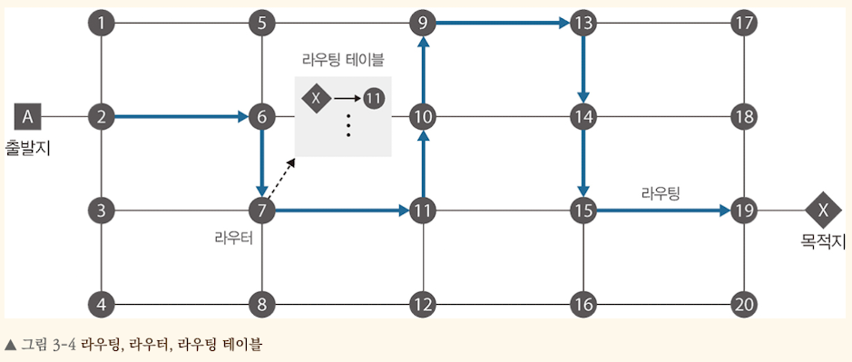

<!-- Date: 2025-01-19 -->
<!-- Update Date: 2025-01-19 -->
<!-- File ID: 0500ab0f-94be-4126-aa05-a96fec674a47 -->
<!-- Author: Seoyeon Jang -->

# 개요
라우팅(routing)은 네트워킹 통신을 수행할 때 목적지 경로를 선택하는 작업을 의미하며, 이를 수행하는 장비를 라우터(router)라고 한다. 이런 라우터는 라우팅 테이블이라는 서브넷의 경로 리스트를 가지고 목적지 네트워크에 대한 최적 경로를 선택해서 전달하는 역할을 한다. 다양한 서브넷이 서로 연결된 복잡한 네트워크 환경에서 라우팅을 통해 최적 경로를 찾아 통신한다.

# 정리

