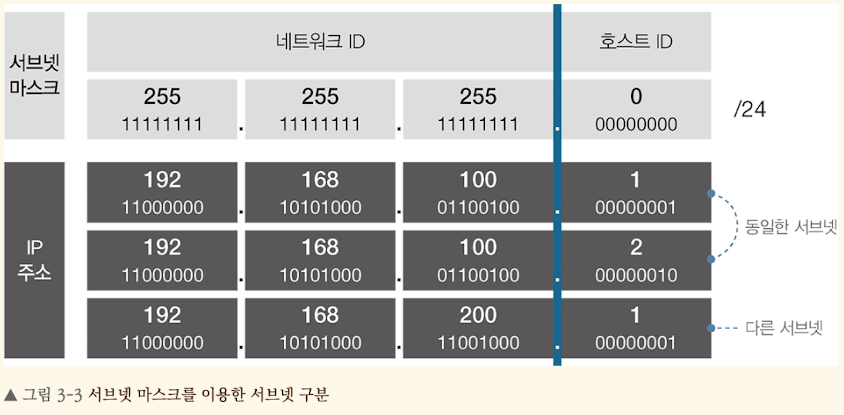

<!-- Date: 2025-01-19 -->
<!-- Update Date: 2025-01-19 -->
<!-- File ID: 7326bf10-e584-4d81-b381-9e2992c03a83 -->
<!-- Author: Seoyeon Jang -->

# 개요

모든 네트워크는 하나의 네트워크로만 구성되어있지 않다. 주체와 목적에 따라 부분 네트워크로 나뉘고, 서로 연결하여 거대한 네트워크 환경을 이루고 있다. 여기서 서브넷은 부분 네트워크를 의미하며, 다양한 서브넷이
연결되어 거대한 네트워크 환경을 이루고 있다고 이해하면 된다. 그렇다면 부분 네트워크인 서브넷은 어떻게 구분하고 식별할 수 있을까? 이때 사용하는 것이 서브넷 마스크이다.

서브넷 마스크는 IP주소와 동일한 32비트 구조에 네트워크 ID와 호스트 ID로 구성되어 있다. 네트워크 ID는 서브넷을 구분하는 기준값이고, 호스트 ID는 동일 서브넷 내에서 대상을 구분하는 기준값이다.

서브넷 마스크 구조를 좀 더 살펴보면 32비트로, 32개의 2진수값 중 1은 네트워크 ID영역이며 0은 호스트 ID 영역이다. 참고로 네트워크 ID영역(2진수값이 1)이 먼저 나열되며, 이후 호스트 ID영역이 연속적으로 나열된다.

동일한 서브넷이라면 IP주소의 네트워크 ID영역 값은 동일하고 호스트 ID영역 값은 서로 다르다. 반대로 다른 서브넷이라면 IP주소에서 네트워크 ID영역 값은 서로 다르다.

서브넷 마스크 표현법은 다음 세가지 형태로 표현할 수 있다.

- 10진수 4자리: **255.255.255.0**
- 2진수 32자리: **11111111.11111111.11111111.00000000**
- /네트워크ID비트수: **/24**

이 중에서 네트워크ID비트수로 형태로 표현하는 방식(10.1.1.0/24)을 IP CIDR(Classes Inter Domain Routing)표기법이라 한다.
일반적으로 IP CIDR 표기법으로 서브넷 마스크를 표현한다.

# 정리

