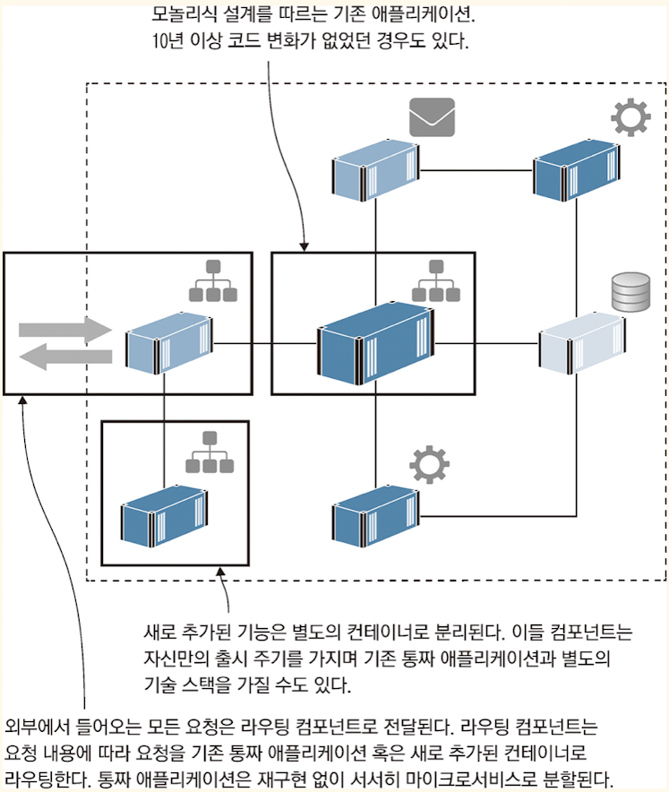

<!-- Date: 2025-01-25 -->
<!-- Update Date: 2025-01-25 -->
<!-- File ID: 0e608a7f-f758-4238-9c80-c78b519c3cec -->
<!-- Author: Seoyeon Jang -->

- 기존 레거시 애플리케이션을 컨테이너로 이주하는 절차와 요령
- 레거시 애플리케이션을 어떻게든 컨테이너로 이주해왔다면, 컨테이너 환경의 장점을 온전히 누리자
- 도커 스웜은 컨테이너 오케스트레이션을 가능하게 한다
- 도커에서 실행할 수 있도록 애플리케이션을 패키징하는 방법
- 윈도, 리눅스, x86, ARM 등 서로 다른 아키텍쳐와 플랫폼에서 동작할 수 있는 도커 이미지를 빌드하는 방법
    - 이러한 이식성은 도커의 핵심적인 특징으로, 앞으로 더욱 싸고 효율이 개선된 ARM 프로세서가 클라우드 환경에 널리 도입되면 점점 더 중요해질 것이다
- **레거시 시스템의 이주 과정과 최적화 방법**
- 도커는 **컨테이너라는 경량 단위로 애플리케이션을 실행하는 기능을 제공하는 플랫폼이다.**

## 컨테이너가 IT 세상을 점령한 이유

컨테이너로 애플리케이션을 이주하려면? 우선 기존 설치 절차를 Dockerfile 이라는 스크립트로 재작성해야 하고, 배포 관련 사항 역시 도커 컴포즈나 쿠버네티스에서 사용되는 애플리케이션 매니페스트로 재작성해야
한다. 코드를 수정할 필요는 없다. 컨테이너화된 애플리케이션은 업무용 노트북과 클라우드까지 어떤 환경에서든 기존과 동일한 기술 스택에서 그대로 동작한다.

## 레거시 애플리케이션 현대화하기

컨테이너를 활용하면 거의 모든 애플리케이션을 클라우드에서 실행할 수 있다. 그러나 기존 애플리케이션의 구조를 낡은 모놀리식 설계로 방치한다면 도커 혹은 클라우드 플랫폼의 진가가 발휘되기 어렵다. 물론 모놀리식 설계를
가진 애플리케이션도 컨테이너에서 동작하는 데 문제가 없지만, **기민성에는 제약이 있다.** 컨테이너 환경에서는 30초면 새 기능을 단계적으로 자동 배포할 수 있지만, 이 새 기능이 모놀리식 설계를 가진 200만줄
코드의 일부분이라면 이야기가 조금 달라진다. 이 상태에서 새 기능을 출시하려면 기존 기능이 망가지지 않았는지 확인하는 회귀 테스트에만 적어도 2주가 걸릴 것이다.

도커로 이주하는 과정은 애플리케이션의 낡은 설계를 탈바꿈하는 첫걸음이다. 애플리케이션을 전면적으로 재구현하지 않고도 새로운 패턴을 도입할 수 있다. 방법은 간단하다. 우선 책에 나오는 대로 Dockerfile
스크립트와 도커 컴포즈 문법을 따라 애플리케이션을 **단일 컨테이너로 옮긴다.** 이것만으로 통짜 애플리케이션의 컨테이너 이주가 끝난다.

**컨테이너는 가상 네트워크를 통해 외부에 노출되지 않고 서로 통신할 수 있다.** 다시 말해 이 통짜 애플리케이션을 분할해 기능별로 별도의 컨테이너에 배치할 수 있는 것이다. 결과적으로 통짜 애플리케이션이 여러
개의 컨테이너로 분할된 분산 애플리케이션으로 거듭나게 된다.

위는 모놀리식 설계를 가진 통짜 애플리케이션을 재구현 없이 분산 애플리케이션으로 재편하는 과정이다. 각 컴포넌트는 도커 컨테이너에서 실행되며, 라우팅 컴포넌트가 요청 처리를 기존 통짜 애플리케이션에 맡길지, 아니면
새로운 마이크로서비스 설계를 따르는 컴포넌트에 맡길지 결정한다.

이렇게 새로운 설계로 거듭난 애플리케이션은 마이크로서비스 아키텍처의 다양한 장점을 누릴 수 있는데, 이를테면 핵심 기능을 작고 독립된 단위로 만들어 따로따로 다루면서 변경 내용을 빠르게 테스트할 수 있다.
애플리케이션 전체를 변경한 것이 아니라 해당 기능이 포함된 컨테이너만을 변경했기 때문이다. 그리고 해당 기능의 확장성을 조절할 수도 있고, 필요에 맞는 적절한 기술 기반을 선택할 수도 있다.

도커를 도입하면 레거시 애플리케이션의 설계를 쉽게 현대화할 수 있다. 20장과 21장에 걸쳐 이 과정을 배울 것이다. 1년이상 재구현에 매달리지 않고도 애플리케이션을 좀 더 유연하고 탄력적이며 기민하게 만들 수
있다. 더구나 이 과정을 **점진적으로 진행하면서 말이다.**

## 클라우드_환경에_적합한_새로운_애플리케이션_개발하기

각 컴포넌트는 자신만의 데이터를 가지며 API를 통해 이 데이터를 외부에 제공한다. 프론트엔드는 이들 API 서비스를 이용하는 웹 애플리케이션 형태다. 다음 데모 애플리케이션은 여러 프로그래밍 언어로 구현됐으며,
서로 다른 데이터베이스 기술을 사용한다. 반면 모든 컴포넌트는 공통적으로 **Dockerfile을 통해 패키징되며 도커 컴포즈 파일 형태로 전체 애플리케이션이 정의된다.**

# 정리

이 책의 목표는 도커의 사용법을 배우는 것이다. 그런만큼 도커의 내부 동작에 대해 자세히 다루지는 않는다. containerd나 리눅스의 cgroups 혹은 namespaces, 윈도의 HCS가 저수준에서 어떻게
동작하는지 세부사항을 알고싶다면 도커인액션을 보자.

운영 환경의 배포를 위해 도커에 내장된 클러스터 기술인 도커스웜을 배우고, 또 쿠버네티스를 다룬다. 도커 스웜과 쿠버네티스를 각각 어떤 경우에 사용하는지도 설명한다. 하지만 쿠버네티스도 결국 도커든 뭐든 *
*컨테이너를 운영하기 위한 한가지 수단일 뿐이다.**

