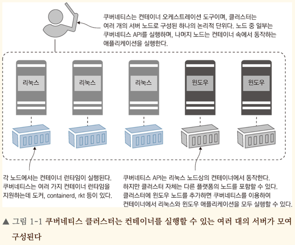
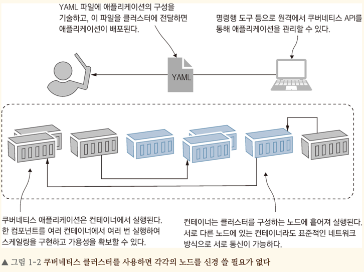
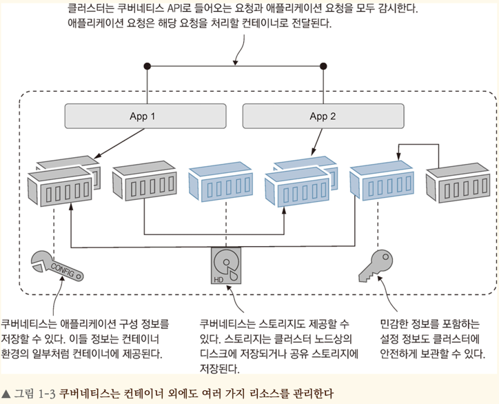
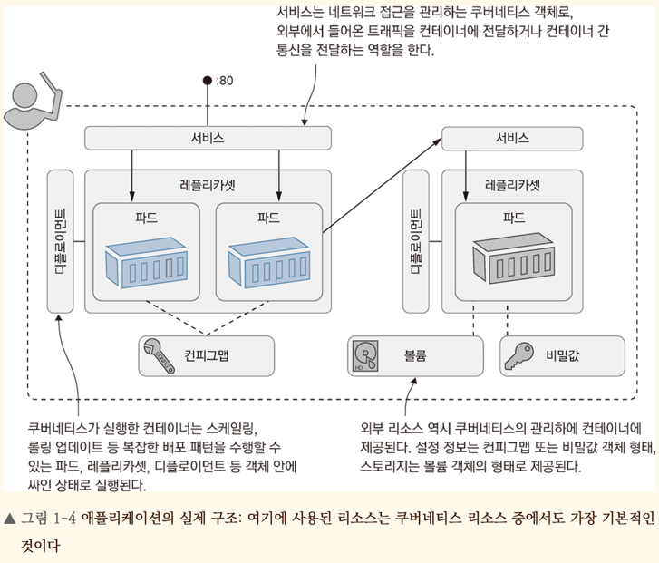

<!-- Date: 2025-01-01 -->
<!-- Update Date: 2025-01-14 -->
<!-- File ID: d2d79ec0-ec35-4a43-ae1f-13378ad10ce0 -->
<!-- Author: Seoyeon Jang -->

# 개요

쿠버네티스가 정확히 무엇이며 어떤 문제를 해결하는 도구인지 알아보자.

쿠버네티스는 **컨테이너를 실행하는 플랫폼**이다. 컨테이너화된 애플리케이션의 시작, 롤링 업데이트, 서비스 수준 유지, 수요에 따른 스케일링, 보안 접근 등 다양한 기능을 제공한다. 쿠버네티스의 두 가지 핵심
개념은 애플리케이션 정의에 사용되는 API와 애플리케이션이 실제로 동작하는 클러스터다. **클러스터**는 도커 같은 컨테이너 런타임이 동작하는 여러 대의 서버가 모여 쿠버네티스 같은 하나의 논리적 단위를 구성한 것을
의미한다. 다음 그림은 클러스터를 추상적으로 나타낸다.

쿠버네티스 클러스터는 컨테이너를 실행할 수 있는 여러 대의 서버가 모여 구성된다. **클러스터 관리자**는 노드(node)라고 하는 각각의 서버를 관리한다. 클러스터의 처리 용량을 확장하기 위해 노드를 추가하거나,
노드를 서비스에서 제외하거나, 클러스터 내 노드를 차례로 업데이트하는 롤링 업데이트를 적용할 수 있다. 마이크로소프트 애저 쿠버네티스(Azure Kubernetes Service, AKS)나 아마존 엘라스틱
쿠버네티스 서비스(Elastic Kubernetes Service, EKS) 같은 매니지드 서비스에서는 웹 인터페이스나 명령행으로 이런 기능을 편리하게 사용할 수 있도록 제공한다. 또한 일반적인 사용에서는 각각의
노드를 신경쓸 필요 없이 전체 클러스터를 하나의 대상처럼 다룰 수 있다.

쿠버네티스 클러스터의 목적은 애플리케이션을 실행하는 것이다. YAML파일에 애플리케이션을 기술하고 이 파일을 쿠버네티스 API에 전달하면, 쿠버네티스가 파일에 구성된 애플리케이션 구성을 이해하고 클러스터 현재 상태와
비교한다. 파일에 기술된 바람직한 상태와 현재 상태에 차이가 있다면 컨테이너를 추가 또는 제거한다. 컨테이너는 고가용성을 위해 여러 노드에 흩어져있으며, 쿠버네티스가 관리하는 가상 네트워크로 서로 통신할 수 있다.
다음 그림은 배포 절차를 나타낸 다이어그램이다. 이 수준에서는 각각의 노드를 신경쓸 필요가 없기 때문에 다이어그램에도 노드가 표현되어있지 않다.

**애플리케이션 구성을 파일에 기술하기만 하면,** 그 구성을 따라 쿠버네티스가 애플리케이션을 실행하고 관리해준다. 어떤 노드가 고장을 일으키더라도 해당 노드에서 실행되던 컨테이너는 다른 노드에서 실행된 컨테이너로
대체된다. 특정한 컨테이너가 이상을 일으켰다면 쿠버네티스가 해당 컨테이너를 재시작한다. 애플리케이션의 컴포넌트 중 하나가 부하가 높아지면 해당 컴포넌트의 컨테이너를 추가로 실행한다. 도커 이미지와 쿠버네티스 YML
파일만 있으면 모든 쿠버네티스 클러스터에서 동일하게 동작하는 자기 수복형(self-healing)애플리케이션을 만들 수 있다.

쿠버네티스가 관리하는 것은 컨테이너 뿐만이 아니다. 바로 이 점 때문에 쿠버네티스가 완전한 애플리케이션 플랫폼이 될 수 있었다. 클러스터에는 분산 데이터베이스가 들어있다. 이 분산 데이터베이스에는 애플리케이션
구성정보는 물론이고 API 키나 데이터베이스 접속 패스워드 같은 비밀값도 함께 저장할 수 있다. 쿠버네티스는 이들 정보를 자연스럽게 컨테이너에 전달해준다. 클러스터에 정확한 설정이 들어있다면 어떤 환경이라도 동일한
컨테이너 이미지를 사용할 수 있다. 쿠버네티스는 스토리지도 제공한다. 이를 이용하여 컨테이너 외부에 데이터를 저장할 수 있으며 유상태 애플리케이션이라도 고가용성을 확보할 수 있다. 또한 클러스터로 들어오는 트래픽을
관리하며, 각 요청을 해당하는 컨테이너로 전달해주는 기능도 있다. 다음 그림은 쿠버네티스의 주 기능을 제공하는 여러 리소스를 나타낸 다이어그램이다.

컨테이너에서 동작하는 애플리케이션이 어떤 것인지는 중요하지 않다. 왜냐하면 쿠버네티스는 자신이 실행하는 애플리케이션이 어떤 것인지 따지지 않기 때문이다. 클라우드에 적합하게 마이크로서비스 아키텍처로 설계된
애플리케이션을 여러 컨테이너에 걸쳐 실행할 수도 있고, 모놀리식 아키텍처로 설계된 레거시 애플리케이션을 단일 컨테이너로 실행할 수도 있다. 또한 리눅스 애플리케이션 또는 윈도우 애플리케이션일 수도 있는데, 어떤
애플리케이션이든 그 구성을 동일한 API를 사용하는 YML로 기술하면 이들 모두를 하나의 클러스터에서 실행할 수 있다. 쿠버네티스의 가장 큰 장점은 모든 애플리케이션을(모놀리식 아키텍처의 오래된 닷넷 또는 자바
애플리케이션이든, 새로 작성된 Node.js 또는 Go애플리케이션이든 상관없이) 모두 똑같은 방식으로 기술하고 배포하고 관리할 수 있다는 것이다.

애플리케이션을 기술한 YML 파일은 애플리케이션 매니페스트(application manifest)라고 한다. 이런 이름이 붙은 것은 파일 내용이 애플리케이션을 구성하는 모든 컴포넌트 목록이기 때문이다. 그리고
쿠버네티스에서 애플리케이션을 구성하는 컴포넌트를 리소스(resource)라고 하며, 리소스 역시 여러 종류가 있다. 다음은 각 리소스의 종류를 표기한 것이다.

# 정리

