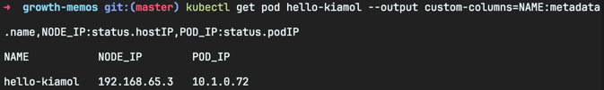
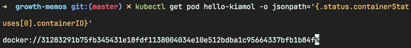
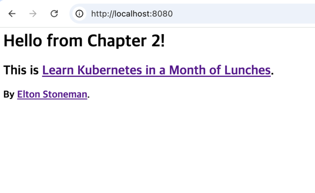

<!-- Date: 2025-01-15 -->
<!-- Update Date: 2025-01-20 -->
<!-- File ID: 2b5011fa-c868-40c7-8652-48a704cab624 -->
<!-- Author: Seoyeon Jang -->

# 개요

쿠버네티스는 컨테이너로 애플리케이션을 실행하지만, 우리는 컨테이너를 직접 다루지 않는다. 모든 컨테이너는 파드(pod)에 속하는데, 파드란 쿠버네티스가 하나 또는 그 이상의 컨테이너를 관리하는 데 사용하는 단위다.
또한 파드는 다른 리소스가 관리하고, 이런 고수준 리소스는 컨테이너의 세부 사항을 추상화시킨다. 이 방법으로 자기수복형 애플리케이션이나 '바람직한 상태(desired-state)' 워크플로가 가능해진다. 쿠버네티스에
우리가 원하는 애플리케이션의 상태를 지시하면 이 상태를 실제로 만들어 내는 것이다.

이 메모에서 **쿠버네티스의 기본 단위**이자, 컨테이너를 실제 실행하는 역할을 담당하는 리소스인 **파드**와 파드의 관리를 담당하는 **디플로이먼트(deployment)** 를 알아보자. 쿠버네티스 명령행 도구와
YML 정의 파일을 사용하여 애플리케이션을 정의하고 관리해볼 것이다.

## 쿠버네티스는 어떻게 컨테이너를 실행하고 관리하는가

컨테이너는 일반적으로 애플리케이션 구성 요소 하나를 실행하는 가상화된 환경을 가리킨다. 쿠버네티스는 이 컨테이너를 또 다른 가상환경인 파드로 감싼다. 파드는 컴퓨팅의 단위로, 클러스터를 이루는 노드 중 하나에서
실행된다. 파드는 쿠버네티스로 관리되는 자신만의 가상 IP 주소를 가지며 이 주소로 가상 네트워크에 접속된 다른 파드, 심지어 다른 노드에서 실행되는 파드라도 통신을 주고 받을 수 있다.

파드 하나는 대개 컨테이너 하나를 포함하는데, 설정에 따라 파드 하나가 여러 개의 컨테이너를 포함할 수도 있다. 파드에 포함된 모든 컨테이너는 같은 가상환경에 포함된다. 따라서 네트워크를 공유하며 localhost
로 서로 통신할 수도 있다.


컨테이너는 파드에 포함되어 동작하는데 우리는 파드를 사용해서 컨테이너를 관리한다.

그런데, 왜 컨테이너를 직접 다루지 않고 파드를 거치도록 했을까? 물론 여러 개의 컨테이너를 포함하는 파드라면 이해가 가지만...

파드를 직접 실행해보고 추상화된 컨테이너가 어떤 것인지 살펴보자.

> 실습: 간단한 파드라면 YML 파일을 정의하지 않아도 쿠버네티스 명령행에서 직접 실행할 수 있다. 명령어 문법은 도커에서 컨테이너를 실행할 때와 비슷하게 컨테이너 이미지와 파드의 동작을 결정할 파라미터를
> 열거해주면 된다.

```shell
# 컨테이너 하나를 담은 파드를 실행한다
$ kubectl run hello-kiamol --image=kiamol/ch02-hello-kiamol

# 파드가 준비 상태가 될 때까지 기다린다
$ kubectl wait --for=condition=Ready pod hello-kiamol

# 클러스터에 있는 모든 파드의 목록을 출력한다
$ kubectl get pods

# 파드의 상세 정보를 확인한다
$ kubectl describe pod hello-kiamol
```


클러스터에서 하나의 컨테이너를 실행했다. 그리고 이 컨테이너는 파드 안에 들어있는 상태다. 도커를 사용해보았다면 익숙한 과정이다. 또한 파드도 그렇게 어렵게 느껴지지 않는다. 대부분의 파드는 (고급 옵션을 건드리지
않았다면) 하나의 컨테이너만 실행한다. 따라서 파드를 '쿠버네티스가 컨테이너를 실행하는 수단'으로 생각해도 크게 틀리지 않는다.

쿠버네티스가 직접 컨테이너를 실행하지는 않는다. 컨테이너를 생성할 책임을 해당 노드에 설치된 `컨테이너 런타임`에 맡기는 형태다. 이 `컨테이너 런타임`은 도커가 될 수도 있고, 그 외에 더 특이한 것이 될 수도
있다. 파드가 컨테이너를 추상화시킨 이유가 여기에 있다. 파드는 쿠버네티스가 관리하는 리소스고, 컨테이너는 외부에서 관리된다. kubectl을 사용하여 파드에서 다음 정보를 확인해보면 이를 쉽게 이해할 수 있다.

> 실습: kubectl의 `get pod` 명령을 사용하여 파드에 대한 기본적인 정보를 확인할 수 있었다. 여기에 출력 파라미터를 추가로 지정하면 더 자세한 정보를 볼 수 있다.

```shell
# 파드에 대한 기본적인 정보를 확인한다
$ kubectl get pod hello-kiamol

# 네트워크 상세 정보 중 특정한 항목을 따로 지정해서 출력한다
$ kubectl get pod hello-kiamol --output custom-columns=NAME:metadata.name,NODE_IP:status.hostIP,POD_IP:status.podIP

# JSONPath 로 복잡한 출력을 구성한다
# 파드의 첫번째 컨테이너의 컨테이너 식별자만 출력한다
$ kubectl get pod hello-kiamol -o jsonpath='{.status.containerStatuses[0].containerID}'
```


위 명령에서 출력된 NODE_IP는 나의 도커데스크톱의 리눅스 가상머신의 IP주소고, POD_IP는 클러스터 속 **파드의 가상 IP**주소이다.


위 명령에서 출력된 컨테이너 식별자 앞에는 컨테이너 런타임의 이름이 붙는다. 도커로 실행된 컨테이너이므로 docker 가 붙었다.

정리해보자면, 컨테이너를 직접 실행하는 것은 쿠버네티스가 아니라는 점을 기억하고 있어야 한다. 파드에서 볼 수 있는 컨테이너 식별자는 컨테이너가 실제 실행되는 다른 시스템을 가리키는 참조일 뿐이다.

파드는 파드를 생성할 때 한 노드에 배정된다. 그리고 이 파드를 관리하고 파드에 포함된 컨테이너를 실행하는 책임도 **이 노드가 맡는다.** 이 과정은 컨테이너 런타임 인터페이스(CRI, Container
Runtime Interface)라는 공통 API를 이용하여 컨테이너 런타임과 연동하는 형태로 진행된다. CRI를 사용하면 해당 노드가 어떤 컨테이너 런타임을 실행중이더라도!!! 같은 방식으로 노드를 관리할 수
있다. 즉 컨테이너 생성과 삭제, 컨테이너 정보 확인 기능이 **표준 API로 제공되는 것이다.** 파드 실행 중에는 노드가 컨테이너 런타임과 연동하며, 파드에 필요한 모든 컨테이너가 갖추어져있는지 확인한다.

> 실습: 모든 쿠버네티스 환경은 컨테이너 관리를 위해 동일한 CRI를 사용한다. 그러나 컨테이너 런타임 중에는 쿠버네티스 외부에서 컨테이너에 접근을 허용하지 않는 것도 있다. 따라서 이번 실습은 컨테이너 런타임이
> 도커여야 한다. **쿠버네티스의 파드로 실행된 컨테이너를 컨테이너 런타임이 어떻게 유지하는지 확인해보자.**

```shell
# 파드에 포함된 컨테이너 찾기
$ docker container ls -q --filter label=io.kubernetes.container.name=hello-kiamol

# 해당 컨테이너 삭제하기
$ docker container rm -f $(docker container ls -q --filter label=io.kubernetes.container.name=hello-kiamol)

# 파드 상태 확인
$ kubectl get pod hello-kiamol

# 컨테이너 다시 찾아보기
$ docker container ls -q --filter label=io.kubernetes.container.name=hello-kiamol
```

이렇게 도커를 통해 파드에 들어있던 컨테이너를 확인한 후 쿠버네티스가 어떻게 반응했는지 알 수 있다. 파드의 컨테이너 개수가 0이 되자마자 쿠버네티스가 즉각적으로 대체 컨테이너를 생성하여 파드를 복원했다.

쿠버네티스가 이런 문제를 해결할 수 있는 이유는 **컨테이너를 파드로 추상화했기 때문이다.**
이상을 일으킨 컨테이너는 일시적인 문제일 뿐이며, **파드는 그대로 있으므로, 새로운 컨테이너를 추가하여 파드 상태를 복원하면 된다.** 이것이 바로 쿠버네티스가 제공하는 자기수복성의 첫번째 단계다. 파드 위로 더
쌓일 추상화를 통해 애플리케이션은 이 이상의 복원력을 가질 수 있다.

쿠버네티스는 컨테이너를 만들 때 파드 이름을 컨테이너 레이블에 포함했기 때문에 도커에서 파드에 포함된 컨테이너를 찾아낼 수 있는 것이다.

쿠버네티스는 파드에 필요한 컨테이너 개수를 유지해준다.

파드 위로 얹히는 또 다른 추상화 중 하나가 바로 **디플로이먼트**다.

다음절로 넘어가기 전에, 이 파드에서 실행한 애플리케이션이 무엇인지 알아보자. 이 애플리케이션은 웹 애플리케이션이다. 하지만 아직은 쿠버네티스에서 네트워크 트래픽을 파드로 전달하도록 설정하지 않았기 때문에 실행중인
애플리케이션에 접근할 수 없다. kubectl 의 다른 기능을 사용해 애플리케이션에 접근할 수 있도록 해보자.

> 실습: kubectl 에는 네트워크 트래픽을 노드에서 파드로 전달할 수 있는 기능이 있다. 이 기능을 사용하면 간편하게 클러스터 외부에서 파드와 통신할 수 있다. 로컬 컴퓨터(클러스터의 노드에 해당)의 특정
> 포트를 주시하도록 하고 이 포트로 들어오는 트래픽을 파드로 전달한다.

```shell
# 로컬 컴퓨터의 8080번 포트를 주시하다가 이 포트로 들어오는
# 트래픽을 파드의 80번 포트로 전달한다.
$ kubectl port-forward pod/hello-kiamol 8080:80
# 이제 웹브라우저에서 https://localhost:8080 에 접근한다
# 확인이 끝나면 ctrl-c 를 눌러 포트포워딩을 중단한다
```

kubectl에는 포트포워딩 설정 기능이 있다. 로컬 컴퓨터의 특정 포트를 클러스터 안 파드로 전달하는 기능이다.


웹 서버 및 웹 페이지 컨텐츠는 도커 허브에 공개된 컨테이너 이미지에 포함되어 있다. CRI를 준수하는 컨테이너 런타임은 모두 도커허브에서 이미지를 내려받을 수 있다. 그러므로 **어떤 쿠버네티스 런타임을 사용하든,
이 애플리케이션은 동일하게 동작할 것이다.**

파드는 쿠버네티스에서 컴퓨팅의 최소 단위다. 하지만 파드는 **원시 타입 리소스이므로 일반적으로 파드를 직접 실행할 일은 없다. 대개는 파드를 관리할 컨트롤러 객체를 따로 만들게 된다.**

# 정리


