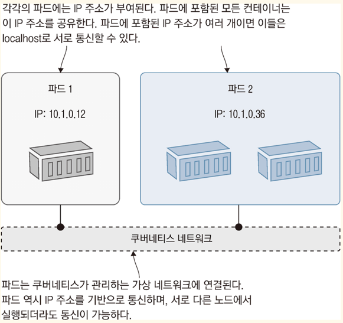
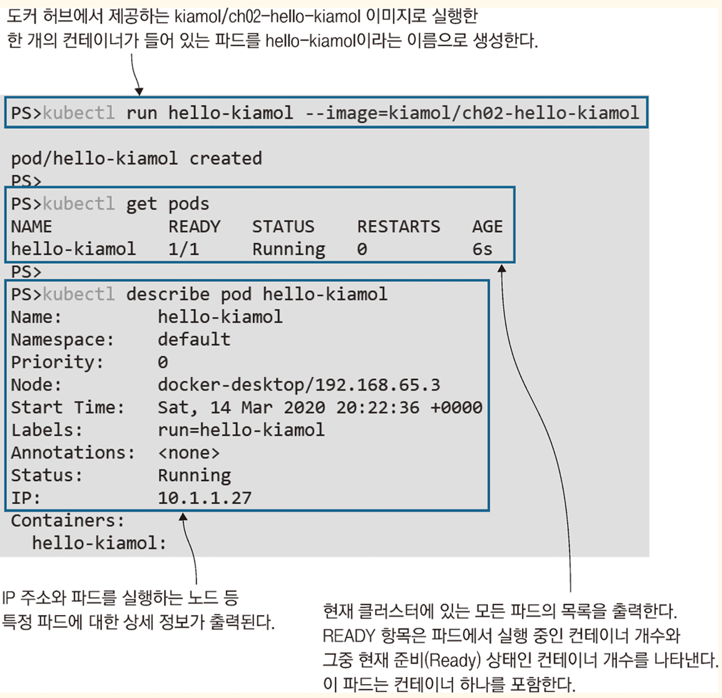

<!-- Date: 2025-01-15 -->
<!-- Update Date: 2025-01-15 -->
<!-- File ID: 2b5011fa-c868-40c7-8652-48a704cab624 -->
<!-- Author: Seoyeon Jang -->

# 개요

쿠버네티스는 컨테이너로 애플리케이션을 실행하지만, 우리는 컨테이너를 직접 다루지 않는다. 모든 컨테이너는 파드(pod)에 속하는데, 파드란 쿠버네티스가 하나 또는 그 이상의 컨테이너를 관리하는 데 사용하는 단위다.
또한 파드는 다른 리소스가 관리하고, 이런 고수준 리소스는 컨테이너의 세부 사항을 추상화시킨다. 이 방법으로 자기수복형 애플리케이션이나 '바람직한 상태(desired-state)' 워크플로가 가능해진다. 쿠버네티스에
우리가 원하는 애플리케이션의 상태를 지시하면 이 상태를 실제로 만들어 내는 것이다.

이 메모에서 **쿠버네티스의 기본 단위**이자, 컨테이너를 실제 실행하는 역할을 담당하는 리소스인 **파드**와 파드의 관리를 담당하는 **디플로이먼트(deployment)** 를 알아보자. 쿠버네티스 명령행 도구와
YML 정의 파일을 사용하여 애플리케이션을 정의하고 관리해볼 것이다.

## 쿠버네티스는 어떻게 컨테이너를 실행하고 관리하는가

컨테이너는 일반적으로 애플리케이션 구성 요소 하나를 실행하는 가상화된 환경을 가리킨다. 쿠버네티스는 이 컨테이너를 또 다른 가상환경인 파드로 감싼다. 파드는 컴퓨팅의 단위로, 클러스터를 이루는 노드 중 하나에서
실행된다. 파드는 쿠버네티스로 관리되는 자신만의 가상 IP 주소를 가지며 이 주소로 가상 네트워크에 접속된 다른 파드, 심지어 다른 노드에서 실행되는 파드라도 통신을 주고 받을 수 있다.

파드 하나는 대개 컨테이너 하나를 포함하는데, 설정에 따라 파드 하나가 여러 개의 컨테이너를 포함할 수도 있다. 파드에 포함된 모든 컨테이너는 같은 가상환경에 포함된다. 따라서 네트워크를 공유하며 localhost
로 서로 통신할 수도 있다.



컨테이너는 파드에 포함되어 동작하는데 우리는 파드를 사용해서 컨테이너를 관리한다.

그런데, 왜 컨테이너를 직접 다루지 않고 파드를 거치도록 했을까? 물론 여러 개의 컨테이너를 포함하는 파드라면 이해가 가지만...

파드를 직접 실행해보고 추상화된 컨테이너가 어떤 것인지 살펴보자.

> 실습: 간단한 파드라면 YML 파일을 정의하지 않아도 쿠버네티스 명령행에서 직접 실행할 수 있다. 명령어 문법은 도커에서 컨테이너를 실행할 때와 비슷하게 컨테이너 이미지와 파드의 동작을 결정할 파라미터를
> 열거해주면 된다.

```shell
# 컨테이너 하나를 담은 파드를 실행한다
$ kubectl run hello-kiamol --image=kiamol/ch02-hello-kiamol

# 파드가 준비 상태가 될 때까지 기다린다
$ kubectl wait --for=condition=Ready pod hello-kiamol

# 클러스터에 있는 모든 파드의 목록을 출력한다
$ kubectl get pods

# 파드의 상세 정보를 확인한다
$ kubectl describe pod hello-kiamol
```



클러스터에서 하나의 컨테이너를 실행했다. 그리고 이 컨테이너는 파드 안에 들어있는 상태다. 도커를 사용해보았다면 익숙한 과정이다. 또한 파드도 그렇게 어렵게 느껴지지 않는다. 대부분의 파드는 (고급 옵션을 건드리지
않았다면) 하나의 컨테이너만 실행한다. 따라서 파드를 '쿠버네티스가 컨테이너를 실행하는 수단'으로 생각해도 크게 틀리지 않는다.

쿠버네티스가 직접 컨테이너를 실행하지는 않는다. 컨테이너를 생성할 책임을 해당 노드에 설치된 `컨테이너 런타임`에 맡기는 형태다. 이 `컨테이너 런타임`은 도커가 될 수도 있고, 그 외에 더 특이한 것이 될 수도
있다. 파드가 컨테이너를 추상화시킨 이유가 여기에 있다. 파드는 쿠버네티스가 관리하는 리소스고, 컨테이너는 외부에서 관리된다. kubectl을 사용하여 파드에서 다음 정보를 확인해보면 이를 쉽게 이해할 수 있다.

> 실습: kubectl의 `get pod` 명령을 사용하여 파드에 대한 기본적인 정보를 확인할 수 있었다. 여기에 출력 파라미터를 추가로 지정하면 더 자세한 정보를 볼 수 있다.

```shell
# 파드에 대한 기본적인 정보를 확인한다
$ kubectl get pod hello-kiamol

# 네트워크 상세 정보 중 특정한 항목을 따로 지정해서 출력한다
$ kubectl get pod hello-kiamol --output custom-columns=NAME:metadata.name,NODE_IP:status.hostIP,POD_IP:status.podIP

# JSONPath 로 복잡한 출력을 구성한다
# 파드의 첫번째 컨테이너의 컨테이너 식별자만 출력한다
$ kubectl get pod hello-kiamol -o jsonpath='{.status.containerStatuses[0].containerID}'
```


# 정리


