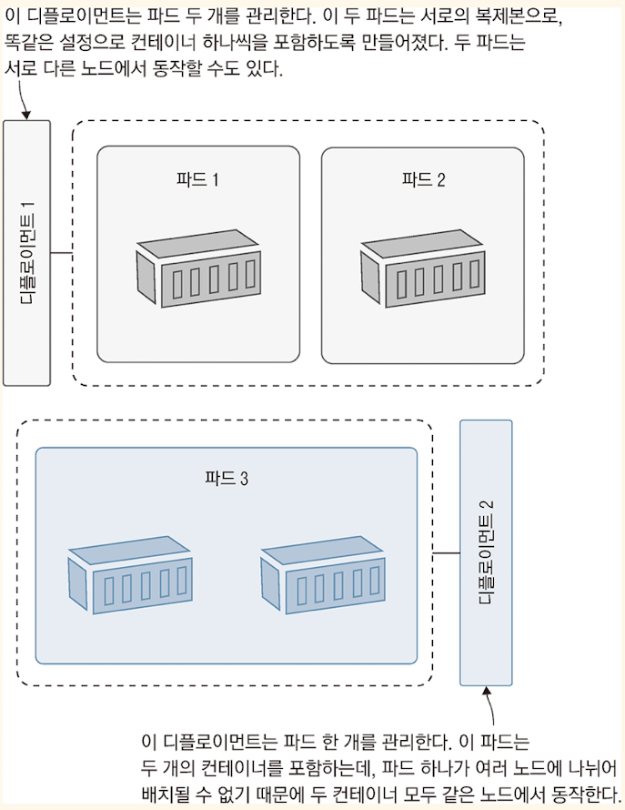

<!-- Date: 2025-01-22 -->
<!-- Update Date: 2025-01-23 -->
<!-- File ID: 31184adf-c840-43ad-b86d-caf7bfeef552 -->
<!-- Author: Seoyeon Jang -->

# 개요

쿠버네티스 객체 중 컨트롤러 객체를 배워보자. 컨트롤러 객체는 다른 객체를 다시 추상화한 것이다. 쿠버네티스가 매우 복잡한 시스템이긴 하지만, 이 복잡성이 바로 강력하고 다양한 설정이 가능한 시스템을 만드는
원동력이다.

**파드는 직접 사용하기에는 너무 단순한 객체다.** 파드는 고립된 한 벌의 애플리케이션이며, 각 파드는 서로 다른 노드에 배정된다. 어떤 노드가 고장을 일으킨다면 파드는 유실되며, 쿠버네티스는 유실된 파드를 새
파드로 대체하지 않는다. 억지로 다른 노드에 실행되도록 사람이 직접 관리해야한다면 오케스트레이션 도구를 사용하는 의미가 없다.

컨트롤러 객체가 바로 이런 불편함을 해결해준다. 컨트롤러(controller)객체는 다른 리소스를 관리하는 쿠버네티스 리소스다. 컨트롤러는 쿠버네티스 API와 연동하며 시스템의 현재 상태를 감시하다가 '바람직한
상태'와 차이가 생기면 필요에 따라 그 차이를 바로잡는다. 쿠버네티스에는 여러 가지 컨트롤러 객체가 있다. 그중에서도 파드를 주로 관리하는 컨트롤러 객체는 바로 **디플로이먼트**이다. 앞서 설명했던 파드의 문제점을
디플로이먼트가 모두 해결해준다. 어떤 노드가 고장을 일으켜 파드가 유실되면, 디플로이먼트가 대체 파드를 다른 노드에 실행한다. 디플로이먼트를 스케일링하고 싶다면 필요한 파드 수를 지정하면 된다. 그러면 디플로이먼트가
여러 노드에 걸쳐 필요한 수만큼 파드를 실행한다.

디플로이먼트는 파드를 관리하고 파드는 컨테이너를 관리한다.



kubectl 을 사용하여 컨테이너를 실행할 이미지와 파드 설정을 지정하면 디플로이먼트를 생성할 수 있다. 쿠버네티스가 디플로이먼트를 생성하면 디플로이먼트가 파드를 생성한다.

> 실습: 조금 전 웹 애플리케이션을 한번 더 실행해보자. 이번에는 디플로이먼트를 사용해서 실행할 것이다.

```shell
$ kubectl create deployment hello-kiamol --image=kiamol/ch02-hello-kiamol
```


kubectl run 으로 띄운 파드는 NAME 뒤에 아무런 문자열이 붙지 않았었는데, 디플로이먼트로 띄운 파드는 이름 뒤에 무작위 문자열이 붙은 형태로 만들어진다.

중요한 점은, 디플로이먼트는 내가 만들었지만 파드를 직접 만든 적은 없다는 것이다. 디플로이먼트는 쿠버네티스 API를 통해 현재 동작중인 리소스가 무엇이 있는지 살펴보고, 자신이 관리해야할 파드가 없다는 사실을
발견한다. 이후 쿠버네티스 API를 통해 자신에게 필요한 파드를 생성한다. 구체적으로 어떤 과정을 거쳤는가는 중요하지 않다. **디플로이먼트만 만들면 우리에게 필요한 파드를 대신 만들어준다는 점이 중요하다.**

하지만 디플로이먼트가 자산이 관리해야할 리소스를 어떻게 추적하는지를 알아둘 필요가 있다. 이런 패턴은 쿠버네티스 전반에서 매우 많이 쓰인다. 모든 쿠버네티스 리소스는 간단히 키-값 쌍 형태의 레이블을 가지며, 이
레이블을 우리가 원하는 데이터를 담는 데 사용할 수 있다. 예를 들어 **디플로이먼트에 release라는 레이블을 추가하고 그 값을 20.04라고 지정한다면, 우리는 나중에 이 디플로이먼트가 배포주기 20.04에
배포된 것임을 알 수 있다.** 또한 레이블은 디플로이먼트와 파드의 관계처럼 객체 간 관계를 표현해서 리소스와 리소스의 느슨한 연결을 만드는 데도 쓰인다.

> 실습: 디플로이먼트는 자신이 관리하는 파드에 레이블을 부여하라. kubectl로 디플로이먼트가 부여한 레이블을 출력하라. 그리고 같은 레이블을 가진 파드 목록도 출력하자.

```shell
# 디플로이먼트가 부여한 파드의 레이블을 출력
$ kubectl get deploy hello-kiamol -o jsonpath='{.spec.template.metadata.labels}'
# {"app":"hello-kiamol"}

# 앞서 출력한 레이블을 가진 파드의 목록을 출력
$ kubectl get pods -l app=hello-kiamol
```

출력된 내용을 보면 컨트롤러 객체가 자신이 관리하는 리소스를 어떤식으로 설정하는지 조금이나마 엿볼수 있다. 디플로이먼트는 템플릿을 적용해서 파드를 생성하는데, 이 템플릿의 일부는 메타데이터 필드로 레이블을 포함한다.
여기에서는 디플로이먼트가 app 이라는 레이블에 hello-kiamol 이라는 값을 달아 파드에 부여했다. 이 레이블이 일치하는 파드를 검색했더니 디플로이먼트가 관리하는 파드를 찾았다.

레이블을 이용하여 리소스 간 관계를 파악하는 것은 쿠버네티스에서 매우 자주 쓰는 중요한 패턴이다. 리소스는 생애주기를 거치며 생성이나 수정, 삭제와 함께 레이블을 부여받는다. 또한 컨트롤러 객체는 레이블 셀렉터를
통해 자신이 관리하는 리소스인지 판단한다.


그림에서 볼 수 있는 것처럼, 컨트롤러 객체는 레이블 셀렉터를 통해 자신이 관리하는 리소스를 식별한다.

컨트롤러가 자신이 관리하는 리소스 목록을 직접 유지하지 않아도, 레이블 셀렉터가 컨트롤러 객체의 정의에 포함되어있기 때문에 컨트롤러 객체가 언제라도 쿠버네티스 API를 통해 자신이 관장하는 리소스를 찾아볼 수 있다는
점에서 매우 유연한 설계다. 하지만 레이블 정보를 함부로 직접 수정하면 이런 리소스 간 관계를 흐트러트릴 수 있기 때문에 주의해야 한다.

> 실습: **디플로이먼트는 파드와 직접적인 관계를 갖지 않는다. 디플로이먼트 입장에서는 레이블 셀렉터와 일치하는 파드가 하나 있기만 하면 된다. 파드의 레이블이 수정된다면 디플로이먼트는 해당 파드를 더 이상
인지하지 못한다.**

```shell
# 모든 파드 이름과 레이블 확인
$ kubectl get pods -o custom-columns=NAME:metadata.name,LABELS:metadata.labels

# 디플로이먼트가 생성한 파드의 'app' 레이블 수정
$ kubectl label pods -l app=hello-kiamol --overwrite app=hello-kiamol-x

# 파드가 또 하나 생성되었다
$ kubectl get pods -o custom-columns=NAME:metadata.name,LABELS:metadata.labels
```


파드의 레이블이 수정되면 파드 자체가 없어지는 것과 같은 효과가 있었다. 디플로이먼트 입장에서는 레이블 셀렉터와 일치하는 파드가 사라졌기 때문에 새로운 파드를 만든 것이다. **디플로이먼트는 자신이 맡은 일을 잘
처리했지만, 파드를 직접 수정하면서 관리를 벗어난 파드가 생겼다...**

이 방법은 디버깅🕷️에 유용하다. 원하는 파드를 컨트롤러 객체의 관리에서 제외하고 직접 접속해서 문제가 무엇인지 확인할 수 있기 때문이다. 컨트롤러 객체는 사라진 파드를 대신하여 대체 파드를 생성할 테고,
애플리케이션은 성능의 손실 없이 계속 동작할 수 있다. 이와 반대 방법도 가능하다. 컨트롤러 객체가 만들지 않은 파드의 레이블을 수정하여 마치 원래 컨트롤러 객체의 관리하에 있었던 것처럼 속이는 방법이다.

> 실습: 본래 있엇던 파드의 레이블을 원래대로 수정하여 디플로이먼트의 관리 아래로 되돌려 놓아라.

```shell
$ kubectl label pods -l app=hello-kiamol-x --overwrite app=hello-kiamol

# 파드의 목록을 다시한번 확인
$ kubectl get pods custom-columns=NAME:medatadata.name,LABELS=metadata.labels
```

수정했던 레이블을 원래대로 되돌려놓으니 다시 디플로이먼트의 관리 아래로 돌아갈 것이다. 디플로이먼트는 쿠버네티스 API를 통해 레이블 셀렉터와 일치하는 파드 수가 두개가 된 것을 깨닫는다. 자신의 정의상 파드를
하나만 유지하면 되므로 그중 하나(삭제 규칙에 따라 결정된 쪽)를 삭제한다.

레이블을 강제로 수정해서 디플로이먼트가 관리하지 않았던 파드를 관리 아래로 추가할 수 있다.

파드는 컨테이너를 실행한다. 하지만 파드 역시 컨테이너와 마찬가지로 생애 주기가 짧다. 대개는 디플로이먼트 같은 고수준 리소스를 이용하여 파드 관리를 맡긴다. 컨테이너와 노드에 문제가 생기더라도 이런 방법을 사용하여
애플리케이션 가용성을 확보할 수 있다.

> 실습: kubectl 의 port-forward 명령을 사용하면 네트워크 트래픽을 파드로 전달할 수 있다. 하지만 디플로이먼트가 가진 파드의 무작위 문자열 이름을 찾을 필요는 없다. 디플로이먼트 리소스 정의에서
> 직접 포트포워딩 설정을 할 수 있다. 이렇게 하면 **디플로이먼트가 자신이 가진 파드 중 하나를 트래픽 전달 대상으로 삼는다.**

```shell
# 로컬 컴퓨터에서 디플로이먼트로 포트포워딩 설정
$ kubectl port-forward deploy/hello-kiamol 8080:80

# 웹브라우저에서 http://localhost:8080에 접근한다
```

이 장에서는 파드와 디플로이먼트만 다룬다. kubectl 의 run과 create 명령만으로는 간단한 애플리케이션밖에 배포할 수 없다. 좀 더 복잡한 애플리케이션을 배포하려면 run 이나 create 명령만으로는
불가능한 훨씬 많은 설정이 필요하다. **이제 쿠버네티스 YAML 정의 파일을 익힐 때가 되었다.**

# 정리


