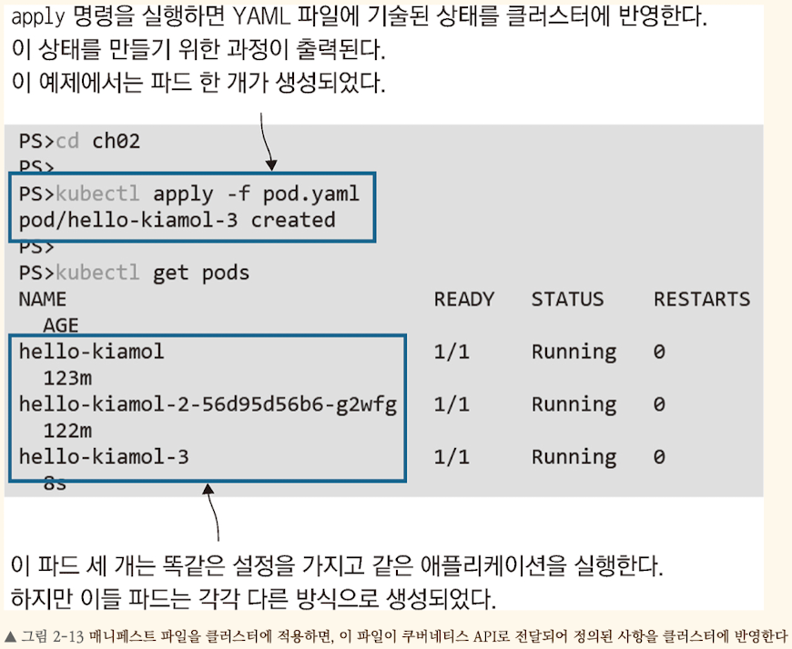
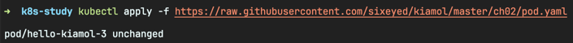

<!-- Date: 2025-01-24 -->
<!-- Update Date: 2025-01-24 -->
<!-- File ID: c45dc12a-51eb-4b37-b73e-4a7c7e5ff168 -->
<!-- Author: Seoyeon Jang -->

# 개요

애플리케이션 매니페스트는 쿠버네티스의 가장 매력적인 기능이다. 하지만 그만큼 배우기 어렵기도 하다. 애플리케이션 배포 오류의 원인을 찾기 위해 수백 줄짜리 YML 스크립트를 뒤적이다보면, 쿠버네티스 API는 사용자를
헷갈리게 하려고 만든 것이 아닌가 싶다. 이런 생각이 든다면, **이 스크립트는 우리 애플리케이션을 속속들이 기술하는 것이 목적임을 떠올리자.** 이 스크립트는 형상 관리 도구를 사용하여 버전 관리를 할 수 있으며,
다른 쿠버네티스 클러스터로 옮기더라도 동일한 배포가 가능하다.

매니페스트는 JSON 또는 YAML 포맷으로 작성할 수 있다. 무엇보다 YAML에는 주석을 작성할 수 있다는 장점이 있다. 다음은 간단한 애플리케이션의 매니페스트 스크립트다. 앞서 실행했던 애플리케이션을 실행하는
단일 파드가 정의되어있다.

```yml
# pod.yml, 컨테이너 하나를 실행하는 단일 파드
# 매니페스트 스크립트는 쿠버네티스 API의 버전과
# 정의하려는 리소스의 유형을 밝히며 시작한다
apiVersion: v1
kind: Pod

# 리소스의 메타데이터에는 이름(필수요소)과
# 레이블(비필수요소)이 있다
metadata:
  name: hello-kiamol-3

# 스펙은 리소스의 실제 정의 내용이다
# 파드의 경우 실행할 컨테이너를 정의해야 한다
# 컨테이너는 이름과 이미지로 정의된다
spec:
  containers:
    - name: web
      image: kiamol/ch02-hello-kiamol
```

kubectl run 명령을 사용할 때보다 필요한 정보가 훨씬 많아졌다. 하지만 애플리케이션 매니페스트의 장점은 선언적 스크립트라는 점이다. kubectl 로 run 또는 create 명령을 사용하는 방식은
명령형이었다. 명령형은 쿠버네티스에 할 일을 일일이 지시하는 방식이고, 선언적 방식은 최종 결과가 어떻게 되어야 하는지 알려주고 그 최종 결과를 만드는 과정은 따지지 않는 방식이다.

> 실습: 매니페스트 파일을 작성했더라도 애플리케이션을 배포하려면 kubectl 을 사용해야 한다. 이때는 **apply** 명령을 사용한다. 즉, 파일에 기술된 설정을 클러스터에 적용하라는 의미다.

```shell
$ kubectl apply -f pod.yml
```

```shell
$ kubectl get pods
```

생성된 파드도 kubectl run 명령을 사용해서 만든 파드와 동일하게 노드를 배정받고 컨테이너를 실행한다. 매니페스트에 정의한 바람직한 상태를 클러스터에 만들기 위해 파드를 생성하는 것을 볼 수 있다.


지금 생성된 새로운 파드를 kubectl 을 사용하여 다른 파드와 마찬가지 방식으로 다룰 수 있다. 파드의 세부 정보를 보고나 네트워크 트래픽을 이 파드로 전달하는 것도 가능하다. 하지만 매니페스트는 애플리케이션
정의를 공유하기 쉽고, 똑같은 배포를 반복할 수 있다는 점에 차이가 있다. 언제든지 kubectl로 apply 명령을 다시 실행하면 항상 hello-kiamol-3 파드가 생기는 동일한 결과를 얻게 된다.

> 실습: 매니페스트 파일을 로컬 컴퓨터에 따로 복사하지 않아도 kubectl로 배포가 가능하다. 공개된 URL만 있으면 된다. 깃헙에서 배포되는 같은 내용의 매니페스트 파일로 조금 전과 똑같은 파드를 배포해보자.

```shell
# 원격 URL에서 제공되는 매니페스트 파일로 애플리케이션 배포
$ kubectl apply -f https://raw.githubusercontent.com/sixeyed/kiamol/master/ch02/pod.yaml
```


웹서버에서 내려 받은 매니페스트 파일의 내용이 조금전 파일과 같으므로 **파드에 변경이 일어나지 않는다.**

고수준 리소스를 사용한다면 애플리케이션 매니페스트로 더 흥미로운 일을 할 수 있다. YML 포맷으로 디플로이먼트를 적용할 때 필수적으로 작성해야하는 것이 이 디플로이먼트가 실행할 파드의 정의다. 파드는 또 자신만의
정의 내용이 따로 있으므로 디플로이먼트 정의는 파드에 대한 정의를 포함하게 된다.

다음은 앞서와 같은 애플리케이션을 실행하는 디플로이먼트에 대한 최소한의 정의다.

```yaml
# 디플로이먼트는 API 버전 1에 속한다
apiVersion: apps/v1
kind: Deployment

# 디플로이먼트의 이름을 정해야 한다
metadata:
  name: hello-kiamol-4

# 디플로이먼트가 자신의 관리 대상을 결정하는
# 레이블 셀렉터가 정의된다
# 여기에서는 app 레이블을 사용하는데, 레이블은 임의의 키-값 쌍이다
spec:
  selector:
    matchLabels:
      app: hello-kiamol-4
  # 이 템플릿은 디플로이먼트가 파드를 만들 때 쓰인다
  template:
    # 디플로이먼트 정의 속 파드의 정의에는 이름이 없다
    # 그 대신 레이블 셀렉터와 일치하는 레이블을 지정해야 한다
    metadata:
      labels:
        app: hello-kiamol-4
    # 파드의 정의에는 컨테이너 이름과 이미지 이름을 지정한다
    spec:
      containers:
        - name: web
          image: kiamol/ch02-hello-kiamol    
```

이 매니페스트에서 정의하는 리소스는 우리가 앞서 본 것과 (우연히 똑같은 웹 애플리케이션을 실행하기는 해도) 전혀 다르다. 하지만 모든 애플리케이션 매니페스트는 kubectl 의 apply 명령을 사용하여 똑같은
방식으로 배치된다. 따라서 아무리 복잡한 애플리케이션이라도 하나 또는 여러 개의 YML 파일에 이 애플리케이션을 기술하고 똑같은 kubectl 명령으로 배치할 수 있다.

> 실습: 디플로이먼트의 매니페스트를 사용해 새로운 디플로이먼트를 생성하라. 이 디플로이먼트가 또 다른 파드를 생성할 것이다.

```shell
# 디플로이먼트의 매니페스트로 애플리케이션 실행
$ kubectl apply -f deployment.yml
# 새로운 디플로이먼트가 만든 파드 찾기
$ kubectl get pods -l app=hello-kiamol-4
```

실행결과는 kubectl 의 create 명령을 사용했을 때와 같음을 알 수 있다. 하지만 이번에는 애플리케이션의 정의가 YML 파일에 기술되어있다는 점이 다르다.

애플리케이션이 복잡해짐에 따라 복제본을 몇 개나 둘지, CPU와 메모리의 사용 상한은 어느 정도를 적용할지, 애플리케이션의 상태 체크는 어떤 방식으로 할지, 애플리케이션에서 사용할 설정값은 어디서 읽어들이고 데이터는
어디다 저장할지 등 어떤 설정이든 YML 파일에 추가하면 된다.

# 정리


