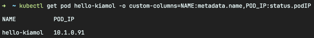
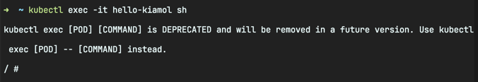
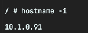
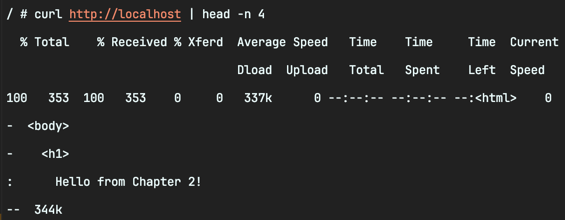
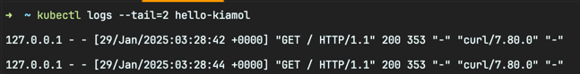
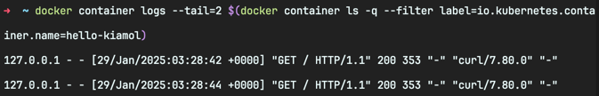
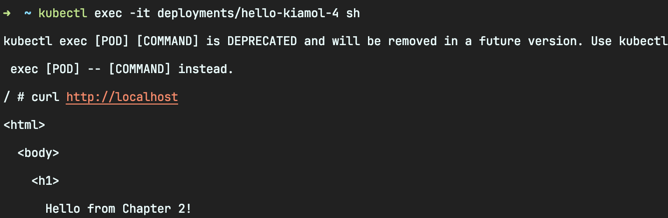
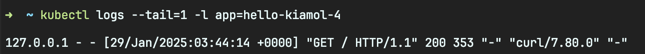

<!-- Date: 2025-01-25 -->
<!-- Update Date: 2025-01-29 -->
<!-- File ID: 57170e12-60d2-49b1-a03e-7fd7421c53f2 -->
<!-- Author: Seoyeon Jang -->

# 개요

파드와 디플로이먼트가 애플리케이션의 **가용성**을 확보하는 역할을 하더라도, 결국 실제 애플리케이션은 컨테이너 속에서 동작한다. 컨테이너 런타임(매니지드 쿠버네티스 클러스터에서는 도커 또는 containerd에
직접 접근할 수 없음)에 따라 직접적인 컨테이너 접근을 허용하지 않을 수도 있다. 그렇더라도 `kubectl`을 사용하면 파드 안에 있는 컨테이너에 접근할 방법이 있다. 쿠버네티스 명령행 도구를 사용하면 컨테이너
안에서 명령을 실행하거나, 애플리케이션 로그를 열람하거나, 파일을 복사할 수 있다.

> kubectl 을 사용하면 컨테이너 속에서 명령을 실행할 수 있다. 즉 파드에 들어있는 컨테이너 역시 원격 서버에 접속하듯 접속할 수 있다.

### 파드의 내부 IP 주소 확인



### 파드 내부와 연결할 대화형 쉘 실행



### 파드 안에서 IP주소를 확인



`컨테이너`의 IP주소는 `파드`의 IP주소와 같다.

### 웹 애플리케이션 동작 확인



컨테이너 속 환경의 IP주소는 쿠버네티스가 설정한 것이고, 컨테이너에서 동작중인 웹서버를 localhost로 접근할 수 있다.

파드 속 컨테이너에 대화형 쉘을 연결하면 파드 속 상황을 파악하기 좋다. 설정값이 정확히 설정되었는지 파일 내용을 확인할 수도 있고, 도메인이 서비스로 제대로 연결되어있는지 확인하거나 가상 네트워크로 API
엔드포인트에 접속되는지 핑(ping)을 날려볼 수도 있다. 이 방법은 문제를 해결하는 주요 수단이지만, 동작중인 시스템을 관리할 때는 애플리케이션 로그를 보는 편이 훨씬 간단하다. kubectl 에는 애플리케이션
로그를 열람하는 전용 명령어가 있다.

> 실습: 쿠버네티스는 컨테이너 런타임을 경유해서 애플리케이션 로그를 불러온다. 애플리케이션 로그를 확인하고, 컨테이너에 직접 접속하여(컨테이너 런타임이 허용한다면) 실제 컨테이너 로그와 애플리케이션 로그가
> 일치하는지 확인해보자.

### 쿠버네티스를 통해 컨테이너의 최근 로그를 출력



### 도커를 통해 컨테이너에 접속해서 실제 로그와 동일한지 확인



컨테이너 런타임을 경유해서 직접 열람한 컨테이너 로그와 쿠버네티스를 통해 열람한 로그가 일치하는 것을 볼 수 있다.

어떤 방법으로 만든 파드라도 이 방법으로 로그를 열람할 수 있다. 컨트롤러 객체가 생성한 파드 이름에는 무작위 문자열이 포함되지만, 이 이름을 직접 참조할 필요는 없다. 이들을 만든 컨트롤러 객체나 그 레이블로
파드를 참조하면 된다.

> 실습: 파드 이름을 직접 알지 못해도 디플로이먼트가 관리하는 파드에서 명령을 실행할 수 있다. 레이블 셀렉터와 일치하는 모든 파드의 로그를 열람해보자.



exec 명령은 다양한 유형의 리소스를 대상으로 할 수 있다.



kubectl 로 여러 파드의 로그를 볼 수 있다. 레이블 셀렉터를 사용하면 무작위 문자열이 들어간 파드 이름을 확인하지 않아도 파드의 로그를 열람할 수 있다.

운영 환경에서는 모든 파드의 로그를 모아 중앙 집중식 스토리지로 보낼 수도 있다. 하지만 지금은 이정도로도 충분함.

마지막으로, 파드 속 파일 시스템에 접근해보자. kubectl 을 사용하여 로컬 컴퓨터와 파드 사이에 파일을 주고받을 수 있다.

> 실습: 로컬 컴퓨터에 임시 디렉토리를 만들고 파드 속 컨테이너에서 이 디렉토리로 파일을 복사하자.

```shell
# 로컬 컴퓨터에 임시 디렉토리 생성
$ mkdir -p /tmp/kiamol/ch02

# 파드 속에서 웹 페이지를 로컬 컴퓨터로 복사
$ kubectl cp hello-kiamol:/usr/share/nginx/html/index.hml /tmp/kiamol/ch02/index.html

# 로컬 컴퓨터에서 내용을 파일 내용 확인
$ cat /tmp/kiamol/ch02/index.html
```

지금까지 실행했던 모든 파드를 삭제하자.

# 정리


