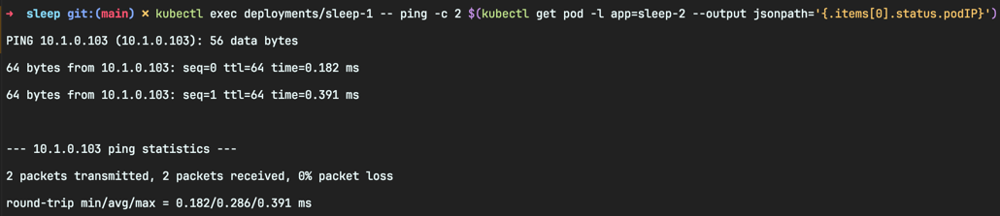
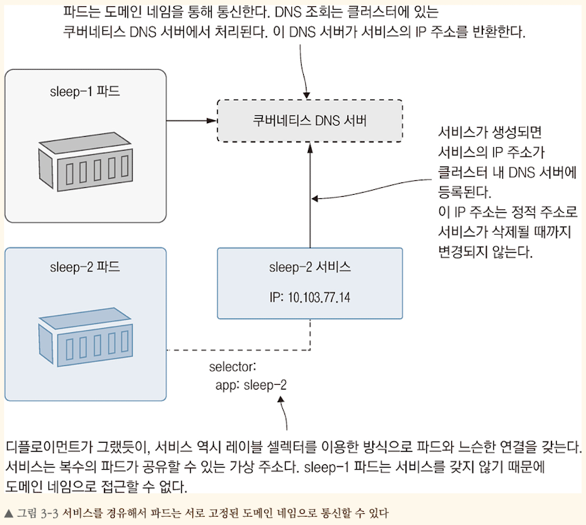
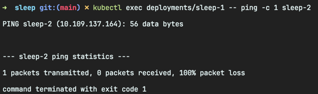

<!-- Date: 2025-01-29 -->
<!-- Update Date: 2025-01-30 -->
<!-- File ID: a93bac68-c6ae-41b1-9f41-9cdea88c7098 -->
<!-- Author: Seoyeon Jang -->

# 개요

파드는 쿠버네티스에서 애플리케이션을 구성하는 기본 요소다. 대부분의 애플리케이션은 여러 개의 구성 요소로 나뉘는데, 쿠버네티스에서는 이들 구성 요소를 각각 파드의 형태로 모델링한다. 예를 들어 웹사이트가 있다면, 이
웹사이트 구조는 `웹 사이트 파드`와 `API 파드` 단 두 개로 구성되거나 마이크로서비스 아키텍처를 채택해서 파드 수십개로 나뉘어 구성되는 식이다. 모든 파드는 서로 통신할 수 있어야 한다. 파드끼리 통신을 위해
쿠버네티스는 표준 네트워크 프로토콜인 TCP와 UDP를 지원한다. 이 두 프로토콜은 모두 IP 주소로 트래픽을 제어하는데, IP 주소는 파드를 대체할 때 주소가 변경된다는 문제가 있다. **쿠버네티스는 서비스(
service)에 어드레스 디스커버리(address discovery) 기능을 제공하여 이 문제를 해결한다.**

서비스는 파드에서 들고나는 통신 트래픽의 라우팅을 맡는 유연한 리소스다. 이 통신 트래픽은 클러스터 외부에서 파드로 전달되는 것과 파드에서 클러스터 외부로 전달되는 것 모두를 포함한다. 이 메모에서는 서비스를
설정하여 시스템의 구성 요소를 결합하는 방법을 배운다.

## 쿠버네티스 내부의 네트워크 트래픽 라우팅

파드에 대한 중요한 두가지 사실이 있다.

1. 파드는 쿠버네티스에서 부여한 IP 주소를 가진 가상환경
2. 파드는 다른 컨트롤러 객체에 의해 생애 주기가 관장되는 '쓰고 버리는' 리소스

어떤 파드가 다른 파드와 통신하는 데는 IP 주소가 필요하다. 이때 두가지 문제가 발생한다.

1. 파드가 새로운 파드로 교체될 때 IP주소가 바뀜
2. 교체된 파드의 IP주소를 찾기 어려움

새로운 IP 주소는 쿠버네티스 API를 통해서만 파악할 수 있다.

> 실습: 파드가 두 개 있다면 서로 통신할 수 있다. 하지만 먼저 서로의 IP 주소를 알아내야 한다.

```shell
# 각각 파드 하나를 실행하는 두 개의 디플로이먼트를 실행한다
$ kubectl apply -f sleep/sleep1.yaml -f sleep/sleep2.yaml

# sleep-2 파드의 IP주소를 반환
$ kubectl get pod -l app=sleep-2 --output jsonpath='{.items[0].status.podIP}'

# sleep-1 파드에서 sleep-2 파드로 ping 요청(결과적으로 ping 명령에 sleep-2 파드의 IP주소가 전달됨)
$ kubectl exec deploy/sleep-1 -- ping -c 2 $(kubectl get pod -l app=sleep-2 --output jsonpath='{.items[0].status.podIP}')

```



ping 명령이 정상적으로 동작한 것으로 보아, 파드는 IP주소를 통해 서로 통신할 수 있다.

쿠버네티스가 만든 가상 네트워크는 클러스터 전체를 커버한다. 따라서 IP주소만 있으면 **서로 다른 노드에서 실행 중인 파드끼리도 통신이 가능하다.**
하지만 이 방법은 일반적으로 사용하지 않는다. 왜냐하면 IP 주소는 파드가 대체될 때마다 바뀌기 때문이다.

`'언제든지 다른 것으로 바뀔 수 있는 리소스에 접근하기 위한 고정된 주소'`는 새로운 문제가 아니다. 인터넷에서는 IP주소에 기억하기 쉬운 이름을 붙이는 도메인 네임을 도입하여 이 문제를 해결했었고,
쿠버네티스에서도 같은 해결책을 도입했다. 쿠버네티스 클러스터에는 전용 DNS 서버가 있다. 이 서버가 서비스 이름과 IP 주소를 대응시켜준다.

다음은 파드와 파드 간 통신에서 도메인 네임 조회가 어떻게 쓰이는지 나타낸 다이어그램이다.



이런 유형의 서비스는 파드와 파드가 가진 네트워크 주소를 추상화한 것이다. 디플로이먼트가 파드와 파드가 포함하는 컨테이너를 추상화한 것과 같다. **서비스는 자신만의 IP주소를 갖는다.**
이 주소 역시 서비스가 삭제될 때까지 바뀌지 않는다. 컨슈머 컴포넌트가 이 주소로 요청을 보내면 쿠버네티스가 서비스와 연결된 파드의 실제 IP주소로 요청을 연결해준다. **서비스와 파드의 연결관계는 디플로이먼트와
파드의 연결 관계와 마찬가지로 `레이블 셀렉터`를 사용한다.**

다음은 서비스에 필요한 최소한의 YAML 정의다. app 레이블을 통해 자신이 받은 네트워크 트래픽을 전달받을 파드를 식별한다.

**sleep2-service.yaml, 간단한 서비스 정의**

```yaml
apiVersion: v1
kind: Service

metadata:
  name: sleep-2 # 서비스 이름이 도메인 네임으로 사용된다

# 서비스 정의에는 셀렉터와 포트의 목록이 포함되어야 한다
spec:
  selector:
    app: sleep-2 # app 레이블의 값이 sleep-2 인 모든 파드가 대상이다
  ports:
    - port: 80 # 80번 포트를 주시하다가 파드의 80번 포트로 트래픽을 전달한다
```

이 서비스 정의는 방금 생성한 디플로이먼트와 연동할 수 있다. 서비스를 클러스터에 배포하면 `sleep-2`라는 도메인 네임이 생성되고, 이 도메인 네임은 `sleep-2` 디플로이먼트에 포함된 파드로 트래픽을
연결해준다. 다른 파드에서도 이 도메인 네임을 사용해서 이 파드에 통신을 보낼 수 있다.

> 실습: kubectl apply 로 서비스를 배포하자. 그리고 파드로 네트워크 트래픽이 잘 연결되는지 확인

```shell
# 서비스 배포
$ kubectl apply -f sleep/sleep2-service.yaml

# 서비스 상세정보 출력
$ kubectl get svc sleep-2

# 파드와 통신이 잘 되는지 확인 - 이 명령은 실패한다
$ kubectl exec deploy/sleep-1 -- ping -c 1 sleep-2
```



도메인 네임은 잘 해소되지만, ping 명령은 동작하지 않았다. 그 이유는 ping 명령이 쿠버네티스 서비스에서 지원하지 않는 프로토콜을 사용하기 때문이다.
ping 명령은 ICMP 프로톹콜을 사용하는데, 서비스 리소스는 표준 TCP 및 UDP 프로토콜을 지원한다.

# 정리

쿠버네티스의 서비스 디스커버리 기능을 살펴보았다. 서비스 리소스를 배포하고 이 서비스 이름을 도메인 네임으로 사용하여 다른 컴포넌트와 통신할 수 있다.

다른 유형의 서비스로 또 다른 네트워크 패턴을 지원할 수 있다. 하지만 우리가 서비스를 이용하는 방법은 모두 동일하다. 다음 메모에서는 간단한 분산 애플리케이션을 소재로 파드와 파드 간 통신을 조금 더 자세히
살펴보겠다.

