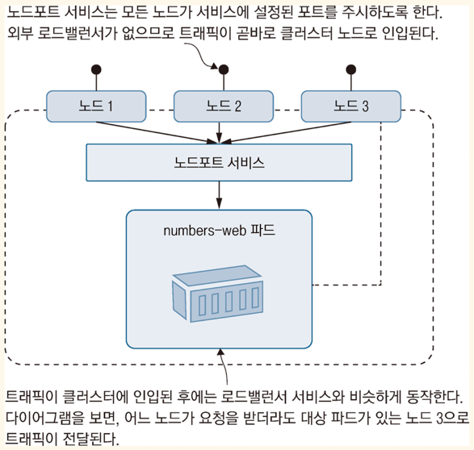

<!-- Date: 2025-02-01 -->
<!-- Update Date: 2025-02-04 -->
<!-- File ID: 02861915-c810-4997-8750-bd670093e2ee -->
<!-- Author: Seoyeon Jang -->

# 개요

쿠버네티스에는 `클러스터 외부`에서 들어오는 트래픽을 `파드`에 전달하는 여러가지 방법이 있다. 먼저 간단하고 유연한 방법부터 보자. 이 방법은 로컬 개발 환경과 운영 환경 어디라도 적용할 수 있는 방법으로,
로드밸런서(`LoadBalancer`)라는 유형의 서비스를 사용한다. 로드밸런서는 트래픽을 받은 노드가 아닌 노드에서 실행되는 파드에도 트래픽을 전달할 수 있다.


서비스의 입장이 되어 생각해보면, 서비스의 레이블 셀렉터와 일치하는 파드가 많으면 파드보다 노드를 먼저 선택해야하니 까다로운 문제처럼 보인다. 그러나 이런 문제는 쿠버네티스가 다 맡아 해결해준다. 우리는 그냥
로드밸런서 서비스를 클러스터에 배치하면 그만이다. 다음은 웹애플리케이션에 트래픽을 전달하는 서비스의 정의다.

```yaml
apiVersion: v1
kind: Service

metadata:
  name: numbers-web

spec:
  ports:
    - port: 8080 # 서비스가 주시하는 포트
      targetPort: 80
  selector:
    app: numbers-web
  type: LoadBalancer # 외부 트래픽도 전달할 수 있는 서비스
```

이 서비스는 8080번 포트를 주시하다가 해당 포트로 들어오는 트래픽을 웹 애플리케이션 파드의 80번 포트로 전달한다. 이 서비스가 클러스터에 배포되면 kubectl 로 따로 포트포워딩을 설정하지 않아도 웹
애플리케이션에 접근할 수 있다. (구체적인 건 클러스터의 종류에 따라 다르다.)

> 실습: 앞서 정의한 로드밸런서 서비스를 클러스터에 배치하고, kubectl을 사용해서 해당 서비스의 IP주소를 찾자.

```shell
# 로드밸런서 서비스 배치
# 방화벽에서 접근 허용 여부 묻는다면 허용
$ kubectl apply -f numbers/web-service.yml

# 서비스의 상세정보 확인
$ kubectl get svc numbers-web

# 애플리케이션의 URL을 EXTERNAL-IP 필드로 출력
$ kubectl get svc numbers-web -o jsonpath='http://{.status.loadBalancer.ingress[0].*}:8080'
```

K3s나 매니지드 쿠버네티스 클러스터를 사용한다면 로드밸런서가 부여받는 전용 외부 IP가 출력되기 때문에 출력 내용이 다를 수 있다.

필자가 사용하는 리눅스 가상머신에서 동작하는 K3s 환경에서는`http://172.28.132.127:8080` URL이 나온다.


똑같은 애플리케이션 매니페스트에서 어떻게 다른 결과가 나오는 것일까? 1장에서 쿠버네티스를 여러가지 방법으로 설치할 수 있지만 이들은 '모두 동일한 쿠버네티스 환경'이라고 설명했었다. **하지만 엄밀하게 따지면 모두
동일한 것은 아니다.** 쿠버네티스에는 확장이 가능한 지점이 여럿 있다. 그리고 분산 환경에 따라 이들 기능이 구현되는 방식의 차이가 발생하게 된다.

- 도커 데스크탑의 쿠버네티스는 로컬 개발환경이다. 이 클러스터는 단일 컴퓨터에서 동작하며, 로컬 컴퓨터의 네트워크 스택과 통합되어 로드밸런서 서비스가 로컬 호스트 주소를 사용할 수 있다. 모든 로드밸런서 서비스가
  localhost로 외부에 공개된다. 따라서 여러 개의 로드밸런서 서비스를 사용하려면 이들의 포트를 각각 다르게 설정해야 한다.

- K3s 환경의 쿠버네티스에서는 별도의 라우팅 테이블을 설정하는 방식으로 로드밸런서 서비스를 구현했다. 각각의 로드밸런서 서비스는 호스트 컴퓨터(여기서는 가상머신)의 IP주소로 외부에 공개된다. 따라서
  localhost 또는 IP주소로 로드밸런서 서비스에 접근할 수 있다. 역시 도커 데스크톱과 마찬가지로 여러 개의 로드밸런서 서비스를 사용하려면 이들의 포트를 각각 다르게 설정해야 한다.

- AKS나 EKS 같은 클라우드 환경의 쿠버네티스는 고가용성을 확부한 다중 노드 클러스터다. 이들 클러스터에서 로드밸런서 서비스를 배포하면 클라우드에 실제 로드 밸런서가 만들어진다. 이 로드밸런서가 외부에서
  들어오는 트래픽을 노드로 전달하고, 그다음쿠버네티스가 이를 다시 파드로 전달한다. 따라서 로드밸런서 서비스의 IP주소도 각기 다르다. 또한 이들 IP주소는 공인 IP주소이며 인터넷에 접근할 수 있다.

다른 기능에서도 분산환경 여부와 가용한 자원의 상황에 따라 이런 패턴을 종종 볼 수 있을 것이다. 즉 YAML로 작성된 매니페스트가 동일하면 결과도 동일하지만 쿠버네티스가 분산을 구현하는 방식에는 차이가 있을 수
있다.

외부에서 클러스터로 들어오는 트래픽을 파드로 전달하는 역할을 하는 서비스 리소스 유형이 한가지 더 있다. 바로 NodePort. 노드포트 서비스는 외부 로드밸런서가 필요 없다. 클러스터를 구성하는 모든 노드가 이
서비스에 지정된 포트를 주시하며 들어온 트래픽을 대상 파드의 대상 포트로 전달한다. 다음은 노드포트의 역할이다.



`노드포트 서비스` 역시 외부 트래픽을 파드로 전달하는 역할을 하지만, 별도의 로드밸런서가 필요 없다는 점이 `로드밸런서 서비스`와 다르다.

`노드포트 서비스`는 서비스에서 설정된 포트가 모든 노드에서 개방되어 있어야 하기 때문에 로드밸런서 서비스만큼 유연하지는 않다. 또한 다중 노드 클러스터에서 로드밸런싱 효과를 얻을 수 없다는 것도 단점이다. `노드포트 서비스` 는 지원하는 분산 수준도 로드밸런서 서비스와 차이가 있다. 이때문에 K3s나 도커 데스크톱에서는 잘 동작하지만, Kind 에서는 그렇지 못하다.


# 정리


