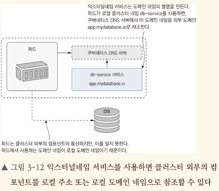

<!-- Date: 2025-02-09 -->
<!-- Update Date: 2025-02-12 -->
<!-- File ID: 23f28c69-46e2-40dc-8a98-a7e1b7ebd797 -->
<!-- Author: Seoyeon Jang -->

# 개요
쿠버네티스는 거의 모든 서버용 소프트웨어를 실행할 수 있다. 그렇다고 모든 서버용 소프트웨어를 꼭 쿠버네티스에서 실행하는 것은 아니다. 데이터베이스같은 스토리지 컴포넌트 등이 대표적으로 쿠버네티스 외부에서 동작하는 소프트웨어의 예다. 

클러스터 외부를 가리키는 도메인 네임 해소에도 쿠버네티스 서비스 리소스를 활용할 수 있다.

첫 번째 선택지는 ExternalName 서비스를 사용하는 방법이다.

## "외부 서비스의 도메인 네임을 그냥 쓰면 되는 거 아님?"
맞다. `database.example.com` 같은 외부 도메인을 그냥 써도 되긴 한다. 그런데 쿠버네티스 환경에서는 ExternalName 서비스를 사용해 외부 도메인을 관리할 때 큰 이점을 주기 때문에 굳이 외부 서비스의 도메인 네임을 코드에 그대로 박지 않는다.

## ExternalName 이 필요한 이유
1. 서비스의 일관성 유지 (내부 서비스처럼 보이게)
    쿠버네티스 내부에서 애플리케이션들이 서로 통신할 떄 보통 이런 식으로 접근한다:
   ```text
    db-service.default.svc.cluster.local
    ```
   ExternalName을 사용하면:
   - `database.example.com`을 쿠버네티스 내부 서비스처럼 보이게 만들어준다
   - 애플리케이션 코드에서 DB주소를 `db-service.default.svc.cluster.local`로 설정해놓으면, 내부 DB를 사용할 때도, 외부 DB를 사용할 때도 **코드를 수정할 필요 없이 쿠버네티스 설정만 변경하면 된다.**
   - 즉 코드 수정없이 배포 가능한 것이다!
2. 인프라 변경이 있어도 애플리케이션 코드가 안전하게 유지됨
   만약 `database.example.com`을 직접 코드에 박아둔다면?
   - 코드를 수중해야 한다...
   - 그러나 ExternalName을 사용한다면?
     - 코드에는 `db-service.default.svc.cluster.local`만 남겨둠
     - DB가 변경되더라도 -> 쿠버네티스 설정만 수정하면 됨
     - 즉 애플리케이션 코드는 전혀 손대지 않고 환경 변경 가능!


## ExternalName
ExternalName 서비스는 어떤 도메인 네임에 대한 별명이라고 생각하면 쉽다. ExternalName 서비스는 어떤 도메인 네임에 대한 별명이라고 생각하면 쉽다. 애플리케이션 파드에서 로컬 네임을 사용하고, 쿠버네티스 DNS 서버에 이 로컬 네임을 조회하면 외부 도메인으로 해소해주는 방식이다. 

다음 그림은 ExternalName의 동작 방식을 나타낸 다이어그램이다.



### ExternalName서비스의 중요한 특징
익스터널네임 서비스는 애플리케이션이 사용하는 주소가 가리키는 대상을 치환해줄 뿐 요청의 내용 자체를 바꾸어주지는 못한다. 데이터베이스처럼 TCP프로토콜을 쓰는 컴포넌트라면 문제 없지만, HTTP 서비스라면 이야기가 달라진다. HTTP 요청의 헤더에는 대상 호스트명이 들어간다. 그리고 이 헤더의 호스트명이 익스터널네임 서비스의 응답과 다르다면 HTTP요청이 실패한다. 이 장의 소재가 되었던 무작위 숫자 생성 애플리케이션 역시 이 문제를 피해가기 위해 헤더의 호스트명을 직접 수정하는 까다로운 코드를 썼다. 하지만 HTTP가 아닌 프로토콜을 사용하는 서비스라면 이 방법이 최선이다.


# 정리


