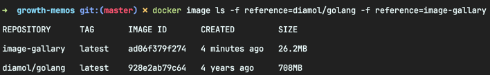
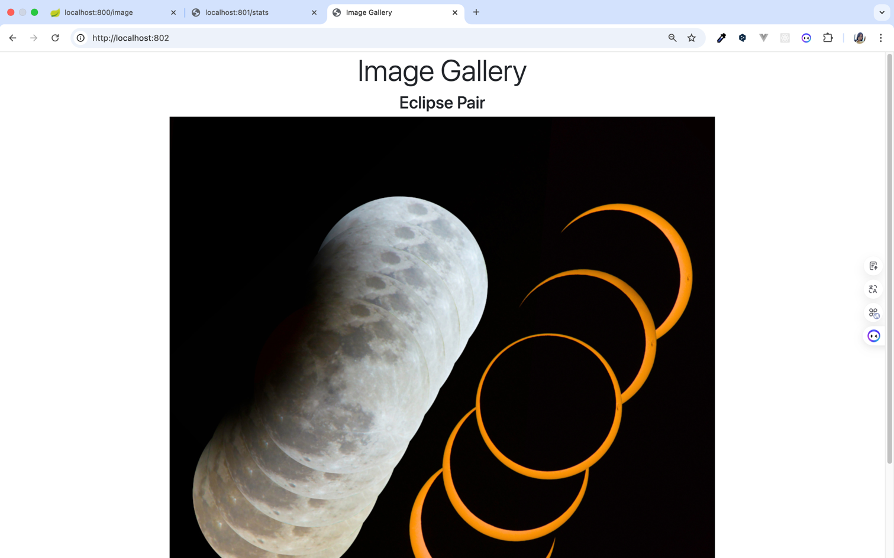

<!-- Date: 2025-01-04 -->
<!-- Update Date: 2025-01-04 -->
<!-- File ID: 203f6080-1718-44d2-bb53-0d34711a79ae -->
<!-- Author: Seoyeon Jang -->

# 개요

멀티 스테이지 빌드를 적용한 Dockerfile의 마지막 예제로, Go를 사용해 구현한 웹 애플리케이션을 살펴보자.
Go는 네이티브 바이너리로 컴파일되는 현대적인 크로스 플랫폼 언어다.
다시 말하면, 원하는 어떤 플랫폼(윈도, 리눅스, amd64 아키텍처, arm 아키텍처)이든, 해당 플랫폼에서 동작하는 바이너리를 컴파일할 수 있다는 의미다.
자바나 Node.js, 닷넷 코어 혹은 파이썬처럼 별도의 런타임이 필요하지도 않다. 그만큼 도커 이미지의 크기가 매우 작아진다.

러스트와 스위프트 등 네이티브 바이너리로 컴파일되는 언어는 Go 외에도 몇 가지가 더 있지만, 그 중에서도 Go가 가장 지원 플랫폼의 범위가 넓다.
또한 Go는 클라우드 네이티브 언어로서도 인기가 높다. 애초에 도커 자체가 Go로 구현됐을 정도다.
도커를 이용한 Go 애플리케이션의 멀티 스테이지 빌드는 자바의 빌드 방식과 유사한 점이 많지만, 중요한 차이점이 있다.

다음은 Go 애플리케이션 빌드를 위한 Dockerfile 스크립트다.

```dockerfile
FROM diamol/golang AS builder

COPY main.go .
RUN go build -o /server

# app
FROM diamol/base

ENV IMAGE_API_URL="http://iotd/image" \
    ACCESS_API_URL="http://accesslog/access-log"

CMD ["/web/server"]
WORKDIR web
COPY index.html
COPY --from=builder /server .
RUN chmod +x server
```

Go는 네이티브 바이너리로 컴파일된다. builder 단계의 기반 이미지는 Go 언어의 도구가 설치된 `diamol/golang`이다.
Go 애플리케이션 빌드는 일반적으로 의존 모듈을 내려받는 단계없이 곧장 빌드에 들어가며(대개 main.go 단일 파일로 구성된다), 그다음 애플리케이션 단계는
최소한의 운영체제 레이어만을 포함하는 이미지를 사용한다. 여기서는 `diamol/base`이미지를 사용한다.

그 다음 몇가지 설정값을 환경 변수 형태로 설정하고 컴파일된 바이너리를 실행해 애플리케이션을 시작한다.
애플리케이션 단계는 builder 단계에서 빌드한 웹 서버 바이너리와 이 웹서버가 제공할 HTML파일을 복사하는 과정으로 마무리된다.
마지막으로, 바이너리 파일이 chmod 명령을 통해 명시적으로 실행 권한을 부여받는다(윈도에서는 효과가 없다.).

> 실습
> Go 애플리케이션의 소스코드를 훑어본다음 이미지를 빌드하라

```shell
$ docker image build -t image-gallary .
```

이번 빌드에서는 컴파일 과정에서 출력되는 로그 양이 그리 많지 않다. Go 컴파일러는 비교적 로그 양이 적으며 빌드에 실패한 경우에만 로그를 출력하기 때문이다.
실행하기 전에 빌드에 사용된 이미지와 최종적으로 빌드된 이미지의 크기를 비교해보자.

> 실습
> 빌드에 사용된 Go 빌드 도구 이미지와 빌드된 Go 애플리케이션 이미지의 크기를 비교해보자.

```shell
$ docker image ls -f reference=diamol/golang -f reference=image-gallery
```

이 명령을 실행해보면 기반 이미지를 잘 선택하는 것이 얼마나 중요한지 깨닫게 될 것이다.

내 MacOS 환경을 기준으로, Go 빌드 도구를 포함하는 이미지의 크기는 708MB이다. 그러나 실제 Go 애플리케이션의 이미지 크기는 25MB에 불과하다.
Go 애플리케이션은 실행 시에 별도의 Go 빌드 도구가 필요 없다.
그러므로 이러한 용량 절감 효과가 극대화되어 나타나보이는 것이다.

이제 애플리케이션을 실행해보자. 자바앱과 노드앱을 묶어 함께 실행할 것이다.
앞서 빌드한 애플리케이션이 제공하는 API를 사용하는 것이 바로 이 Go 애플리케이션이기 때문이다.
docker container ls 명령을 사용해 확인해보면, 두 개의 컨테이너 accesslog(노드앱), iotd(자바앱)가 실행중일 것이다.
Go 애플리케이션을 담은 컨테이너를 실행하면 새로운 컨테이너가 이들 두 컨테이너게 제공하는 API를 사용하게 된다.

> 실습
> Go 애플리케이션의 이미지로 컨테이너를 실행하되, 컨테이너를 nat 네트워크에 접속하고 80번 호트를 호스트 컴퓨터의 포트를 통해 공개하라.

```shell
$ docker container run -d -p 802:80 --name=imagegallary --network=nat image-gallary
```


세 개의 컨테이너에 걸쳐 실행되는 분산 애플리케이션이 실행됐다. Go 로 구현된 웹 애플리케이션이 자바로 구현된 API를 호출해 이미지의 상세 정보를 얻은 다음
Node.js 로 구현된 API에 접근 로그를 남긴다. 여기까지 오는 데 각 애플리케이션의 소스코드와 도커만 필요했을 뿐 어떤 언어의 빌드 도구도 설치할 필요가 없었다.

멀티스테이지 빌드를 적용한 Dockerfile 스크립트를 통해 우리 프로젝트의 이식성을 극적으로 향상시킬 수 있다.

# 정리


