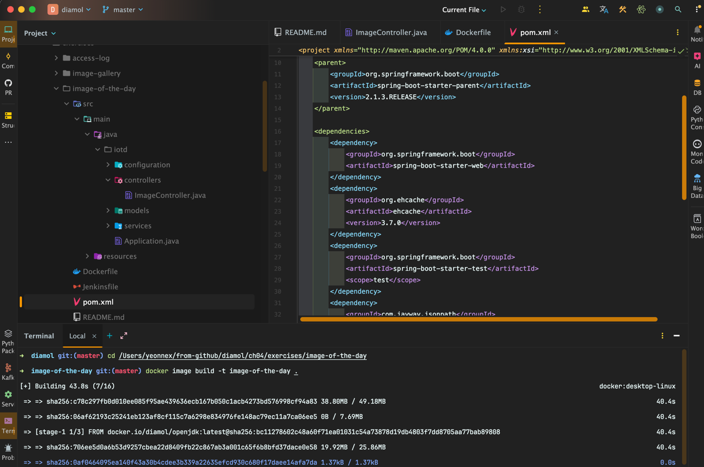
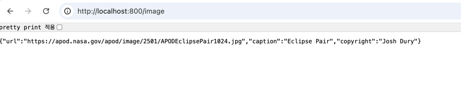

<!-- Date: 2025-01-03 -->
<!-- Update Date: 2025-01-25 -->
<!-- File ID: 81caf4d3-bd78-4b08-9783-c94693c4e62a -->
<!-- Author: Seoyeon Jang -->

# 개요

자바 스프링부트 앱을 도커를 이용해 빌드하고, 실행해보자.
이 애플리케이션을 빌드하고 실행하기 위해 **자바 빌드 도구를 따로 설치할 필요는 없다.**
**필요한 도구는 모두 도커 이미지를 통해 가져온다.**

애플리케이션은 표준적인 자바 빌드 도구인 메이븐과 OpenJDK를 사용한다.
메이븐은 빌드 절차와 의존 모듈의 입수 방법을 정의하는 도구이고, OpenJDK는 자바 런타임이자 개발자 키트다.
메이븐은 빌드 절차가 정의된 XML 문서를 사용하며, mvn 명령을 실행해 사용한다.

다음은 메이븐을 사용해 자바 애플리케이션을 빌드하는 Dockerfile 스크립트이다.

```dockerfile
FROM diamol/maven AS builder

WORKDIR /usr/src/iotd
COPY pom.xml
RUN mvn -B dependency:go-offline

COPY . .
RUN mvn package

# app
FROM diamol/openjdk

WORKDIR /app
COPY --from=builder /usr/src/iotd/target/iotd-service-0.1.0.jar .

EXPOSE 80
ENTRYPOINT ["java", "jar", "/app/iotd-service-0.1.0.jar"]
```

거의 모든 인스트럭션은 이미 본 적 있는 인스트럭션이다.
`FROM`인스트럭션이 여러 개 있는 것으로 보아, **멀티 스테이지 빌드**가 적용된 스크립트다.
그리고 도커의 레이어 캐시를 최대한 활용할 수 있도록 인스트력션이 배치됐다는 것도 알 수 있다.

첫번째 단계인 builder 단계에서 하는 일은 다음과 같다.

- 기반 이미지는 `diamol/maven`이다. 이 이미지는 OpenJDK와 메이븐을 포함한다.
- builder 단계는 먼저 이미지에 작업 디렉터리를 만든 다음 이 디렉터리에 pom.xml 파일을 복사하면서 시작된다. 이 파일에는 메이븐에서 수행할
  빌드 절차가 정의돼있다.
- 첫번째 RUN 인스트럭션에서 메이븐이 실행돼 필요한 의존 모듈을 내려받는다. 이 과정에는 상당한 시간이 걸리기 때문에 별도의 단계로 분리해
  레이어 캐시를 활용할 수 있도록 한다. 새로운 의존 모듈이 추가될 경우, XML 파일이 변경됐을 것이므로 이 단계가 다시 실행된다.
  추가된 의존 모듈이 없다면 이미지 캐시를 재사용한다.
- 그 다음 COPY . . 인스트럭션을 통해 나머지 소스 코드가 복사된다. 이 인스트럭션은 '도커 빌드가 실행 중인 디렉토리에 포함된 모든 파일과 서브 디렉토리를
  현재 이미지 내 작업 디렉토리로 복사하라'는 의미다.
- builder 단계의 마지막은 mvn package 명령을 실행하는 것이다. 이 명령은 애플리케이션을 빌드하고 패키징하라는 의미다. 입력은 자바 소스코드이며,
  출력은 JAR 포맷으로 패키징된 자바 애플리케이션이다.

builder 단계가 끝나고 나면, 컴파일된 애플리케이션이 해당 단계의 파일 시스템에 만들어진다.
메이븐을 이용한 빌드 과정에 (네트워크 문제로 의존 모듈을 받아오지 못했거나 소스 코드에 컴파일 에러가 있는 등의)문제가 있었다면 RUN 인스트럭션이 실패하면서
전체 빌드도 실패한다.

builder 단계를 정상적으로 마쳤다면, 다음 과정을 수행하는 마지막 단계를 실행해 애플리케이션 이미지를 생성한다.

- 기반 이미지는 `diamol/openjdk`이다. 이 이미지는 자바 11 런타임을 포함하지만, 메이븐은 포함하지 않는다.
- 이번에도 이미지 작업 디렉터리를 만든 다음, 여기에 앞서 builder 단계에서 만든 JAR 파일을 복사한다.
  이 JAR 파일은 모든 의존 모듈과 컴파일된 애플리케이션을 포함하는 단일 파일이다. 그러므로 builder 단계의 파일 시스템에서 이 파일만 가져오면 된다.
- 애플리케이션은 80번 포트를 주시하는 웹 서버 애플리케이션이다. 그러므로 이 포트를 EXPOSE 인스트럭션을 통해 외부로 공개해야 한다.
- ENTRYPOINT 인스트럭션은 CMD 인스트럭션과 같은 기능을 한다. 해당 이미지로 컨테이너가 실행되면 도커가 이 인스트럭션에 정의된 명령을 실행한다.
  이 이미지의 경우 java 명령으로 빌드된 JAR 파일을 실행한다.

> 실습
> 자바 애플리케이션의 소스코드를 훑어보고 이미지를 빌드하라.


이 이미지를 빌드하면 메이븐이 출력하는 상당한 양의 로그를 볼 수 있다.
그 내용은 의존 모듈을 내려받고 자바 빌드를 실행하는 내용이다.

방금 빌드한 이 애플리케이션은 NASA의 천문 사진 서비스(https://apod.nasa.gov)에서 오늘 자 사진을 받아오는 간단한 REST API다.
받아온 사진은 캐시해두었다가 다음에 또 같은 요청이 들어오면 전에 받아온 사진을 다시 보여준다.

이 API는 이번 장에서 실행해 볼 전체 애플리케이션의 한 부분이다.
앞으로 여러 개의 컨테이너를 실행해 이들이 서로 통신하게 할 것이다.
컨테이너는 컨테이너가 실행될 때 부여되는 가상 네트워크 내 가상 IP를 통해 서로 통신한다.
이 가상 네트워크 역시 명령행 인터페이스를 통해 관리할 수 있다.

> 실습
> 컨테이너 간 통신에 사용되는 도커 네트워크를 생성하라

```shell
$ docker network create nat
```

**컨테이너를 실행할 때** --network 옵션을 사용하면 새로 만들 컨테이너를 연결할 네트워크를 직접 지정할 수 있다.
같은 네트워크 안에 속한 컨테이너 간에는 서로 자유롭게 통신이 가능하다.

> 앞서 빌드한 이미지로부터 컨테이너를 실행하되, 80번 포트를 호스트 컴퓨터를 공개하고 nat 네트워크에 컨테이너를 접속하라.

```shell
$ docker container run --name iotd -d -p 800:80 --network nat image-of-the-day
```


이 애플리케이션 자체는 썩 대단해보이지 않지만, 진짜 중요한 것은 도커만 설치돼 있다면 이
애플리케이션을 어디서든 실행할 수 있다는 점이다.
소스코드와 Dockerfile 스크립트만 있으면된다. 그 외에는 빌드 도구를 설치할 필요도 없고
특정한 버전의 자바 런타임을 설치할 필요도 없다.
최종적으로 생성되는 애플리케이션 이미지에 빌드도구는 포함되지 않는다.
`image-of-the-day`이미지를 사용해 대화식 컨테이너를 실행해보면, 이 이미지에서는
`mvn`명령어를 사용할 수 없다는 것을 알 수 있다.
애플리케이션 이미지에는 도커 파일에 정의된 빌드 단계 중 마지막 단계의 콘텐츠만이 포함된다. 이전 단계의 콘텐츠 중 포함시키고 싶은 것이 있다면
최종 단계에서 명시적으로 해당 콘텐츠를 복사해와야 한다.

# 정리