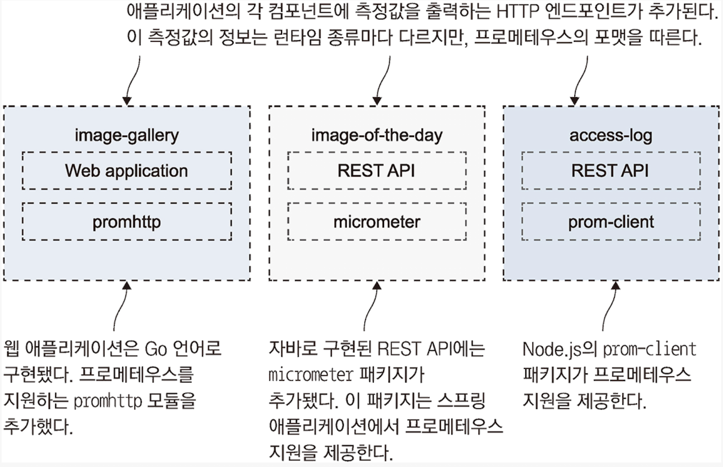
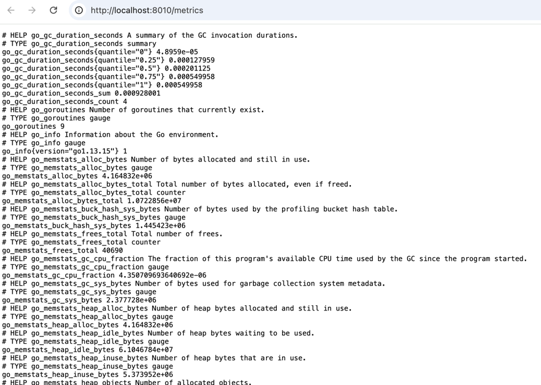
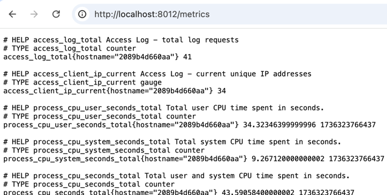

<!-- Date: 2025-01-07 -->
<!-- Update Date: 2025-01-08 -->
<!-- File ID: 9b2cdfcd-acba-4be0-8c21-2c099963702e -->
<!-- Author: Seoyeon Jang -->

# 개요

앞서 도커 엔진이 출력하는 측정값을 살펴봤다.
`도커 엔진의 측정값`은 **프로메테우스의 사용법을 익히는 출발점**으로 적당하기 때문이다.
애플리케이션의 유용한 정보를 측정값으로 구성하려면 이들 정보를 생성하는 코드를 작성해 HTTP 엔드포인트로 출력해야한다.
하지만 주요 프로그래밍 언어에는 프로메테우스의 라이브러리가 제공되므로 이를 사용하면 그리 어려운 일은 아니다.

이번에는 이전에 다뤘던 NASA 오늘의 천체 사진 애플리케이션에 프로메테우스 측정값 생성 코드를 추가한 것이다.
자바와 Go 언어용 프로메테우스 공식 클라이언트와 Node.js용 비공식 클라이언트 라이브러리를 사용해보자.
다음은 각 컨테이너에 프로메테우스 클라이언트가 함께 패키징된 것을 보여준다. 이 클라이언트가 측정값을 출력하고 수집한다.

프로메테우스 클라이언트 라이브러리를 사용해 각 컨테이너에 측정값을 출력하는 엔드포인트를 만든다.

**프로메테우스 클라이언트 라이브러리를 통해 수집된 정보는 런타임 수준의 측정값**으로, 해당 컨테이너가 처리하는 작업이 무엇이고 이 작업의
부하가 어느 정도인지에 대한 정보가 런타임의 관점에서 표현돼있다. 예를 들어 **Go 애플리케이션의 측정값에는 현재 활성 상태인 고루틴의 개수**가 포함돼있고,
**자바 애플리케이션의 측정값에는 JVM이 사용중인 메모리 용량 정보**가 들어있다.
**각각의 런타임은 자신만의 중요도가 높은 측정값을 가지고 있으며** 해당 클라이언트 라이브러리도 이러한 정보를 수집해 외부로 제공한다.

> 실습: 이번 연습문제에는 `image-gallery`애플리케이션의 프로메테우스 클라이언트가 적용된
> 새로운 버전을 적용하는 도커 컴포즈 파일이 들어있다. 이 애플리케이션을 실행해 측정값을 제공하는
> 엔드포인트에 접근해보자.

```shell
# 모든 컨테이너 제거
$ docker container rm -rf $(docker container ls -aq)

# 도커 네트워크 nat을 생성한다
$ docker network create nat

# 애플리케이션을 시작한다
$ docker-compose up -d

# 웹브라우저에서 http://localhost:8010에 접근하면 애플리케이션 화면이 나타난다
# http://localhost:8010/metrics 에서는 측정값을 볼 수 있다
```


이 데이터를 생성하기 위해 따로코드를 작성하지는 않았다. 단지 그냥 **애플리케이션에 Go 언어용 프로메테우스 클라이언트 라이브러리만 추가하면 된다.**
측정값의 포맷은 프로메테우스 포맷이지만 내용은 런타임 종류에 따라 다르다. 위의 측정값은 Go 애플리케이션의 고유의 측정값인
활성 고루틴의 개수다.

웹 브라우저에서 [http://localhost:8011/actuator/prometheus](http://localhost:8011/actuator/prometheus)에 접근하면
이와 비슷한 형태로 자바의 측정값을 볼 수 있다. 엔드포인트에서 출력된 내용은 언뜻 어수선한 텍스트처럼 보이지만,
그 안에 컨테이너가 얼마나 '열심히' 동작하는지(CPU시간, 메모리, 스레드 등을 얼마나 많이 점유하는지) 한 눈에 알 수 있는 대시보드를 만들기 위해
필요한 내용을 모두 포함하고 있다.

이러한 런타임 상태 측정값은 도커 엔진에서 얻은 인프라스트럭처 측정값과는 또 다른 수준의 정보를 제공한다.

프로메테우스 클라이언트 라이브러리를 사용해도 응답 처리시간 처럼 연산중심의 정보나, 새로운 서비스를 사용하는 사용자 수와 같이
비즈니스 중심의 정보를 얻고자 한다면, 애플리케이션에서 **명시적으로 이들 정보를 생성하는 코드를 작성해야 한다.**

다음은 Node.js 프로메테우스 라이브러리를 `access-log`컴포넌트에서 사용한 예다.
컨테이너를 더욱 폭넓게 활용하다보면 반드시 프로메테우스를 다루게 될 때가 온다. 다음 코드 조각으로 다양한 활용을 할 수 있다.

```javascript
// Node.js에서 커스텀 프로메테우스 측정값을 선언하고 사용하기

// 측정할 값 선언하기
const accessCounter = new prom.Counter({
  name: "access_log_total",
  help: "Access Log - 총 로그 수"
});

const clientIpGauge = new prom.Gauge({
  name: "access_client_ip_current",
  help: "Access Log - 현재 접속 중인 IP 주소"
});

// 측정값 갱신하기
accessCounter.inc();
clientIpGauge.set(countOfIpAddresses);
```

각 앱의 소스코드를 보면, Go 언어로 구현된 `image-gallery`애플리케이션과 자바로 구현된 REST API `image-of-the-day`애플리케이션에
사용자 정의 측정값을 볼 수 있다. 두 애플리케이션에서 프로메테우스 클라이언트 라이브러리는 서로 다른 방식으로 도작한다.
`main.go`파일에서도 Node.js 소스코드에서처럼 먼저 카운터와 게이지를 초기화하지만, 그 다음에는 측정값을 명시적으로 갱신하지 않고
라이브러리에서 제공되는 핸들러로 처리한다.
자바 애플리케이션에서 사용된 방식은 이와는 또 다르다.
**ImageController.java**파일을 보면 `@Timed`어노테이션과 `registry.counter`객체를 증가시키는 방식을 사용했다.
**두 클라이언트 모두 해당 언어에서 가장 합리적인 방식으로 동작한다.**

프로메테우스의 측정값에도 몇 가지 유형이 있다. 이 애플리케이션에서 사용한 유형은 그중에서도 가장 간단한 종류인 `counter`와 `gauge`다.
카운터와 게이지는 모두 숫자값인데, 카운터의 값은 현상 유지 혹은 증가만 가능하고 게이지의 값은 증가와 감소가 모두 가능하다.
가장 적합한 측정값 유형을 정하고 정확한 시점에 값을 갱신하는 것은 애플리케이션 개발자에게 달렸다. 나머지는 프로메테우스 라이브러리가 대신 처리해준다.

> 실습: `image-gallery`애플리케이션이 아직 실행중이며, 측정값이 수집되는 중이다.
> 애플리케이션에 조금 부하를 가한 다음 해당 애플리케이션의 측정값이 출력되는 엔드포인트에 접근해보자.

```shell
# 반복문을 돌며 다섯번의 HTTP GET 요청을 보낸다
$ for i in {1..5}; do curl http://localhost:8010 > /dev/null; done;
```

웹브라우저에서 http://localhost:8012/metrics 에 접근해보자.

처음 두개의 레코드는 **커스텀 측정값**으로, API에 들어온 요청의 횟수와 서비스를 이용한 IP주소의 총 개수를 기록한 것이다.

프로메테우스를 활용해 이보다 더 복잡한 측정값도 수집할 수 있다. 하지만 간단한 카운터나 게이지 같은 측정값으로도 애플리케이션의 상세한 상황을 알 수 있다.

- (만약 있다면) 외부 시스템과의 통신에 걸린 시간과 성공적으로 응답을 받았는지 여부에 대한 기록. 이 측정값으로 외부 시스템이 애플리케이션의
  속도나 이상 상태에 영향을 줬는지 알 수 있다.
- 로그로 남길 가치가 있는 모든 정보. 로그로 남기는 것보다는 측정값으로 수집하는 편이 메모리, 디스크 용량, CPU시간 면에서 저렴하고 추세를 볼 수 있도록
  시각화하기도 쉽다.
- 사업부에서 필요로 하는 애플리케이션의 상태 및 **사용자 행동에 관한 모든 정보**. 과거 정보를 수고를 들여 보고하는 대신 실시간 정보로 대시보드를 구성할 수
    있다.


# 정리


