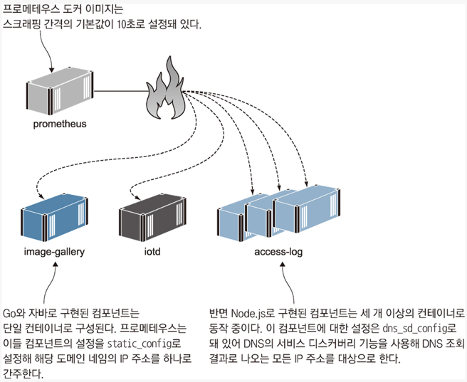
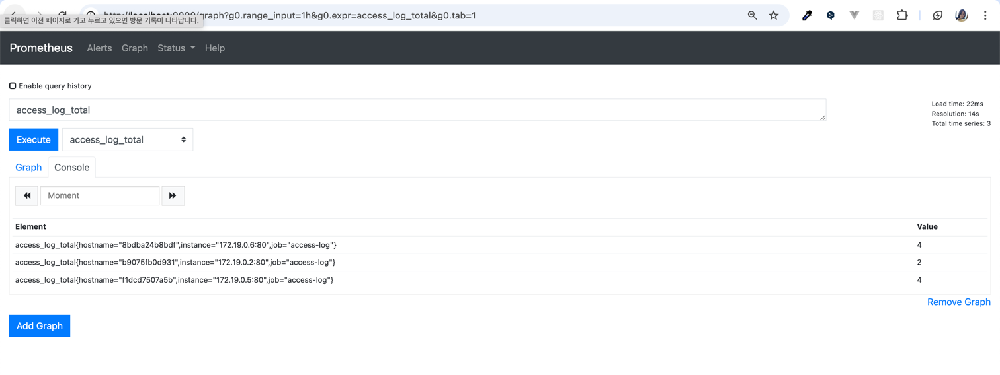

<!-- Date: 2025-01-08 -->
<!-- Update Date: 2025-01-09 -->
<!-- File ID: ccfcf7b3-19f7-4f0f-bc52-fe7d8665b9ba -->
<!-- Author: Seoyeon Jang -->

# 개요

**프로메테우스**는 직접 측정값을 **대상 시스템에서 받아다 수집하는 풀링 방식으로 동작한다.**
프로메테우스에서는 측정값을 수집하는 이 과정을 스크래핑(scraping)이라고 한다.
프로메테우스를 실행하면 스크래핑 대상 엔드포인트를 설정해야 한다.
운영 환경의 컨테이너 플랫폼에서는 클러스터에 있는 모든 컨테이너를 찾도록 설정할 수도 있다.
단일 서버의 도커 컴포즈 환경에서는 서비스 목록으로 도커 네트워크의 DNS를 통해 대상 컨테이너를 자동으로 찾는다.

다음은 `image-gallery`애플리케이션의 두 컴포넌트로부터 측정값을 스크래핑하기 위해 필자가 사용한 설정이다.
전역 설정인 global 항목을 보면 스크래핑 간격이 기본값인 10초로 되어있고, 각 컴포넌트마다 스크래핑 작업을 의미하는 job 설정이 정의돼있다.
job 설정은 해당 스크래핑 작업의 이름과 측정값을 수집할 엔드포인트, 대상 컨테이너를 지정하는 정보로 구성된다.
이 설정에는 두가지 유형이 있다.

1. 정적 설정인 static_config
    - 호스트명으로 단일 컨테이너 지정
2. dns_sd_config 로 DNS 서비스 디스커버리 기능
    - 여러 컨테이너를 지정할 수도 있고 스케일링에 따라 대상 컨테이너를 자동으로 확대할 수 있음

다음은 prometheus.yml 파일이다.

```yaml
global:
  scrape_interval: 10s

scrape_configs:
  - job_name: "image-gallery"
    metrics_path: /metrics
    static_configs:
      - targets: [ "image-gallery" ]

  - job_name: "iotd-api"
    metrics_path: /actuator/prometheus
    static_configs:
      - targets: [ "iotd" ]

  - job_name: "access-log"
    metrics_path: /metrics
    dns_sd_configs:
      - names:
          - accesslog:
        type: A
        port: 80
```

이 설정을 따르면 프로메테우스가 10초마다 한번씩 모든 컨테이너에서 측정값을 수집한다. 프로메테우스는 DNS의 응답 중에서 가장 앞에 오는 IP주소를 사용하므로
도커 엔진이 DNS응답을 통해 로드 밸런싱을 적용한 경우 그 컨테이너 모두에서 측정값을 받아올 수 있다. accesslog 컴포넌트의 스크래핑은 여러 IP주소를 상정해 설정됐으므로
모든 컨테이너의 IP주소를 목록으로 만들어 이들 모두에게서 같은 간격으로 측정값을 수집한다. 다음은 실제 스크래핑이 일어나는 과정이다.


필자는 `image-gallery`애플리케이션을 위해 따로 설정된 프로메테우스 도커 이미지를 만들어두었다. 이 이미지는 프로메테우스의 공식 이미지를 기반으로 필자의 설정 파일을 추가한 것이다.

```dockerfile
FROM diamol/prometheus
COPY prometheus.yml /etc/prometheus/prometheus.yml
```

이런 방법으로 원하는 설정값이 기본값으로 포함된 프로메테우스 이미지를 만들면 매번 추가로 설정을 작성하지 않아도 되며, 필요한 경우에는 기본값을 수정할 수 있다.

측정값은 여러 컨테이너에서 수집할 때 한층 더 흥미롭다. `image-gallery`애플리케이션의 **Node.js 컴포넌트를 스케일링**해 컨테이너의 수를 증가시키면
프로메테우스가 이들 컨테이너 모두에서 측정값을 수집한다.

> 실습: 연습문제 디렉토리에는 또 다른 도커 컴포즈파일이 있다. 이 파일은 access-log 서비스의 공개 포트를 무작위로 설정하기 때문에 해당 서비스에 스케일링을
> 적용할 수 있다. 세 개의 컨테이너로 이 서비스를 실행하고 웹 애플리케이션에서 부하를 가해보자.

```shell
$ docker-compose -f docker-compose-scale.yml up -d --scale accesslog=3
```

```shell
# 반복문을 돌며 다섯번의 HTTP GET 요청을 보낸다
$ for i in {1..5}; do curl http://localhost:8010 > /dev/null; done;
```

웹 애플리케이션은 요청을 받을 때마다 access-log 서비스를 호출할 것이고, access-log 서비스는 세 개의 컨테이너가 동작 중이므로 서비스에 대한 요청은 이들 컨테이너에
고르게 분배될 것이다. access-log 서비스에 로드 밸런싱이 잘 적용됐는지 어떻게 검증할 수 있을까?

애플리케이션 컴포넌트에서 수집한 측정값에는 측정값이 수집된 컨테이너의 호스트명 정보(여기서는 컨테이너 식별자)를 포함한다.
프로메테우스 웹 인터페이스를 열고 access-log 컴포넌트의 측정값을 살펴보자. 데이터가 세 개의 세트로 나뉜 것을 볼 수 있다.

> 실습: 웹 브라우저에서 [http://localhost:9090/graph](http://localhost:9090/graph) 에 접근해 측정값 드롭다운 메뉴에서
> access_log_total을 선택하고 Execute 를 클릭해보자.



측정값 레이블에 컨테이너의 호스트명이 포함된 것으로 보아 컨테이너마다 측정값이 수집됐으며, 측정값의 값 항목을 보면 로드밸런싱이
얼마나 고르게 부하를 분배했는지 알 수 있다. 이상적인 상황이라면 이 측정값이 모두 같겠지만, 로드 밸런싱에 네트워크가 관여하는 부분(DNS캐시 혹은 HTTP keep-alive 커넥션 등)
이 많으므로 단일 서버에서 도커를 실행했다면 측정값이 완전히 같은 경우는 보기 어렵다.

레이블을 붙여 측정값에 정보를 추가하는 기능은 프로메테우스의 기능 중에서도 가장 강력한 것 중 하나다. 각 줄이 하나의 컨테이너에서 수집한 가장 최근 값이 된다.
`sum()`쿼리를 사용해 레이블을 무시하고 합을 구해 모든 컨테이너의 값을 통합할 수도 있으며, 이를 그래프로 나타내 사용량이 증가하는 추세를 확인할 수도 있다.

```shell
sum(access_log_total) without(hostname, instance)
```

sum() 쿼리는 프로메테우스에서 쓰이는 쿼리 언어인 PromQL로 구현돼있다. PromQL은 쿼리 값의 시간에 따른 추이 또는 변화율을 확인하거나 측정값 간의 상관관계를 보여주는
여러 통계 함수를 갖추고 있다. 하지만 이런 유용한 대시보드를 꾸리는 데 꼭 이런 기능까지 필요하지는 않다. 프로메테우스 포맷은 구조화가 잘돼있기 때문에 간단한 쿼리로도 핵심 측정값을
쉽게 시각화할 수 있다. 레이블을 이용한 필터를 적용하거나 합을 구하는 등의 기본적인 기능만으로도 쓸 만한 대시보드를 만들 수 있다.

다음은 대시보드를 구성하기 위해 쓰이는 쿼리의 전형적인 예다. 이 쿼리는 `image-gallery-request` 측정값을 통합한 다음, 그 중 응답 코드가 200인 것을 추려
instance 레이블과 무관하게 이 값을 합하는 쿼리다. 그러므로 모든 컨테이너의 측정값이 합해진다. 결국 쿼리의 결과값은 image-gallery 애플리케이션의 응답 중 응답 코드가 200인
응답의 총 횟수다.

```shell
sum(image_gallery_requests_total{code="200"}) without(instance)

중괄호는 SQL의 WHERE나 HAVING처럼 필터 조건을 지정하는 데 쓰인다.
이 쿼리의 결과에는 HTTP응답코드를 나타내는 레이블 code의 값이 200인 측정값만이 포함된다.

without 함수는 측정값을 통합할 때 무시할 레이블을 지정하는 데 쓰이며, SQL의 GROUP BY와 비슷한 역할을 한다.
이 표현식의 의미는 instance의 값을 무시하므로 모든 인스턴스의 값을 합하라는 의미다.
```

프로메테우스 웹 UI는 현재 설정을 확인하는 데도 유용하다. 모든 스크랩 대상이 접근 가능한 상태인지, 쿼리가 처리중인지도 확인할 수 있다. 그러나 이 자체가 대시보드라고 할 수는 없다.
대시보드를 만들려면 그라파나를 사용해야 한다.

# 정리


