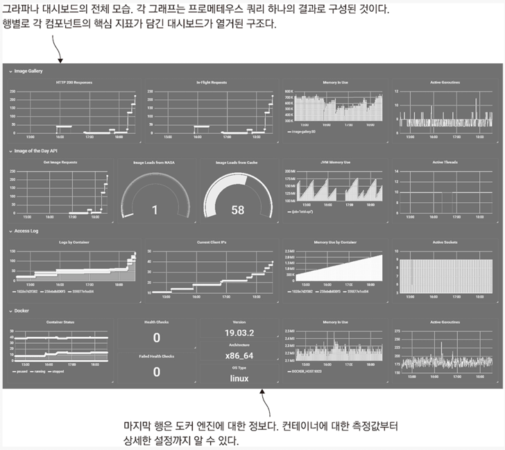

<!-- Date: 2025-01-09 -->
<!-- Update Date: 2025-01-09 -->
<!-- File ID: 7bd15a05-88d2-4fb7-9945-9465dd5d5fe3 -->
<!-- Author: Seoyeon Jang -->

# 개요

모니터링은 컨테이너의 주제 중에서도 핵심에 속한다. 세세한 조정은 애플리케이션의 상황에 따라 달라진다.
어떤 측정값을 수집할 것인지는 비즈니스의 목표와 운영상의 필요에 따라 결정된다. 그리고 측정값을 어떻게 수집할 것인가는 애플리케이션을 구동하는 런타임과 이 런타임에서 동작하는
프로메테우스 클라이언트의 작동 방식에 달렸다.

프로메테우스를 사용해 데이터를 수집했다면 그 뒤에 할 일은 비교적 간단하다. 측정값을 열람하거나 데이터 시각화를 위한 쿼리를 확인하고 손보는 데는 프로메테우스 웹 UI를 사용하고,
이 쿼리를 연결해 대시보드를 구성하는 데는 그라파나를 사용한다. 각 데이터 점(data point)은 이해하기 쉽게 시각화되며, 대시보드로 애플리케이션의 상황을 일목요연하게 파악할 수 있다.

그라파나로 image-gallery 애플리케이션의 대시보드를 만들어보자. 대시보드는 애플리케이션의 모든 구성요소와 도커 런타임의 상태를 한눈에 알수 있는 유용한 수단이다.
이 대시보드에 사용된 쿼리는 스케일링을 지원하도록 작성됐으므로 운영 클러스터에서도 대시보드를 수정 없이 사용할 수 있다.

그라파나 대시보드는 애플리케이션의 핵심 정보를 다양한 수준에서 제공한다. 얼핏 복잡해보이지만 시각화된 그래프 하나하나는 PromQL로 작성된 단일 쿼리로 그려지며,
이들 쿼리는 측정값의 취합이나 필터링 이상의 복잡한 작업을 필요로 하지 않는다.


필자가 작성한 커스텀 그라파나 이미지에 이 대시보드가 담겨져 있으므로 직접 컨테이너에서 실행시켜볼 수 있다.

> 실습: 다시 한번 로컬 컴퓨터의 IP주소를 확인해보자. 환경 변수로 저장된 IP주소는 컴포즈 파일을 통해 프로메테우스 컨테이너로 전달된다.
> 도커 컴포즈로 애플리케이션을 실행한 다음 약간의 부하를 가해보자.

```shell
$ docker-compose -f docker-compose-with-grafana.yml up -d --scale accesslog=3
```

```shell
# 측정값에 변화가 생기도록 부하를 가하기
$ for i in {1..20}; do curl http://localhost:8010 > /dev/null; done
```

그라파나의 웹 UI는 포트 3000번을 사용하며, 웹브라우저에서 처음 접근하면 로그인을 요구한다.
초기 사용자명은 admin, 패스워드도 admin이다.
UI가 로딩되면 '홈' 대시보드를 볼 수 있다. 화면 좌측의 홈링크를 클릭하면 대시보드 목록 화면이 나온다. image-gallery 항목을 클릭해
애플리케이션 대시보드로 이동한다.

대시보드를 어떤 측정값으로 구성해야하는지 궁금하다면 구글에서 제공하는 문서인 '사이트 신뢰성 엔지니어링'을 참고하기 바란다.
이 문서에서는 주로 지연 시간, 트래픽, 오류, 가용 시스템 자원을 주요 측정값으로 지목하는데, 이들을 합쳐 '골든 시그널'이라고 부른다.

필자가 만든 대시보드의 그래프와 그래프를 만든 쿼리를 하나하나 살펴보며, 이 정도의 대시보드를 만드는데 복잡한 쿼리가 필요하지 않다는 것을 확인해보자.
다음은 `image-gallery` 웹 인터페이스에서 수집된 측정값을 보여주는 그래프다.

# 정리


