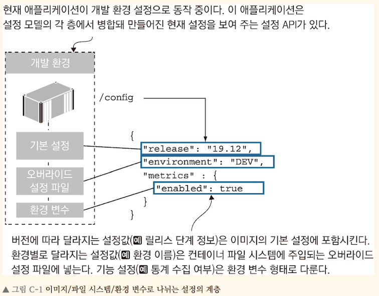

<!-- Date: 2025-01-11 -->
<!-- Update Date: 2025-01-11 -->
<!-- File ID: b88462cc-c822-445e-8ae0-23ee0a3e308b -->
<!-- Author: Seoyeon Jang -->

# 개요

애플리케이션은 환경에 따른 설정을 외부로부터 주입받아야 한다. 이 설정은 주로 환경변수 또는 파일 형태를 갖는다.
도커는 컨테이너에서 실행되는 애플리케이션에 환경을 만들어주며, 환경 변수를 설정하고 파일 시스템을 구성한다.
이러한 수단만으로도 테스트 단계를 통과한 이미지를 그대로 운영 환경에 배포할 수 있는 유연한 애플리케이션 설정을 만들 수 있다.

이번 예제에서는 닷넷코어, 자바, Go, Node.js 애플리케이션에 적합한 설정 관리 방법을 각 예제를 통해 설명한다.
이들 중 일부는 설정 관리 기능을 제공하는 라이브러리를 통해 도입되므로 **개발의 영역**에 속하지만, 나머지는 개발과 운영 사이의 어딘가의 중간 영역에
속하므로 개발팀과 운영팀이 설정 모델을 잘 이해하는 것이 중요하다.

## 다단 애플리케이션 설정

설정 모델은 설정에 담긴 데이터의 구조를 반영해야 한다. 설정 데이터의 종류는 주로 다음 세 가지다.

- **버전**에 따라 달라지는 설정: 모든 환경에서 동일하지만 버전별로 달라지는 설정
- **환경**에 따라 달라지는 설정: 환경별로 달라지는 설정
- **기능** 설정: 버전별로 애플리케이션의 동작을 달리하기 위한 설정


첫번째 예제는 설정관리 라이브러리인 node-config를 사용하는 Node.js 애플리케이션이다. node-config는 여러 곳에 위치한 파일에서 단계별로 정의된 설정값을 읽어들이고
병합해 설정을 구성한 다음 환경변수로 이 설정을 오버라이드하는 방식으로 설정을 관리한다. access-log 애플리케이션의 다음 두 디렉터리에서 설정을 읽어온다.

- config: 기본 설정으로 도커 이미지에 포함되는 설정
- config-override: 이미지에는 포함되지 않지만 볼륨, 컨피그 객체, 비밀값 등을 통해 컨테이너 파일 시스템에 주입되는 설정

> 예재 애플리케이션을 이미지에 포함된 기본 설정으로 실행하라. 그리고 동일한 이미지를 개발환경 설정 오바라이드 설정 파일을 적용해 다시한번 실행하라.

```shell
# 이미지에 포함된 기본 설정으로 컨테이너를 실행
$ docker container run -d -p 8080:80 diamol/ch18-access-log

# 로컬 오버라이드 설정 파일의 설정을 적용해 컨테이너를 실행
$ docker container run -d -p 8081:80 -v "$(pwd)/config/dev:/app/configoverride" diamol/ch18-access-log

# 설정 API로 현재 설정을 확인
curl http://localhost:8080/config
curl http://localhost:8081/config
```

첫번째 컨테이너는 이미지에 함께 패키징된 기본 설정파일만을 사용한다. 이 설정 파일에는 릴리스 주기(19.1.2)정보와, 프로메테우스 정보 수집을 활성화하는 설정이 담겨있다.
환경 이름은 UNKNOWN이라고 되어있다. 이 환경 이름으로 환경별 설정이 제대로 적용되지 않았다는 것도 확인할 수 있다. 두번째 컨테이너는 로컬 디렉터리를 볼륨으로 연결해 그 안에 있는
오버라이드 설정 파일의 설정을 적용한다. 이 파일은 프로메테우스 정보 수집을 비활성화하고 환경 이름을 설정한다. 두 번째 컨테이너를 대상으로 설정 API를 호출해보면 동일한 이미지인데도
다른 설정이 적용된 것을 볼 수 있다.

미리 정의된 경로에서 오버라이드 설정 파일을 읽어들이도록 해두면, 어떤 경로로든 컨테이너 파일 시스템에 설정 파일을 주입하기만 하면 해당 설정을 적용할 수 있다.
여기서는 로컬 바인드를 사용했으나 클러스터에 저장된 컨피그 객체나 비밀값을 사용해도 같은 결과를 얻을 수 있다.

node-config 패키지에는 환경 변수로부터 설정값을 불러오는 기능도 있다. 이 설정값으로 파일 계층에서 불러온 설정값을 오버라이드할 수 있다.
이 방법은 12 Factor App 에서 추천하는 방법이기도 한다. 12 Factor App 은 환경변수에 포함된 설정값을 최우선 순위에 두는 현대적 애플리케이션 설계 스타일을 말한다.
이 방법은 컨테이너를 교체해야만 환경 변수를 수정할 수 있다는 점에서 컨테이너를 '쓰고 버리는' 대상으로 보는 태도를 기르기에도 유용하다.

# 정리


