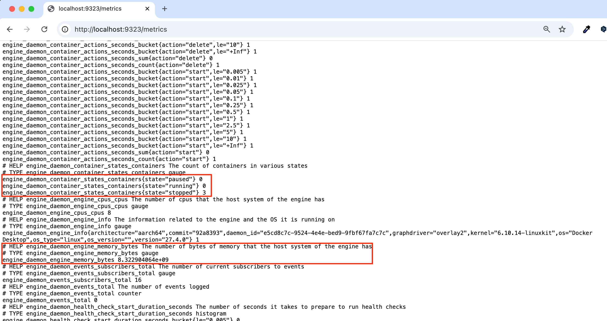

<!-- Date: 2025-01-06 -->
<!-- Update Date: 2025-01-06 -->
<!-- File ID: c8fb5930-1a68-4601-b591-744ec55878a5 -->
<!-- Author: Seoyeon Jang -->

# 개요

컨테이너 환경의 모니터링은 일반 환경과는 사뭇 다르다. 컨테이너 이전의 전통적인 애플리케이션 모니터링이라고 하면,
서버의 목록과 현재 동작 상태(잔여 디스크 공간, 메모리와 CPU 사용량 등)가 표시된 대시보드가 있고 과부하가 걸리거나
응답하지 않는 서버가 발생하면 경보가 울리는 형태가 대표적이다.

컨테이너화된 애플리케이션의 환경은 이보다 훨씬 역동적이다. 애플리케이션은 수십 개에서 수백 개에 이르는 컨테이너에 걸쳐 실행되고,
컨테이너는 플랫폼에 의해 끊임없이 생성됐다가 삭제되기를 반복한다.

이런 환경에서는 컨테이너 플랫폼과 연동해 정적인 컨테이너 혹은 IP주소 목록 없이도 실행 중인 애플리케이션을 속속들이 들여다볼 수 있는 도구를 갖춘
새로운 모니터링 방식이 필요하다.

**프로메테우스는 바로 이런 기능을 제공하는 오픈소스도구다.**

프로메테우스는 CNCF(쿠버네티스와 컨테이너 런타임인 `containerd`를 관리하는 바로 그 곳)에서 개발을 담당하며 다양한 곳에서 널리 사용되고 있다.
프로메테우스 역시 컨테이너에서 동작하기 때문에 분산 애플리케이션에 어렵지 않게 모니터링을 추가할 수 있다.

애플리케이션 프로메테우스 역시 컨테이너에서 실행되며 도커 엔진과 그 외 애플리케이션 컨테이너로부터 데이터를 수집한다.
수집된 데이터는 수집 시각과 함께 저장된다. 측정값을 외부로 공개하는 API를 포함해 컨테이너를 만든다.
컨테이너의 상태를 측정하는 API를 제공하도록 도커엔진을 설정하면 프로메테우스는 도커 엔진과 다른 컨테이너를 모니터링한다.

프로메테우스를 사용하면 모니터링의 중요한 측면인 일관성이 확보된다. 모든 애플리케이션에서 똑같이 구성된
측정값을 내놓기 때문에 윈도 컨테이너의 닷넷 애플리케이션이든 리눅스 컨테이너의 Node.js 애플리케이션이든 모든
애플리케이션을 똑같은 표준적인 형태로 모니터링할 수 있다. 측정값을 추출하기 위한 쿼리 언어도 한가지만 익히면 되고,
전체 애플리케이션 스택에 똑같은 모니터링을 적용할 수 있다.

프로메테우스의 또 다른 장점은 도커 엔진의 측정값도 같은 형식으로 추출할 수 있다는 점이다.
이를 통해 컨테이너 플랫폼에서 벌어지는 일도 파악할 수 있다. 이 기능을 사용하려면 도커 엔진 설정에서 프로메테우스
측정 기능을 명시적으로 활성화해야 한다. 도커 엔진의 설정은 `daemon.json`이라는 이름의 파일에 포함돼있는데,
이 파일은 윈도환경에서는 `C:\Program Data\docker\config` 디렉토리에 있고 리눅스환경에서는 `/etc/docker`디렉토리에 있다.
도커 데스크톱을 사용중이라면, 고래 아이콘을 우클릭해 메뉴에서 설정을 선택한다음 Daemon항목에서 설정을 수정하면 된다.

> 실습: 설정 파일을 열고 다음 두 값을 추가하라.

```json
"metric-addr" : "0.0.0.0:9323",
"experimental": true
```

이 설정을 추가하면 포트 9323번을 통해 측정값이 공개된다.
도커 엔진의 상태도 전체 시스템의 상태를 파악하기 위한 밑바탕이 되므로 대시보드에 추가할만한 가치가 있는 정보다.
도커 엔진의 상태측정 기능을 활성화했다면 [http://localhost:9323/metrics](http://localhost:9323/metrics)에서 도커 엔진의
상태 정보를 볼 수 있다. 즉 도커 엔진에서 상태 측정 기능이 활성화되었으므로 상태 정보를 제공하는 HTTP 엔드포인트를 사용할 수 있게 되는 것이다.


제공되는 상태 정보 중에는 도커를 실행중인 시스템의 설치된 메모리 용량 같은 정적인 정보도 있고, 현재 컨테이너의 상태별 개수처럼 지속적으로 변화하는 정보도 있다.

위 상태정보 출력 포맷이 바로 프로메테우스 포맷이다. 측정된 각 상태 정보가 이름과 값의 쌍 형태로 표현되는
간단한 텍스트 기반 포맷으로 돼 있다. 그리고 이름-값 쌍 앞에는 해당 정보가 어떤 정보인지 간단한 주석이 붙는다.
이 텍스트 형식의 정보가 컨테이너 모니터링의 핵심이다. 정보 항목마다 별도의 엔드포인트를 통해 실시간으로 값을 제공한다.
프로메테우스는 이 값을 수집하면서 타임스탬프값을 덧붙여 저장하므로 저장된 값을 정리해 시간에 따른 값의 변화를 추적할 수 있다.

> 실습:
> 프로메테우스를 컨테이너에서 실행해 현재 도커를 실행중인 컴퓨터의 정보를 수집해보자.
> 이를 위해 먼저 현재 로컬 컴퓨터의 IP주소를 확인해야 한다. 컨테이너는 자신을 실행중인 서버의 IP주소를 알 수 없다.
> 따라서 이 정보를 컨테이너에 환경변수 형태로 직접 전달해야 한다.

```shell
# 로컬 컴퓨터의 IP주소를 확인해 환경 변수로 정의하기(리눅스)
$ hostIP=$(ip route get 1 | awk '{print $NF;exit}')

# 로컬 컴퓨터의 IP주소를 확인해 환경 변수로 정의하기(macOS)
$ hostIP=$(ifconfig en0 | awk '/inet / {print $2}')

# 환경 변수로 로컬 컴퓨터의 IP주소를 전달해 컨테이너를 실행
$ docker container run -e DOCKER_HOST=$hostIP -d -p 9090:9090 diamol/prometheus:2.13.1
```

프로메테우스가 포함된 `diamol/prometheus`이미지의 설정 중 DOCKER_HOST 환경변수를 사용해 호스트 컴퓨터와 통신하고
도커 엔진의 상태 측정값을 수집한다. 컨테이너에서 호스트 컴퓨터의 서비스에 접근할 일은 별로 없지만, 필요하다면 서버 이름을 설정해
IP 주소를 직접 알아내도록 한다.

이제 프로메테우스가 실행됐다. 좀 더 구체적으로 말하자면, 주기적으로 도커 호스트에서 측정값을 수집한 다음,
타임스탬프를 덧붙여 데이터베이스에 저장한다. 그리고 수집된 데이터를 열람할 수 있는 간단한 웹 인터페이스가 실행됐다.
이 웹 인터페이스를 통해 **/metrics**엔드포인트로 제공되는 정보는 모두 확인할 수 있다. 원하는 정보만 필터링하거나
표 혹은 그래프 형식으로 요약해보는 것도 가능하다.

> 실습: 웹 브라우저에서 [http://localhost:9090](http://localhost:9090)에 접근해 프로메테우스의 웹인터페이스를 살펴보자.
> 웹 인터페이스 메뉴의 Status > Targets 항목에서 원하는 대상의 측정값을 볼 수 있다.
> DOCKER_HOST의 상태가 녹색이라면 프로메테우스가 호스트 컴퓨터를 발견했다는 의미다!
>
> 그 다음에 Graph 메뉴로 이동하면 프로메테우스가 수집한 모든 측정값의 목록이 담긴 드롭다운 리스트가 나온다.
> 그 중에는 `engine_daemon_container_actions_seconds_sum`이라는 항목이 있는데, 이 항목은 컨테이너의 각 활동에 걸린
> 시간을 의미한다. 이 항목을 선택하고 Execute 버튼을 클릭하면, 컨테이너를 시작, 생성, 삭제하는 데 걸린 시간이 각각 얼마나 되는지 알 수 있다.


프로메테우스 UI를 통해 쉽게 쿼리를 실행하고 그 결과를 확인할 수 있다.
단순한 측정값의 이름 외에도 PromQL 문법으로 된 복잡한 쿼리를 쓸 수 있다.
이들 정보는 각 상태별 컨테이너 수나 실패한 헬스체크 횟수 같은 고수준 정보부터 도커 엔진이 점유 중인 메모리 용량 같은
저수준 정보까지 다양하다. 호스트 컴퓨터에 설치된 CPU 수와 같은 인프라스트럭처의 정적인 정보도 여기에 포함된다.
이들 정보도 대시보드에 포함시킨다면 유용하게 활용할 수 있다.

애플리케이션 또한 자신의 상태 정보를 제공하는데, 이들 정보의 자세한 정도는 애플리케이션마다 다르다.
우리가 할 일은 컨테이너마다 측정값을 수집할 엔드포인트를 만들고 프로메테우스가 이들 엔드포인트에서 주기적으로 정보를 수집하게 하는 것이다.
이 정도면 전체 시스템의 상태를 한눈에 알 수 있는 대시보드를 만드는 데 충분한 정보를 수집할 수 있다.

# 정리


