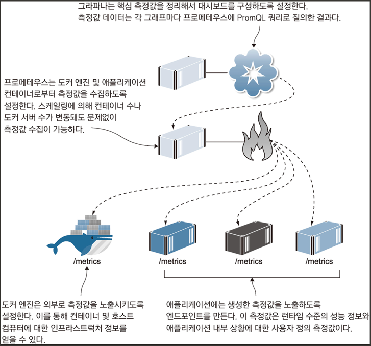

<!-- Date: 2025-01-10 -->
<!-- Update Date: 2025-01-10 -->
<!-- File ID: 3b74ead5-7215-46be-836e-89eea1d90ee7 -->
<!-- Author: Seoyeon Jang -->

# 개요
간단한 개념검증 수준의 프로덕트에서 실제 서비스가 가능한 수준으로 나아가기 위해서는 투명성(observability)이 반드시 필요하다. 프로메테우스와 그라파나를 소개한 
이유가 단지 이것 때문만은 아니다. 도커를 익힌다는 것은 Dockerfile 스크립트와 도커 컴포즈 스크립트 작성법을 배우는 것만이 아니다. 도커의 진짜 매력은 컨테이너를 
중심으로 만들어진 생태계와 구성하는 도구를 적용하는 패턴에 있다.

컨테이너 기술 초기의 모니터링은 정말 골치아픈 문제였다. 운영 환경에 배포하는 과정은 그때나 지금이나 별반 다를 바 없지만, **운영환경에 투입한 애플리케이션의 
상태를 파악하기가 너무 어려웠다.** 당시로서는 핑덤(Pingdom)같은 외부 서비스로 API의 동작 상태를 확인하거나 사용자 리포팅에 의존하는 수밖에 없었다. 오늘날의 
컨테이너 모니터링은 이미 시행착오를 거친 신뢰성있는 수단을 사용한다.

컨테이너화된 애플리케이션의 모니터링 과정이다. 프로메테우스가 모니터링의 중심이 된다. 

`image-gallery`애플리케이션의 전체적인 상황을 모니터링하는 대시보드 하나만을 만들었지만, 실제 운영 환경 모니터링이라면 더 자세한 상황을 알려주는 대시보드가 필요하다.
또 가용한 디스크 용량, CPU, 메모리, 네트워크 자원 등 모든 서버의 상황을 보여주는 **인프라스트럭쳐 대시보드**도 생각해볼 수 있다. 애플리케이션을 구성하는 각 컴포넌트도 자신만의
추가적인 정보를 모니터링하는 대시보드를 따로 가질 수 있다. 이를테면 웹 애플리케이션의 페이지별로 혹은 API의 엔드포인트별로 응답 시간을 분류해본다거나 하는 것이 가능하다.

가장 중요한 것은 애플리케이션의 전체 상황을 조망하는 대시보드다. 측정값 중에서 가장 애플리케이션에 중요한 데이터를 모아 하나의 화면으로 구성할 수 있어야 한다.
**그래야만 한눈에 이상상황을 파악하거 좋고, 사태가 악화되기 전에 조치를 취할 수 있다.**

# 정리

