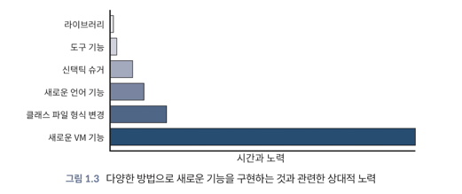

<!-- Date: 24. 12. 25. } -->
<!-- File ID: f65921c6-b365-4aaf-a9ff-364a2c791bfa -->
<!-- Author: Seoyeon Jang -->

# 개요

자바 언어를 변경하는 데는 노력 곡선(effort curve)이 존재한다.
일부 구현은 다른 구현보다 엔지니어링 작업이 덜 필요하다.
다음 그림은 서로 다른 변경 방법을 나타내고 각 방법으로 새로운 기능을 구현하는 데 필요한
상대적인 노력을 보여준다.

일반적으로 최소한의 노력이 필요한 방법을 선택하는 것이 좋다.
새로운 기능을 라이브러리로 구현하는 것이 가능하다면, 그렇게 하는 것이 좋다.
그러나 일부 기능은 라이브러리나 IDE 기능으로 구현하기 쉽지 않거나 불가능할 수 있다.
일부 기능은 더 깊숙이 플랫폼 내부에서 구현해야 한다.
다음은 새로운 언어 기능에 대한 복잡성 척도에 최근 몇 가지 기능이 어떻게 적용되는지 보여준다.

- 라이브러리 변경: 컬렉션 팩토리 메서드(자바 9)
- 신택틱 슈거: 숫자 안의 밑줄(자바 7)
- 작은 새로운 언어 기능: `try-with-resources`(자바 7)
- 클래스 파일 형식 변경: 애너테이션(자바 5)
- 새로운 JVM 기능: 네스트메이트(nestmates)(자바 11)
- 새로운 주요 기능(새로운 언어 기능): 람다 표현식(자바 8)

자바에서 새로운 기능을 구현하는 방법에는 여러가지가 있다.
각 방법은 필요한 노력과 복잡성에 따라 달라진다.
아래는 각 방식에 대한 설명과 예시이다.

## 설탕 뿌리기 🍬

종종 언어의 기능을 설명하는 데 사용되는 문구가 **신택틱 슈거**다.
즉 언어에 이미 존재하는 기능임에도 인간이 작업하기 쉬운 형식으로 제공된다.

일반적으로 신택틱 슈거 기능은 컴파일 프로세스 초기 단계에서 컴파일러의 프로그램 표현에서 제거되며,
이를 '설탕이 제거됐다(desugared)'라고 한다.

이런 문법적 변화를 언어에 쉽게 구현할 수 있는 이유는 상대적으로 적은 작업량이 필요하며 작업이
컴파일러에 대한 변경만 필요(자바의 경우 `javac`컴파일러에 대한 변경만 필요)로 하기 때문이다.

자바 7에서 `switch`문에 문자열(String)을 허용하도록 변경된 구현은 컴파일러의 내부 구현 방식에 중요한 변화를 가져왔다.
자바 7이전에는 `switch`문이 int, enum, chat 등의 값들믄 허용했는데, 자바 7에서 문자열을 허용하게 됨으로써, 컴파일러는 문자열을
처리할 수 있도록 변경되었다. 이 변화는 컴파일러 내부의 코드 변환 및 최적화 방식에 영향을 미쳤다.

### 설탕 뿌리기 - 숫자 안의 밑줄 변경(Underscores in Numbers)(자바 7)

자바 7에서 도입된 또 다른 문법적 변화는 **숫자 리터럴 안에 밑줄을 사용할 수 있는 기능**이었다.
예를 들어, `1_000_000`처럼 숫자 리터럴에 밑줄을 삽입해 가독성을 높일 수 있었다.

이 변경은 문법적 설탕의 일종으로, 기존의 숫자 리터럴을 그대로 유지하되, 컴파일러가 밑줄을 제거하고 이를 숫자로 처리하도록 구현되었다.
밑줄은 단순히 사람이 코드를 더 읽기 쉽게 만들기 위한 기능이므로, 컴파일러는 이를 처리할 때 특별한 변환을 수행하고 최종적으로 실행되는
바이트코드는 숫자 `1000000` 으로 변환된다. 즉, 밑줄을 제거하는 작업은 컴파일러의 초기 단계에서 이루어진다.

### `switch`문에서 문자열 처리(String in Switch)

자바 7에서 `switch`문에 문자열을 허용하기 위한 변경은 자바 언어 설계에 있어 중요한 수정이었다.
이전에는 `switch`문이 정수값만 지원했으나, 문자열을 `switch`의 조건으로 사용할 수 있게 됨으로써,
다음과 같은 과정이 필요했다.

- 컴파일러 측면: 컴파일러(javac)는 문자열을 `switch`문에서 사용할 수 있도록 변환해야 했다.
- 변경 내용: 자바 언어 명세(JLS)에 `switch`문에서 문자열을 지원한다고 명시했다.

# 언어 변경

모든 변경에 대해 수행해야 하는(또는 적어도 조사해야 하는) 전체 작업의 세트는 다음과 같다.

- JLS 업데이트
- 소스 컴파일러에서 프로토타입 구현
- 변경에 필수적인 라이브러리 지원 추가
- 테스트 및 예제 작성
- 문서 업데이트

또한 변경 사항이 JVM이나 플랫폼에 영향을 미치는 경우 다음 작업이 수행돼야 한다.

- VMSpec 업데이트
- JVM 변경사항 구현
- 클래스 파일 및 JVM 도구에 지원 추가
- 리플렉션에 미치는 영향 평가
- 직렬화에 미치는 영향 평가
- 자바 네이티브 인터페이스(JNI)와 같은 네이티브 코드 구성 요소에 미치는 영향 평가

# JSRs와 JEPs

자바 플랫폼을 변경하는 데 두 가지 주요 매커니즘이 사용된다.
첫번째는 **자바 커뮤니티 프로세스(JCP)**에서 지정하는 **자바 스펙 요구서(JSR)**이다.
이는 **외부 라이브러리**와 **내부 주요 플랫폼 API**, 둘 모두의 표준 API를 결정하는 데 사용된다.

> 외부 라이브러리 vs 내부 주요 플랫폼 API ?
>
> 자바 플랫폼의 발전은 두 가지 범주에서 이루어진다:
> - **외부 라이브러리** (External Libraries)
> - **내부 주요 플랫폼 API** (Core Platform APIs)
    > 이 둘은 자바의 기능을 확장하지만, **제공 위치**와 **역할**에서 차이가 있다.
>
> **1. 외부 라이브러리 (External Libraries)**
> - 정의: 자바의 표준 라이브러리가 아닌, 외부에서 개발된 라이브러리나 프레임워크.
> - 예시:
    >
- Apache Commons (유틸리티 라이브러리)
>   - Gson / Jackson (JSON 파싱)
>   - Hibernate (ORM 프레임워크)
>   - Spring (애플리케이션 프레임워크)
> - 특징:
    >
- JSR을 통해 표준화되거나 자바의 일부로 편입될 수 있지만, 대부분 독립적으로 관리됨.
>   - 의존성 관리도구(Maven, Gradle)를 통해 애플리케이션에 추가됨
>
> 2. 내부 주요 플랫폼 API (Core Platform APIs)
> - 정의: 자바 표준 라이브러리(자바 SE, JDK)의 일부로 포함된 API
> - 예시:
    >
- `java.lang` (기본 클래스, String, Math 등)
>   - `java.util` (컬렉션, 날짜, 유틸리티)
>   - `java.nio` (입출력 API)
> - 특징:
    >
- 자바 플랫폼의 핵심 구성 요소로, **JDK에 포함됨**
>   - 별도 의존성 추가 없이 자바 애플리케이션에서 바로 사용 가능
>   - **플랫폼의 버전에 따라 업데이트**되며, JEP를 통해 새로운 API가 추가됨
>
> 예시로 보는 차이
> - **JSON 처리**
    >
- 외부 라이브러리: Gson, Jackson (JDK에 포함되어 있지 않음)
>   - 내부 API: `javax.json`(Java EE 및 Jakarta EE 표준 API)
> - **HTTP 클라이언트**
    >
- 외부 라이브러리: Apache HttpClient
>   - 내부 API: `java.net.http`(JDK 11부터 포함)

자바 스펙 요구서(JSR)는 역사적으로 자바 플랫폼을 변경하는 유일한 방법이었으며, 이미 성숙한 기술에 대한 합의를 규정하는 데 가장 적합했다.
그러나 최근 몇 년 동안 변경을 빠르게(그리고 더 작은 단위로)구현하려는 욕구로 인해 더 가벼운 대안으로 **JEP(JDK Enhancement Proposal)**가 개발됐다.
플랫폼 JSR은 이제 다음 버전의 자바를 대상으로 하는 JEP들로 구성된다.

새로운 자바 기능에 대해 논의할 때, 해당 JEP번호로 예정된 기능이나 최신 기능을 참조하는 것은 유용하다.
모든 JEP의 전체 목록은 [http://openjdk.java.net/jeps/0](http://openjdk.java.net/jeps/0)에서 확인할 수 있다.

# 인큐베이팅과 프리뷰 기능

새로운 릴리스 모델 내에서 자바는 후속 릴리스에서 최종 확정하기 전에 제안한 기능을 시험해볼 수 있는 두가지 메커니즘을 갖고 있다.
이러한 매커니즘의 목적은 더 나은 기능을 제공하기 위해 더 넓은 사용자 집단의 피드백을 수집하고, 기능이 자바의 영구적인 일부가 되기 전에 기능을 변경하거나 철회할
수 있도록 하기 위한 것이다.

**인큐베이팅 기능**(incubating feature)은 새로운 API와 해당 구현으로, 가장 단순한 형태로 독립적인 모듈로 제공하는 새로운 API에 불과하다.
(자바 모듈에 대한 자세한 내용은 2장에서 설명)
모듈 이름은 API가 일시적이며 기능이 최종 완성되면 변경될 것임을 분명하게 하도록 명명한다.

인큐베이팅 기능에서 눈에 띄는 한 가지 예는 일반적으로 HTTP/2라고 하는 HTTP 프로토콜 버전 2에 대한 새로운 지원이다.
자바 9에서는 인큐베이터 모듈 `jdk.incubator.http`로 제공됐다.
이 모듈의 이름과 `java`가 아닌 `jdk.incubator`네임스페이스의 사용은 이 기능이 비표준으로 변경될 수 있음을 명확히 했따.
이 기능은 자바 11에서 네임스페이스에 `java`가 존재하는 `java.net.http`모듈로 이동하면서 표준화됐다.

이 접근 방식의 주요 장점은 인큐베이팅 기능이 하나의 네임스페이스로 격리될 수 있다는 것이다.
개발자들은 빠르게 기능을 사용해볼 수 있으며, 기능이 표준화되면 일부 코드를 수정, 재컴파일, 재링크하면 프로덕션 코드에서도 사용할 수 있다.

미완성 기능을 배포하는 데 사용하는 다른 매커니즘이 **프리뷰 기능**(preview feature)이다.
최신 자바 버전에서 제공하는 기능으로, 인큐베이팅 기능보다 더 깊은 수준에서 언어 자체의 일부로 구현된다.
이러한 기능은 다음과 같은 지원이 필요할 수 있다.

- `javac`컴파일러
- 바이트코드 형식
- 클래스 파일과 클래스 로딩

이는 특정 플래그와 컴파일러가 런타임에 전달되는 경우에만 사용할 수 있다.
플래그를 활성화히지 않고 프리뷰 기능을 사용하려고 하면 컴파일할 때와 런타임할 때 모두 오류가 발생한다.

이로 인해 처리하기가 훨씬 더 (인큐베이팅 기능에 비해)복잡해진다.
결론적으로 프리뷰 기능은 실제 프로덕션용으로 사용할 수 없다.
한 가지 이유는 이들이 최종 완성되지 않은 클래스 파일 형식의 버전으로 표현되며 자바 프로덕션 버전에서는
지원되지 않을 수도 있기 때문이다.

즉 피리뷰 기능은 실험, 개발자 테스트, 체험용에만 적합하다.

자바 11에는 프리뷰 기능이 포함돼있지 않다.(`switch` 구문의 첫 번째 프리뷰 버전이 자바 12에 포함됨)

이후에 자바 17에 대해 논의할 때 프리뷰 버전에 대해 자세히 알아보자.