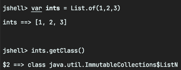
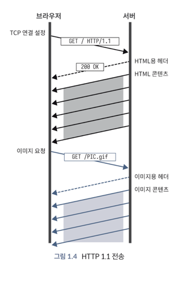
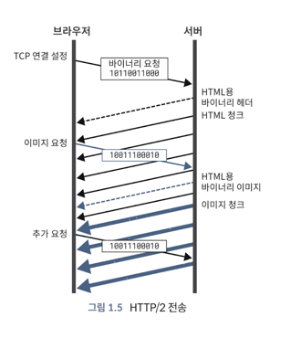

<!-- Date: 24. 12. 29. } -->
<!-- File ID: 30a0bcf9-ecc9-40f0-baa2-ff5e5c37e00f -->
<!-- Author: Seoyeon Jang -->

# 개요

자바 8 이후로 비교적 많은 새로운 작은 기능들이 후속 릴리즈에 등장했다.
자바 11을 처음 사용할 때면 이러한 기능들을 보게 될 것이다.

## 컬렉션 팩토리(JEP 213)

자주 요청되는 개선 사항은 **컬렉션 리터럴**(`list` 또는 `map`과 같은 객체의 단순 컬렉션을 선언하는 간단하고 편리한 방법)을 선언하는
간단하고 편리한 방법을 지원하도록 **자바를 확장**하는 것이다.
이는 많은 다른 언어가 이런 기능을 제공하고 있고, 자바 자체에서도 **배열 리터럴**을 항상 지원해왔기 때문이다.

```java
int[] numbers = {1, 2, 3};
```

그러나 이러한 기능을 언어 수준에서 추가하는 것은 겉으로 보기에는 매력적일 수 있지만, 몇 가지 단점이 있다.
예를 들어 `ArrayList`, `HashMap`, `HashSet`은 대부분의 개발자에게 가장 익숙한 구현체이지만,
자바 `Collections`의 주요 설계원칙 중 하나는 클래스가 아닌 인터페이스로 표시된다는 것이다.
이렇게 함으로써 서로 다른 구현이 가능해지는 것이다.

즉 아무리 일반적이더라도 구체적인 구현과 직접 결합하는 새로운 구문이 있다면, 의도한 설계 원칙과
반대된다는 것이다. 대신, 자바 8에서 인터페이스에 정적 메서드를 가질 수 있는 기능이 추가돼 이를 활용해서
해당 인터페이스에 간단한 팩토리 메서드를 추가하는 것으로 설계 결정이 이루어졌다.
결과적으로 코드는 다음과 같이 작성된다.

```java
Set<String> set = Set.of("a", "b", "c");
var list = List.of("x", "y");
```

이 방법은 언어 수준에서 지원을 추가하는 것보다 조금 더 장황히지만 구현 측면에서 복잡성 비용은
훨씬 적다. 이런 새로운 메서드는 다음과 같이 일련의 오버로드들로 구현된다.

```java
List<E> of()

List<E> of(E e1)

List<E> of(E e1, E e2)

...

List<E> of(E e1, E e2, E e3, E e4, E e5, E e6, E e7, E e8, E e9, E e10);

ListM<E> of(E... elements)
```

일반적인 경우(최대 10개의 요소)에는 해당 요소들을 나열한 메서드가 제공되며, 요소가 10개보다 더 많은 경우를
위해 **가변인수**(varargs)형태도 제공된다.

맵의 경우는 조금 복잡한데, 두 개의 일반 매개변수(키 타입과 값 타입)가 있으므로 간단한 경우에는
다음과 같이 작성할 수 있다.

```java
var m1 = Map.of(k1, v1);
var m2 = Map.of(k1, v1, k2, v2);
```

맵에 대해 가변 인수 형식과 동등하게 작성할 수 있는 간단한 방법은 없다.
대신 다음 코드와 같이 `ofEntries`라는 다른 팩토리 메서드를 사용하고 `entry()`라는 정적 도우미 메서드와 결합하여
가변 인수 형태와 동등한 것을 제공한다.

```java
import java.util.Map;

Map.ofEntries(
        entry(k1, v1),

entry(k2, v2),

entry(k3, v3),

entry(k4, v4),
        ...
                );
```



이 클래스들은 변경할 수 없는 자바 컬렉션 인터페이스의 새로운 구현체다.
`ArrayList`나 `HashMap` 과 같은 익숙한 가변 클래스가 아니다.
이런 타입의 인스턴스를 수정하려고 시도하면 예외가 발생한다.

## 엔터프라이즈 모듈 제거(JEP 320)

시간이 지남에 따라 **자바 스탠다드 에디션(자바 SE)**Standard Edition에는 다음과 같은
**자바 엔터프라이즈 에디션(자바 EE)**Enterprise Edition의 일부인 몇몇 모듈이 추가됐다.

- JAXB
- JAX-WS
- CORBA
- JTA

자바 9에서 이런 기술을 구현한 다음의 패키지들은 비핵심 모듈로 옮겨졌고, 더이상 사용되지 않아 제거됐다.

- java.activation(JAF)
- java.corba(CORBA)
- java.transaction(JTA
- java.xml.bind(JAXB)
- java.xml.ws(JAX-WS)

플랫폼을 간소화하기 위한 노력의 일환으로 자바 11에서 이러한 모듈들이 제거됐다.
즉 핵심 SE 배포에서 제거된 것이다.

이런 기능들을 사용하려면 자바 11에서 빌드된 프로젝트는 이제 명시적으로 외부 의존성을 포함해야 한다.
이는 이런 API에 의존한 일부 프로그램이 자바 8에서는 깨끗하게 빌드됐지만, 자바 11에서 빌드하려면 빌드 스크립트를 수정해줘야 한다는 것을 의미한다.
11장에서 이 특정 문제를 더 자세히 살펴볼 것이다.

## HTTP/2(자바 11)

현대에 이르러 HTTP 표준의 새로운 버전인 HTTP/2가 출시됐다.
우리는 1997년에 발표된, 유서 깊은 HTTP 1.1사양을 업데이트하게 된 이유를 살펴볼 것이다.

1997년에 나온 기술이라고 하면 예상할 수 있듯이 HTTP 1.1은 노후됐는데,
특히 최신 웹 애플리케이션의 성능과 관련해 다음과 같은 문제가 있다.

- 헤드 오브 라인 블로킹
- 단일 사이트로의 제한된 연결
- HTTP 제어 헤더의 성능 오버헤드

HTTP/2는 이런 근본적인 성능 문제를 해결하는 데 중점을 둔 프로토콜의 **전송계층**(transport level)에 대한 업데이트다.
클라이언트와 서버 간 바이트 흐름 방식에 중점을 둔 HTTP/2는 실제로 요청/응답, 헤더, 상태코드, 응답바디와 같은
많은 익숙한 HTTP 개념을 변경하지 않았다. 이런 개념은 HTTP/2 나 HTTP 1.1에서 의미상 동일하게 유지된다.

## 해드 오브 라인 블로킹

**헤드 오브 라인 블로킹**(head-of-line blocking, HOL blocking)문제를 보자.
HTTP 통신은 TCP 소켓을 통해 이뤄진다. HTTP 1.1은 불필요한 연결 설립 비용을 반복하지 않기 위해 기본적으로 개별 소켓을 재사용하도록 돼 있지만,
프로토콜은 여러 요청이 소켓을 공유하는 경우에도 요청이 순서대로 반환되도록 했다.
이는 서버의 느린 응답이 이론적으로 더 빨리 반환될 수 있는 후속 요청을 차단하는 것을 의미한다.

이 문제는 웹 브라우저가 서버에서 여러 개의 파일(이미지, 스크립트 등)을 다운로드할 때,
한번에 하나씩 차례로 받아와야 하는 상황을 말한다. 만약 첫 번째 파일을 받아오는 데 시간이 오래걸리면,
그 뒤에 있는 파일들은 기다려야 하는 것이다.

이는 HTTP 기반의 서비스와 통신해야 하는 JVM 애플리케이션에 제한을 줄 수 있다.
즉 여기서의 "제한"dms JVM 애플리케이션이 HTTP를 통해 다른 서비스(서버)와 통신할 때
발생하는 문제를 가리킨다. 좀 더 구체적으로 설명하면, JVM 애플리케이션이 다른 서버의 API 를 호출하거나,
데이터를 요청할 때 **HTTP 1.1**을 사용한다면, **한 번에 하나의 응답만 처리해야 해서**, 느린 요청이 있으면 그 뒤의 요청들이 지연된다.

### 왜 이런 일이 생기는가?

HTTP 1.1에서는 한 소켓(서버와 브라우저 간 연결)이 여러 요청을 처리한다.
이 소켓이 요청을 순서대로 처리해야 해서, 첫번째 요청이 끝날 때까지 다음 요청은 대기 상태가 된다.


### 이걸 왜 중요하게 생각해야 하는가?

브라우저에서 웹사이트가 느리게 뜨는 원인 중 하나이기 때문이다.
특히, 이미지나 CSS 같은 에셋들이 차례로 늦어지면 웹사이트가 늦게 뜨는 현상으로 이어지기 때문이다.

### HTTP/2는 어떻게 해결했는가?

HTTP/2에서는 이런 문제를 해결하기 위해 **멀티플렉싱**(Multiplexing)기술을 사용한다.
여러 요청을 동시에 보낼 수 있어서, 첫 번째 요청이 느려도 뒤에 있는 요청들이 기다리지 않고 바로 처리할 수 있게 된다.

쉽게 말해, HTTP 1.1에서는 파일을 일렬로 하나씩 받아야 했지만, HTTP/2에서는 여러 파일을 동시에 받을 수 있는 것이다.

HTTP/2는 처음부터 동일한 연결에서 요청을 다중화하도록 설계됐다.
클라이언트와 서버 간 **다중 스트림**(multiple stream)이 항상 지원된다.
단일 요청의 헤더와 본문을 별도로 수신할 수도 있다.

이는 수십 년간 개발자들에게 자연스러운 것으로 여겨졌던 HTTP 1.1의 가정들을 근본적으로 바꿨다.
예를 들어 웹사이트에서 작은 에셋을 많이 전달하는 것이 커다란 번들을 한 두개 전달하는 것보다 나쁜 성능을 낸다는 것은 오랫동안 받아들여져왔다.
자바스크립트, CSS, 이미지는 모두 여러 개의 파일을 한데 묶어 더 효율적으로 반환하는 일반적인 기술과 도구가 있다.
HTTP/2에서 다중화된 응답을 사용하면 다른 느린 요청때문에 에셋이 차단되지 않고, 작은 응답이 더 정확하게 캐시될 수 있어서 전반적으로
더 나온 사용자 경험을 제공한다.



HTTP 1.1 사양에서는 서버에 대한 연결을 한번에 두 개로 제한할 것을 권장한다.
이는 의무가 아닌 권고로 명시돼있으며, 현재 웹브라우저는 흔히 도메인당 6-8개의 연결을 허용한다.
한 사이트에서 동시 다운로드에 대한 이런 제한으로 개발자들은 종종 여러 도메인으로 나누어 사이트 서비스를 제공하거나.
앞서 언급한 번들링을 구현하는 경우가 많다.

HTTP/2는 이런 상황을 해결한다. 각 연결을 효과적으로 사용하여 원하는 만큼의 동시 요청을 수행할 수 있다.
브라우저는 특정 도메인에 대해 하나의 연결만 열지만, 동일한 연결을 통해 동시에 많은 요청을 수행할 수 있다.

### HTTP 헤더 성능

HTTP의 중요한 특징 중 하나는, 요청과 함꼐 **헤더**를 전송하는 기능이다.
헤더는 HTTP 프로토콜 자체가 상태를 유지하지 않지만, **애플리케이션에서 요청 간의 상태를 유지할 수 있게 해준다**(예: 사용자가 로그인한 사실)

HTTP 1.1의 **페이로드**는 클라이언트와 서버가 압축 알고리즘(일반적으로 gzip)에 대해 합의하면
압축할 수 있지만, 헤더는 압축되지 않는다.
점점 더 리치 웹 애플리케이션이 많아지고 **요청이 잦아짐**에 따라 큰 헤더를 반복하는 것은 문제가 된다.

HTTP/2는 헤더의 새로운 이진 형식을 통해 이 문제를 해결한다.
프로토콜을 사용하는 사용자는 이에 대해 생각을 많이 할 필요가 없다.
왜? 헤더가 클라이언트와 서버 간에 전송되는 방식에 내장돼있기 때문이다.

### TLS의 모든 것

1997년에 HTTP 1.1은 오늘날 우리가 접하는 것과는 매우 다른 인터넷 시대였다.
인터넷 상거래는 막 시작됐고, 보안은 초기 프로토콜 설계에서 최우선 관심사가 아니었다.
컴퓨팅 시스템은 암호화와 같은 작업을 수행하기에는 매우 많은 비용이 소요될 정도로 느렸다.

HTTP/2는 보안에 대한 더욱 높은 인식을 갖춘 2015년에 공식적으로 승인됐다.
또한 **TLS**(이전 버전에서는 SSL로 알려짐)를 통한 웹 요청의 암호화에 필요한 컴퓨팅 비용은 충분히 낮아졌다.
이에 따라, 실제로 HTTP/2는 TLS 암호화만 지원한다(이론적으로는 평문 전송이 가능하지만, 주요 구현체들은 평문 전송을 제공하지 않는다).

이는 만료와 갱신 주기가 있는 인증서를 필요로 하기 때문에 HTTP/2를 배포하는 데 운영상 영향을 미친다.
기업에서는 이로 인해 인증서 관리의 필요성이 증가한다.
이런 필요에 대응해서 Let's Encrypt 및 기타 사설용이라는 옵션이 늘어나고 있다.

### HTTP/2 채택 시 기타 고려 사항

HTTP/2의 채택은 미래를 향한 추세이지만, 웹 전반에 걸쳐 배포가 빠르지는 않았다.
이러한 지연은 로컬 개발에도 영향을 미치는 암호화 요구 사항 외에도 다음과 같은 무리한 부분과 추가적인 복잡성 때문일 수도 있다.

- HTTP/2는 바이너리 전용인데, 불투명한 형식으로 작업하는 것은 어렵다.
- 로드밸런서, 방화벽, 디버깅 도구와 같은 HTTP 계층의 제품을 HTTP/2를 지원하도록 업데이트해야 한다.
- 성능 향상은 주로 브라우저 기반 HTTP 사용을 대상으로 하고 있으며, HTTP를 통해 작동하는 백엔드 서비스는 업데이트에 대한 이점이 적을 수 있다.
    - 즉 HTTP/2의 주요 성능 향상이 **브라우저-서버 간 통신**에서 두드러지며, **서버-서버 간의 백엔드 통신**에서는 상대적으로 큰 이점이 없다는 뜻
    - **웹사이트 프론트엔드**에서는 HTTP/2가 필수지만, **백엔드 서비스**에서는 꼭 필요하지 않을 수 있음
-

### 자바 11에서 HTTP/2

새로운 HTTP 버전이 등장하자 JEP 110은 완전히 새로운 API를 도입하게 됐다.
많은 개발자가 HTTP 관련 요구사항을 충족하기 위해 외부 라이브러리에 의존해왔기 때문에 JDK 내에서
`HttpURLConnection`을 대체(그러나 기존의 `HttpURLConnection`을 제거하지는 않는다.)하면서도
사용 가능한 HTTP API를 '그대로' 제공하는 것을 목표로 한다.

결과적으로 HTTP/2 및 웹 소켓 호환 API는 인큐베이팅 기능으로 자바 9에 처음 소개됐다.
JEP 321에서 이를 `java.net.http`에 위치시켜 자바 11에 담았다. 새로운 API는 HTTP 1.1과 HTTP/2를 모두 지원하며,
**호출된 서버가 HTTP/2를 지원하지 않는 경우 HTTP 1.1로 폴백할 수 있다.**

새로운 API와의 상호작용은 `HttpRequest`와 `HttpClient` 타입에서 시작한다.
이들은 빌더를 통해 인스턴스화되며, HTTP 호출을 실제로 수행하기 전에 구성을 설정한다.

```jshelllanguage
var client = HttpClient.newBuilder().build();
    var uri = new URI("https://google.com");
    var request = HttpRequest.newBuilder(uri).build();
    client.send(
            request,
            HttpResponse.BodyHandlers.ofString(Charset.defaultCharset())
    );

    System.out.println(response.body());
```

이것은 API의 동기적 사용을 보여준다. 요청(request)과 클라이언트(client)를 생성한 후 `send` 메서드를 사용해서
HTTP 호출을 실행한다. JDK의 이전 HTTP API와 마찬가지로 전체 HTTP 호출이 완료될 때까지 **응답 객체**를 받지 못한다.

첫번째 매개변수는 우리가 설정한 요청 객체다.
두번째 매개변수를 자세히 살펴볼 필요가 있다.
`send`메서드는 항상 단일 타입을 반환하는 것을 기대하는 대신, 응답을 처리하는 방법을 알려주는 HttpResponse.BodyHandler<T>인터페이스의 구현을
제공할 것을 기대한다.
`HttpResponse.BodyHandlers`는 응답을 바이트 배열, 문자열 또는 파일로 받을 수 있는 몇 가지 유용한 기본 핸들러를 제공한다.
이 동작을 사용자 정의하고 싶다면, `BodyHandler`의 구현만으로도 충분하다.
이 모든 구조는 `java.util.concurrent.Flow`패키지의 게시(publisher)와 구독(subscriber)매커니즘(반응형 스트림으로 알려진 프로그래밍 형식)을 기반으로 한다.

HTTP/2의 가장 큰 장점은 내장된 멀티플렉싱이다.
동기적인 `send`메서드만 사용하면 이러한 장점을 실현하기 어려우므로 `HttpClient`는 `sendAsync`메서드를 지원한다.
`sendAsync`는 플랫폼의 다른 부분에서도 친숙한 풍부한 일련의 기능들을 제공하는 `HttpResponse`를 감싼 `CompletableFuture`를 반환한다.

```java
public class Main {
    public static void main(String[] args) {

        var client = HttpClient.newBuilder().build();
        var uri = new URI("https://google.com");
        var request = HttpRequest.newBuilder(uri).build();
        var handler = HttpResponse.BodyHandlers.ofString();

        CompletableFuture.allOf(
                client.sendAsync(request, handler)
                        .thenAccept((resp) -> System.out.println(resp.body())),
                client.sendAsync(request, handler)
                        .thenAccept((resp) -> System.out.println(resp.body())),
                client.sendAsync(request, handler)
                        .thenAccept((resp) -> System.out.println(resp.body()))
        ).join();
    }
}
```

`CompletableFuture.allOf` 를 써서 모든 요청이 완료될 때까지 기다린다.
`sendAsync`는 HTTP요청을 시작하지만 퓨처를 반환하고 다음 호출을 차단하지 않는다.
퓨처가 완료되면 thenAccept를 사용해서 응답을 받는다.

`CompletableFuture.allOf`가 이 세개의 퓨처를 결합하므로 하나의 `join`으로 모두 완료될 때까지 기다릴 수 있다.

여기서는 HttpClient API의 두가지 주요 진입점에 대해서만 설명했다. 타임아웃과 TLS 구성부터 `HttpResponse.PushPromiseHandler`를 통한
HTTP/2 서버 푸시 수신과 같은 고급 비동기에 이르기까지 다양한 기능과 사용자 정의 기능을 제공한다.

퓨처와 반응형 스트림을 기반으로 구축된 JDK의 새로운 HTTP API는 HTTP 영역에서 생태계를 지배해온 대형 라이브러리들에 대한 매력적인 대안을 제공한다.
현대적인 비동기 프로그래밍을 최우선에 둔 `java.net.http`는 웹이 발전하는 모든 곳에서 자바를 탁월한 위치에 있게끔 한다.

### 단일 소스 코드 프로그램(JEP 330)

자바 프로그램을 실행하는 일반적인 방법은 소스 코드를 클래스 파일로 컴파일한 다음, 클래스의 바이트코드를 해석하는 실행 컨테이너 역할의 가상머신 프로세스를 시작하는 것이다.

이는 소스코드가 직접 해석되는 파이썬, 루비, 펄과 같은 언어들과는 매우 다르다.
유닉스 환경은 이런 타입의 **스크립트 언어**에 대한 오랜 역사를 가지고 있지만 자바는 전통적으로 여기에 포함되지 않았다.

JEP 330 출시와 함께 자바 11은 프로그램을 실행하는 새로운 방법을 제공한다.
다음 그림과 같이 소스코드는 메모리에서 컴파일된 다음, 디스크에 .class 파일을 생성하지 않고 인터프리터로 실행할 수 있다.


이는 파이썬 및 기타 스크립팅 언어와 같은 사용자 경험을 제공한다. 이 기능에는 몇 가지 제약 사항이 있다.

- 단일 소스 파일에 있는 코드로 제한된다.
- 소스 파일에 여러 클래스를 포함할 수 있다.
- 소스 파일에서 첫 번째 클래스를 진입점으로 선언해야 한다.
- 진입점 클래스에서 `main`메서드를 정의해야 한다.

스크립트이ㅡ 언어 수준을 지시하기 위해 `--source` 플래그를 사용한다.

자바 파일 이름 지정 규칙에 따라 실행해야 하므로 클래스 이름이 파일 이름과 일치해야 한다.
그러나 자바 확장자는 런처에 혼동을 줄 수 있으므로 사용하지 말아야 한다.

```shell
#!/usr/bin/java --source 11

public class Hello {
  public static void main(String[] args) {
    if (args.length > 1) {
      System.out.println(args[0]);
    }
  }
}
```

```shell
$ ./Hello https://www.google.com
```

> 셔뱅?
>
> 유닉스나 리눅스 운영체제에서 사용되는 스크립트 파일의 첫번째 줄에 위치하는 특수한 주석으로,
> 주로 스크립트 파일에서 인터프리터를 지정하는 데 사용된다.

이 기능이 스크립팅 언어의 완전한 경험을 자바에 제공하지는 않지만, 다른 프로그래밍 언어를 도입하지 않고
유닉스 전통의 간단하고 유용한 도구를 작성하는 방법은 될 수 있다.

# 정리

- 자바 언어와 플랫폼은 자바 생태계의 두 가지 개별 구성 요소다. 이 플랫폼은 자바 외에도 많은 언어를 제공한다.
- 자바 8이후 자바 플랫폼은 새로운 시간 기반 릴리즈 프로세스를 채택했다. 새로운 버전은 6개월마다 출시되며, 장기 지원 버전 릴리즈는 2-3년마다 출시된다.
- 이전 버전과의 호환성에 초점을 맞추고 있기 때문에 자바를 변경하는 것은 쉽지 않다. 라이브러리나 컴파일러에만 국한된 변경은 가상머신의 업데이트가 필요한 변경보다
  훨씬 간단한 경우가 많다.
- 자바 11에는 업그레이드할 가치가 있는 많은 유용한 기능이 도입됐다.
    - 변수의 정의를 단순화하는 `var`키워드
    - 리스트, 맵, 기타 컬렉션 생성을 단순화하는 팩토리 메서드
    - HTTP/2를 완벽하게 지원하는 `HttpClient`구현
    - 클래스 파일로 컴파일하지 않고 바로 실행할 수 있는 단일 파일 프로그램


