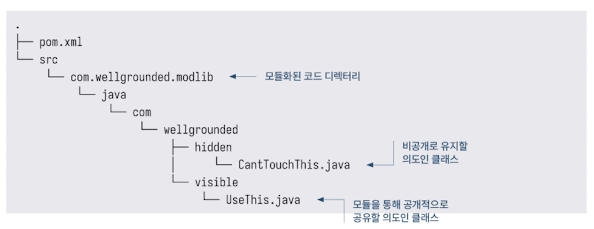

<!-- Date: 2025-01-26 -->
<!-- Update Date: 2025-01-27 -->
<!-- File ID: f6ed42cc-40eb-447f-bba0-d9f38db4ebee -->
<!-- Author: Seoyeon Jang -->

# 개요

JDK의 새로운 모듈 시스템에 대해 알고 있다. 이제 **빌드 스크립팅에 어떤 영향을 미치는지** 살펴보자.

패키지 중 하나를 공개적으로 노출하고 다른 패키지는 숨기는 간단한 라이브러리를 살펴보겠다.

## 모듈형 라이브러리

모듈형 프로젝트는 코드 레이아웃이 엄격한 메이븐 표준과 약간 다른데, `main` 디렉터리가 다음과 같이 모듈의 이름을 반영한다.


이렇게 변경하면 메이븐에게 소스코드를 컴파일 할 새로운 위치를 다음과 같이 알려줘야 한다.

```xml
<build>
    <sourceDirectory>src/com.wellgrounded.modlib/java</sourceDirectory>
</build>
```

라이브러리를 모듈화하는 마지막 단계는 코드 루트(com 디렉터리와 같은 레벨)에 module-info.java 를 추가하는 것이다. 다음과 같이 모듈의 이름을 지정하고, 어느 것의 접근을 허용할지 선언한다.
```java
module com.wellgrounded.modlib {
    exports com.wellgrounded.modlib.visible;
}
```

이 간단한 라이브러리의 나머지 부분은 모두 동일하며, `$mvn package`를 실행하면 target 디렉터리에 JAR 파일이 생성된다. `$mvn install`을 통해 이 라이브러리를 로컬 메이븐 캐시에 넣을 수도 있다.

>NOTE: JDK의 모듈 시스템은 패키징이 아닌 빌드 및 런타임 시 접근제어에 관한 것이다. 모듈형 라이브러리는 모듈형 애플리케이션에 상호작용하는 방법을 알려주는 module-info.class 만 추가하면 일반 JAR 파일로 공유할 수 있다.

이제 모듈화된 라이브러리가 준비되었으니, 이를 사용하는 모듈화된 애플리케이션을 만들어보자.

## 모듈화된 애플리케이션

**module-info.java**
```java
module com.seoyeon.modapp {
    requires com.seoyeon.modlib;
}
```

**pom.xml**
```xml
<project>
    <modelVersion>4.0.0</modelVersion>
    <groupId>com.seoyeon</groupId>
    <artifactId>modapp</artifactId>
    <version>2.0</version>
    <name>mod-app</name>

    <properties>
        <project.build.sourceEncoding>UTF-8</project.build.sourceEncoding>
        <maven.compiler.source>11</maven.compiler.source>
        <maven.compiler.target>11</maven.compiler.target>
    </properties>

    <build>
        <sourceDirectory>src/com.seoyeon.modapp/java</sourceDirectory>
        <plugins>
            <plugin>
                <groupId>org.apache.maven.plugins</groupId>
                <artifactId>maven-compiler-plugin</artifactId>
                <version>3.8.1</version>
                <executions>
                    <execution>
                        <goals>
                            <goal>compile</goal>
                        </goals>
                        <id>compile</id>
                    </execution>
                </executions>
            </plugin>
            <plugin>
                <groupId>org.apache.maven.plugins</groupId>
                <artifactId>maven-jar-plugin</artifactId>
                <version>2.4</version>
                <configuration>
                    <archive>
                        <manifest>
                            <addClasspath>true</addClasspath>
                            <mainClass>com.seoyeon.Main</mainClass>
                        </manifest>
                    </archive>
                </configuration>
            </plugin>
            <plugin>
                <groupId>com.seoyeon</groupId>
                <artifactId>wellgrounded-maven-plugin</artifactId>
                <version>1.0-SNAPSHOT</version>
                <executions>
                    <execution>
                        <!--   goal을 컴파일 단계에 바인딩한다    -->
                        <phase>compile</phase>
                        <goals>
                            <goal>wellgrounded</goal>
                        </goals>
                    </execution>
                </executions>
            </plugin>
        </plugins>
    </build>

    <dependencies>
        <dependency>
            <groupId>com.seoyeon</groupId>
            <artifactId>modlib</artifactId>
            <version>2.0.0</version>
        </dependency>
    </dependencies>
</project>
```

# 정리


