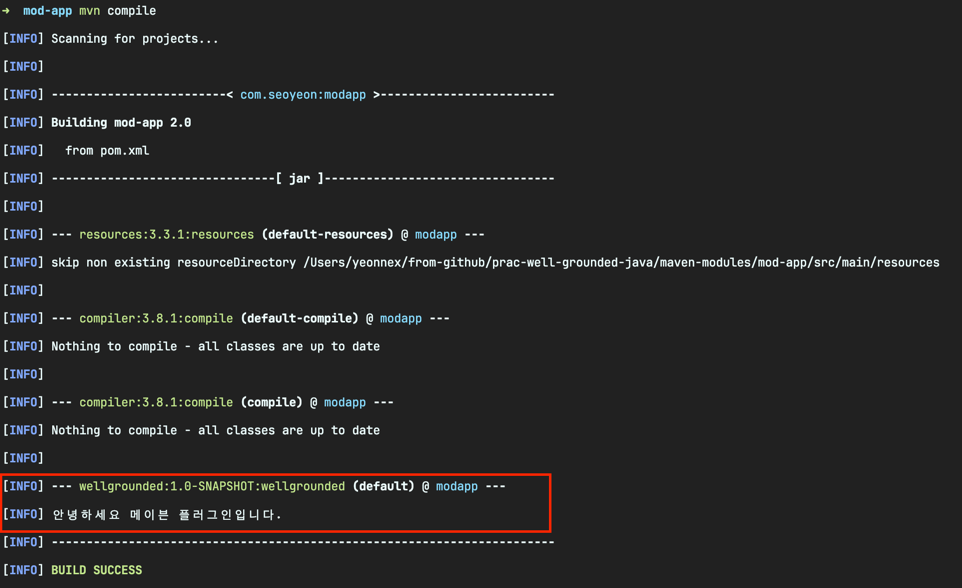
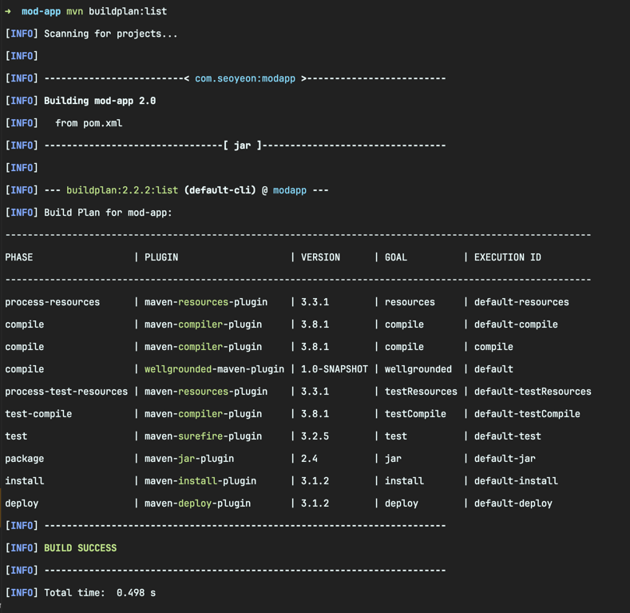

<!-- Date: 2025-01-26 -->
<!-- Update Date: 2025-01-26 -->
<!-- File ID: 686510a5-724e-4e29-a2f2-e28eaaf111b0 -->
<!-- Author: Seoyeon Jang -->

# 개요

메이븐의 가장 기본적인 설정도 플러그인으로 제공되기 때문에, 더 많은 작업을 해야할 때 플러그인을 작성하지 말아야할 이유는 없다. 해야할 작업이 더 많아질 때도 마찬가지다. 플러그인을 참조하는 것은 종속된
라이브러리를 가져오는 것과 유사하다. 따라서 메이븐 플러그인을 별도의 JAR 파일로 구현하는 것은 놀라운 일이 아니다.

pom.xml 파일부터 시작한다. 대부분의 뼈대는 유사하지만, 몇가지 추가 사항이 있다.

```xml

<project>
    <modelVersion>4.0.0</modelVersion>
    <groupId>com.seoyeon</groupId>
    <artifactId>wellgrounded-maven-plugin</artifactId>
    <version>1.0-SNAPSHOT</version>
    <!--  플러그인 패키지를 빌드하라는 의도를 메이븐에 알린다.  -->
    <packaging>maven-plugin</packaging>
    <name>A Well-Grounded Maven Plugin</name>
    <properties>
        <project.build.sourceEncoding>UTF-8</project.build.sourceEncoding>
        <maven.compiler.source>11</maven.compiler.source>
        <maven.compiler.target>11</maven.compiler.target>
    </properties>
    <!--  구현에 필요한 메이븐 API 의존성  -->
    <dependencies>
        <dependency>
            <groupId>org.apache.maven</groupId>
            <artifactId>maven-plugin-api</artifactId>
            <version>3.0</version>
        </dependency>
        <dependency>
            <groupId>org.apache.maven.plugin-tools</groupId>
            <artifactId>maven-plugin-annotations</artifactId>
            <version>3.4</version>
            <scope>provided</scope>
        </dependency>
    </dependencies>
</project>
```

이제 코드를 추가할 준비가 됐다. 표준 레이아웃 위치에 자바 파일을 배치하고, 다음과 같이 `Mojo`라고 하는 것을 구현한다.(사실상 메이븐 목표)

```java
package com.seoyeon;

import org.apache.maven.plugin.AbstractMojo;
import org.apache.maven.plugin.MojoExecutionException;
import org.apache.maven.plugin.MojoFailureException;
import org.apache.maven.plugins.annotations.Mojo;

@Mojo(name = "wellgrounded")
public class WellGroundedMojo extends AbstractMojo {

    @Override
    public void execute() throws MojoExecutionException, MojoFailureException {
        getLog().info("안녕하세요 메이븐 플러그인입니다.");
    }
}
```

클래스는 AbstractMojo 를 확장하며 @Mojo 어노테이션을 통해 메이븐에게 goal의 이름을 알려준다. 메서드의 본문에서 우리가 원하는 작업을 처리한다. 여기서는 간단히 텍스트를 로그로 출력하는 것이지만,
이제 자바 언어와 외부 라이브러리를 사용해서 목표를 구현할 수 있게 됐다.

다른 프로젝트에서 플러그인을 테스트하려면 `$mvn install`을 실행해서 로컬 캐시 저장소에 JAR을 배치해야 한다. 로컬 캐시 저장소에 저장되면 다음과 같이 플러그인을 다른 프로젝트에서 사용할 수 있다.

```xml

<build>
    <plugins>
        <plugin>
            <groupId>com.seoyeon</groupId>
            <artifactId>wellgrounded-java-plugin</artifactId>
            <version>1.0-SNAPSHOT</version>
            <executions>
                <execution>
                    <!--   goal을 컴파일 단계에 바인딩한다    -->
                    <phase>compile</phase>
                    <goals>
                        <goal>wellgrounded</goal>
                    </goals>
                </execution>
            </executions>
        </plugin>
    </plugins>
</build>
```

이렇게 하면 컴파일할 때 플러그인이 작동하는 것을 볼 수 있다.


단순히 <executions> 요소 없이 플러그인을 포함하면 프로젝트의 어디에도 플러그인이 동작하지 않는다. 사용자 정의 플러그인은 pom.xml 파일을 통해 생명주기에서 원하는 단계를 선언해야 한다.

생명주기와 어떤 goal이 어떤 단계에 바인딩되는지 파악하는 것은 어렵다. 다행히 이를 도와주는 플러그인이 있다. `buildplan-maven-plugin`은 현재 작업에 대한 명확한 정보를 제공한다.

이 플러그인은 다른 플러그인처럼 pom.xml에 포함할 수 있지만, 반복을 피하는 유용한 대안은 다음과 같이 사용자의 ~/.m2/settings.xml 파일에 넣는 것이다. settings.xml 파일은 메이븐에서
pom.xml 파일과 유사하지만 특정 프로젝트에 연결되지 않는다.

```xml

<pluginGroups>
    <pluginGroup>fr.jcgay.maven.plugins</pluginGroup>
</pluginGroups>
```

이렇게 설정이 완료되면 메이븐을 사용하는 모든 프로젝트 빌드에서 호출할 수 있다.

```shell
$ mvn buildplan:list
```



메이븐은 여전히 가장 일반적인 자바 빌드도구이다. 하지만 모든 사람이 이 도구의 독자적인 성향을 좋아하는 것은 아니다. 그래들은 가장 널리 사용되는 대안이므로 동일한 문제를 어떻게 처리하는지 살펴보자.

# 정리


