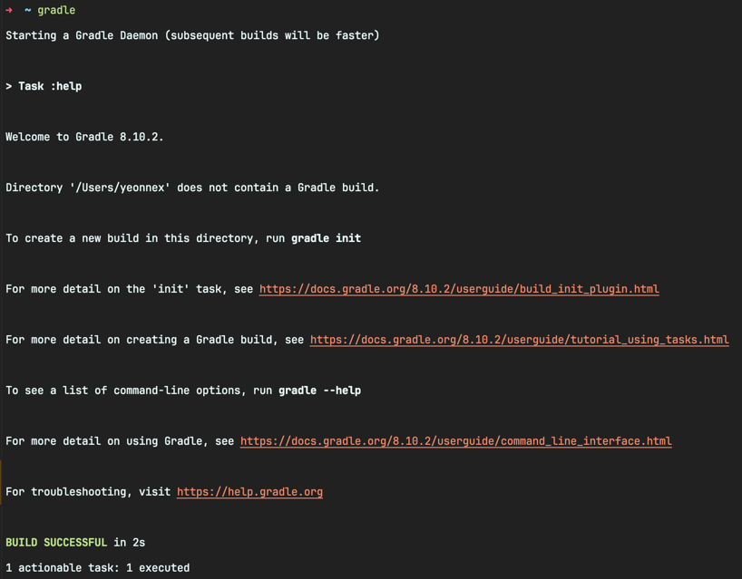

<!-- Date: 2025-01-27 -->
<!-- Update Date: 2025-01-27 -->
<!-- File ID: 0ad20bd8-6955-4d06-babd-c41cbcfa49a3 -->
<!-- Author: Seoyeon Jang -->

# 개요

그래들 설치는 해당 웹사이트([https://gradle.org/install](https://gradle.org/install))를 참조하자. JVM 버전 8 이상이 요구된다. Gradle은 JVM 위에서 실행되기 때문이다. 설치가 완료되면
`$ gradle` 명령줄로 실행할 수 있으며, 다음과 같이 기본적으로 도움말을 표시한다.

이렇게 하면 쉽게 시작할 수 있지만 단일 글로벌 그래들 버전을 사용하는 것은 이상적이지 않다. `개발자가 여러 개의 서로 다른 프로젝트를 빌드하는 경우`에는 **각각 다른 버전의 그래들을 사용하는 것이 일반적**이다.

이를 처리하기 위해 그래들은 **래퍼(wrapper)** 라는 개념을 도입했다. `gradle wrapper` 작업은 특정 버전의 그래들을 프로젝트의 로컬로 캡쳐한다. 그다음 `$ ./gradlew` 또는 `$ ./gradlew.bat` 명령을 통해 액세스한다. 버전 비호환성을 피하기 위해 `gradlew` 래퍼를 사용하는 것이 좋은 습관으로 간주되므로, 실제로 `gradle` 자체를 직접 실행하는 경우는 거의 없을 수도 있다.

>NOTE: 래퍼의 gradle 및 gradlew* 결과를 소스컨트롤에 포함시키는 것이 좋지만 `.gradle`의 로컬 캐싱은 제외하는 것이 좋다.

래퍼를 커밋하면 프로젝트를 다운로드하는 모든 사람이 추가적인 설치 없이 적절한 버전의 빌드 도구를 사용할 수 있다.

# 정리

