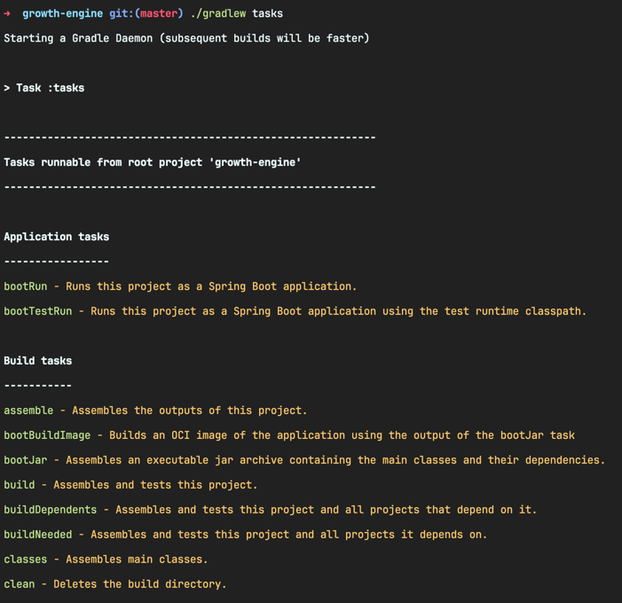

<!-- Date: 2025-01-27 -->
<!-- Update Date: 2025-01-27 -->
<!-- File ID: 596f9327-ee9b-483b-84dd-9ed44f71efa4 -->
<!-- Author: Seoyeon Jang -->

# 개요

그래들의 주요 개념은 태스크다. 태스크는 호출할 수 있는 작업의 조각을 정의하며, 다른 태스크에 의존할 수 있다. 또 스크립팅을 통해 구성되며, 그래들의 플러그인 시스템을 통해 추가할 수 있다. 이들은 메이븐의
목표(goal)와 유사하지만 개념적으로 함수와 더 비슷하다. 그들은 명확하게 정의된 입력과 출력을 갖고 있으며, 조합하고 연결할 수 있다. 반면에 메이븐의 목표는 빌드 생명주기의 특정 단계와 연관돼야 하지만, 그래들
작업은 편리한 방식으로 호출하고 사용할 수 있따.

그래들은 우수한 내장 검사(introspection) 기능을 제공한다. 이 중 주요한 것은 `$ ./gradlew tasks` 메타-태스크(meta-task)로, 현재 프로젝트에서 사용 가능한 태스크 목록을
나열한다.



어떤 태스크에 `--dry-run` 플래그를 제공하면 해당 태스크가 수행되지 않고 그래들이 실행했을 때 태스크들을 보여준다. 이것은 빌드 시스템의 흐름을 이해하거나 잘 작동하지 않는 플러그인이나 사용자 정의 태스크를
디버깅하는 데 유용하다.

### 예제 시나리오 1: 빌드 흐름 확인

#### 상황

Gradle 프로젝트에서 `build` 태스크를 실행했을 때, 어떤 태스크들이 순차적으로 실행되는지 알고 싶다고 가정한다.

#### 실행 명령어

```shell
$ gradle build --dry-run
```

#### 출력결과

```text
> Task :clean SKIPPED
> Task :compileJava SKIPPED
> Task :processResources SKIPPED
> Task :classes SKIPPED
> Task :jar SKIPPED
> Task :assemble SKIPPED
> Task :compileTestJava SKIPPED
> Task :processTestResources SKIPPED
> Task :testClasses SKIPPED
> Task :test SKIPPED
> Task :check SKIPPED
> Task :build SKIPPED
```

#### 해석

Gradle 은 `build` 태스크를 실행하기 위해 위으 태스크들을 순서대로 실행해야 한다는 것을 보여준다. `--dry-run` 플래그 때문에 실제 실행은 하지 않고, 실행 순서만 표시된다.

### 예제 시나리오 2: 사용자 정의 태스크 디버깅

#### 상황

다음의 build.gradle 파일이 있고, `customTask`라는 사용자 정의 태스크를 실행했을 때 어떤 흐름이 발생하는지 알고 싶다.

```groovy
tasks.register('customTask') {
    dependsOn 'clean', 'build'
    doLast {
        printlin "Running customTask!"
    }
}
```

#### 실행 명령어

```shell
$ gradle customTask --dry-run
```

#### 출력 결과

```text
> Task :clean SKIPPED
> Task :compileJava SKIPPED
> Task :processResources SKIPPED
> Task :classes SKIPPED
> Task :jar SKIPPED
> Task :assemble SKIPPED
> Task :compileTestJava SKIPPED
> Task :processTestResources SKIPPED
> Task :testClasses SKIPPED
> Task :test SKIPPED
> Task :check SKIPPED
> Task :build SKIPPED
> Task :customTask SKIPPED
```

`customTask` 태스크가 실행되기 전에 `clean`과 `build` 태스크가 실행될 것임을 알 수 있다. 실제 실행 없이 종속 관계만 확인했으니, 의존성 문제를 미리 파악할 수 있다.

### 예제 시나리오 3: 플러그인으로 추가된 태스크 디버깅

#### 상황

Spring Boot 플러그인을 사용하는 프로젝트에서 `bootRun` 태스크를 실행할 때, 어떤 작업들이 진행되는지 알고 싶다

#### 실행명령어

```shell
$ gradle bootRun --dry-run
```

#### 출력 결과

```text
> Task :clean SKIPPED
> Task :compileJava SKIPPED
> Task :processResources SKIPPED
> Task :classes SKIPPED
> Task :bootRun SKIPPED
```

#### 해석

`bootRun` 태스크 실행 전에 Gradle이 어떤 태스크를 실행하려고 하는지 파악할 수 있다. 이를 통해 실행 흐름을 이해할 수가 있는 것이다.

### `--dry-run` 이 유용한 경우

1. 의존성확인: 특정 태스크 실행 전에 어떤 작업들이 미리 실행되는지 파악.
2. 최적화: 필요 없는 태스크가 실행되고 있는지 확인하고 Gradle 설정 조정.
3. CI/CD 준비: 빌드 환경에서 실행될 태스크 흐름을 미리 점검.

--dry-run 플래그는 Gradle의 실행 흐름을 시뮬레이션해서, 빌드 프로세스를 이해하거나 문제를 디버깅하는 데 아주 효과적인 도구이다.

# 정리


