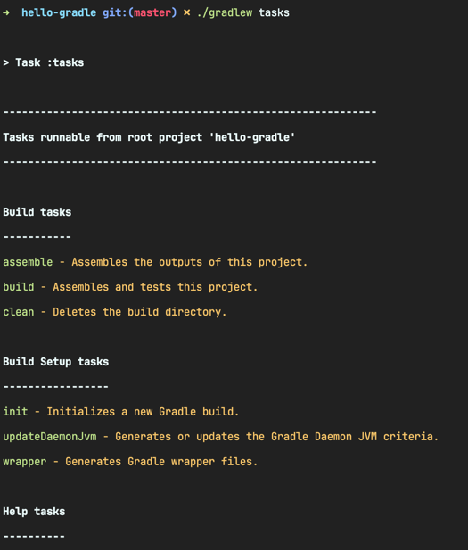
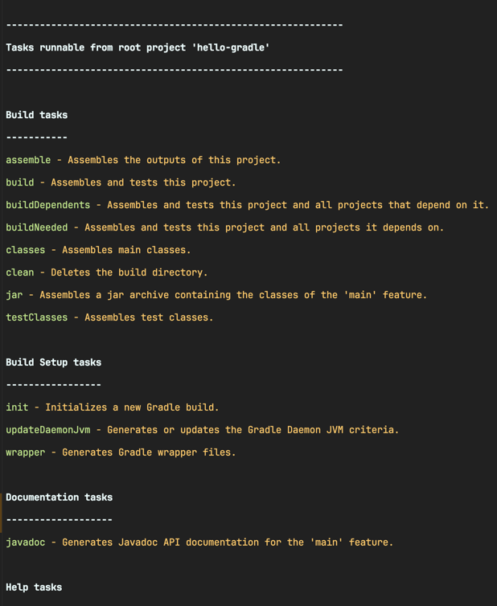

<!-- Date: 2025-01-27 -->
<!-- Update Date: 2025-01-27 -->
<!-- File ID: 728ca52e-507f-4444-8034-7370ec881d83 -->
<!-- Author: Seoyeon Jang -->

# 개요
그래들은 작업과 관련된 모든 내용을 정의하기 위해 플러그인을 사용한다. 이전에 살펴보았듯이, 빈 그래들 프로젝트에서 태스크를 나열하는 것만으로는 빌드, 테스트, 배포에 관한 내용이 전혀 드러나지 않는다. 이 모든 것은 **플러그인에서 제공된다.**

그래들 자체에는 다양한 플러그인이 함께 제공되므로 이를 사용하려면 `build.gradle.kts` 파일에 선언만 하면 된다. 그 중 하나가 `base` 플러그인인데, 다음과 같이 선언할 수 있다.

```groovy
plugins {
    base
}
```

`base` 플러그인을 포함한 후에는 일부 예상할 수 있는 일반적인 빌드 생명주기 태스크가 나타난ㄷ. 이를 포함한 태스크 목록은 다음과 같다.
```shell
$ gradlew tasks
```


`java` 플러그인은 다음과 같은 태스크를 진행한다.

```groovy
plugins {
    id("java")
}
```
```shell
$ gradlew tasks
```


다음으로는 그래들 프로젝트를 빌드해보자.

# 정리


