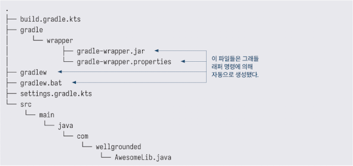
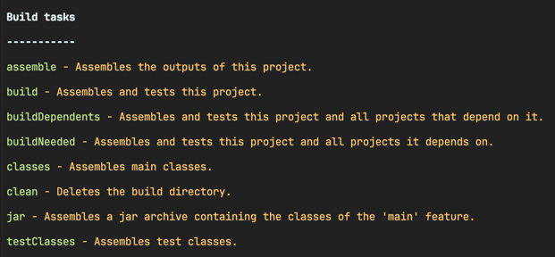
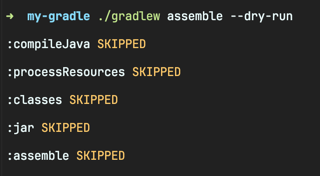

<!-- Date: 2025-01-27 -->
<!-- Update Date: 2025-01-27 -->
<!-- File ID: 84e0d3f6-bdd3-46e8-a09d-666ded15bfc8 -->
<!-- Author: Seoyeon Jang -->

# 개요

그래들은 사용자정의가 가능하지만, 기본적으로는 메이븐이 설정하고 보급한 것과 동일한 코드 레이아웃을 기대한다. 많은 프로젝트(아마도 대부분)에서는 이 레이아웃을 변경하는 것이 의미가 없을 수 있다.(그러나
변경가능하다.)

기본적인 자바 라이브러리로 시작해보자. 이를 위해 다음과 같은 소스 트리를 생성한다.



`base` 플러그인은 자바에 대해 아무것도 모르기 때문에, 더 많은 기능을 가진 플러그인이 필요하다. 일반 자바 JAR를 위한 경우, 다음과 같이 그래들의 `java-library` 플러그인을 사용할 것이다.

```groovy
plugins {
    ` java - library `
}
```

이 플러그인은 `base` 에서 필요한 모든 부분을 기반으로 구축한다. 실제로 그래들 빌드에서 `base` 플러그인만 볼 일은 거의 없다. 플러그인은 객체지향 프로그래밍의 컴포지션처럼 다른 플러그인을 사용해서 빌드할
수 있기 때문이다.

플러그인 이름에 특수문자(위에서는 `-`)가 포함될 때는 백틱으로 감싼다.

이렇게 하면 빌드 섹션에서 더 많은 작업이 생성된다.


그래들의 용어에서 `assemble` 은 JAR 파일을 컴파일하고 패키징하는 작업이다. 프리뷰(dry-run)에는 기본 작업 목록에 표시되지 않는 일부 단계를 포함한 모든 단계가 표시된다.



`$ ./gradlew assemble` 을 실행하면 다음과 같이 build 디렉토리에 출력이 생성된다.

## 1. 애플리케이션 만들기

일반 JAR로 시작하는 것도 좋지만, 결국에는 애플리케이션을 실행하고 싶을 것이다. 여기에는 더 많은 구성이 필요하지만, 기본적으로 필요한 부분들이 이미 제공되고 있다.

플러그인을 변경하고 애플리케이션의 메인 클래스가 무엇인지 그래들에 알려주겠다. 또한 이 간단한 코드 조각에서 코틀린이 제공하는 몇가지 좋은 기능을 확인할 수 있다.

```text
// 마지막 인수가 람다인 경우, 코틀린에서 괄호를 생략할 수 있다.
plugins {
    application // 자바 앱을 컴파일하고 실행하는 방법을 아는 플러그인
}

application {
    mainClass.set("com.seoyeon.Main")
}

// 수정된 매니페스트가 있는 JAR를 패키징하는 작업
tasks.jar {
    manifest {
        attributes("Main-Class" to application.mainClass) // 코틀린은 해시맵을 선언하기 위해 이 구문(해시 리터럴이라고도 함)을 사용한다.
    }
}
```

이제 그래들이 작업을 최적화하고 빌드 시간을 줄이는 방법을 살펴보자.

# 정리


