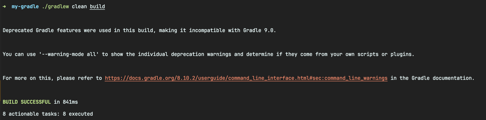
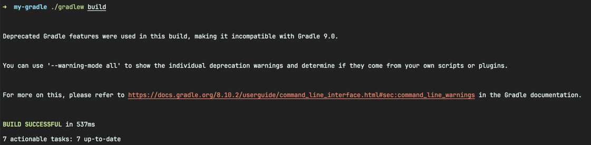

<!-- Date: 2025-01-28 -->
<!-- Update Date: 2025-01-28 -->
<!-- File ID: bee69853-b88a-43d0-9fc4-cfe8ae9cc00f -->
<!-- Author: Seoyeon Jang -->

# 개요

빌드를 가능한 빠르게 실행하기 위해 그래들은 불필요한 작업의 반복을 피하려고 노력한다. 이를 위한 전략 중 하나는 **증분 빌드(incremental build)** 다. 그래들의 모든 작업은 입력과 출력을
선언한다. 그래들은 이 정보를 사용해서 빌드가 마지막으로 실행된 이후에 변경 사항이 있는지 확인한다. 변경 사항이 없으면 그래들은 작업을 건너뛰고 이전 빌드에서 출력을 재사용한다.

> NOTE: 그래들은 빌드 결과를 생성하는 데 필요한 작업만 수행하므로 정기적으로 `clean`을 실행해서는 안된다.

애플리케이션 빌드에서 한 번의 전체 실행(강제 `clean`)과 두번째 실행의 빌드 시간을 살펴보면 이를 확인할 수 있다.





이 기능은 프로젝트에서 `--build-cache` 명령줄 플래그가 있는 속성을 통해 활성화할 수 있다. 다음 `clean` 빌드에서도 이전 실행에서 캐시된 출력을 재사용할 수 잇으므로 속도가 빨라지는 것을 확인할 수 있다.

```shell
$ ./gradlew clean build --build-cache
```

성능은 코드의 크기가 커져도 프로젝트 빌드 시간을 단축하는 그래들의 핵심 기능이다. 증분 자바 컴파일, 그래들 데몬, 병렬 작업, 테스트 실행과 같은 기능도 있다. 자세한 사항은 공식문서를 참고하자.

# 정리


