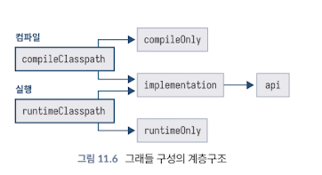
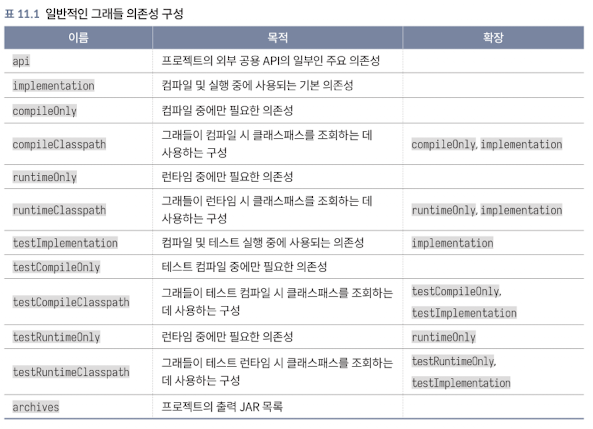

<!-- Date: 2025-01-28 -->
<!-- Update Date: 2025-01-28 -->
<!-- File ID: e3bc49a2-d96d-44b3-a0b3-5c0f5680b494 -->
<!-- Author: Seoyeon Jang -->

# 개요

의존성 도입을 시작하려면 먼저 그래들이 다운로드할 수 있는 **저장소**를 알려줘야 한다. 기본 제공 함수로 **`mavenCentral`** 과 **`google`** 이 있다. 저장소를 구성할 때 사용할 수 있는
더 구체적인 함수들을 사용해서 프라이빗 인스턴스를 포함한 다른 저장소를 구성할 수도 있다.

```text
repositories {
    mavenCentral()
}
```

그다음 메이븐에서 널리 사용되는 **표준 좌표 형식**으로 의존성을 도입할 수 있다. 메이븐에서 특정 의존성이 사용되는 위치를 제어하기 위해 `<scope>` 요소가 있었던 것처럼, 그래들은 이를 **의존성 구성**
을 통해 표현한다. 예를 들어 로깅을 돕기 위해 SLF4J 라이브러리를 사용하려면 다음과 같은 구성을 사용할 수 있다.

```text
dependencies {
    implementation("org.slf4j:slf4j-api:1.7.30")
    runtimeOnly("org.slf4j:slf4j-simple:1.7.30")
}
```

이 예에서는 코드에서 `slf4j-api`의 클래스와 메서드를 직접 호출하므로 implementation 구성을 통해 포함시킨다. 이로써 응용 프로그램을 컴파일하고 실행하는 동안 사용할 수 있다. 그러나
`slf4j-simple`의 메서드를 직접 호출해서는 안된다. 이는 엄격하게 `slf4j-api`를 통해서만 수행돼야 한다. 따라서 runtimeOnly 를 통해 `slf4j-simple` 을 요청하면 컴파일 중에
코드를 사용할 수 없도록하여 라이브러리를 오용하는 것을 방지한다. 이로써 메이븐의 의존성과 `<scope>` 요소의 목적을 달성한다.

### 1. `implementation` 구성

- 이 구성은 **컴파일 시 필요한 라이브러리**를 정의한다
- 코드에서 직접 해당 라이브러리의 클래스나 메서드를 호출할 수 있다
- 예: `slf4j-api`는 응용 프로그램에 로깅 인터페이스를 제공하므로 `implementation`에 포함된다

### 2. `runtimeOnly` 구성

- 이 구성은 **실행시에 필요한 라이브러리**를 정의한다
- 컴파일 단계에서는 이 라이브러리를 사용할 수 없으며, 오직 실행 중에만 포함된다
- 예: `slf4j-simple`은 `slf4j-api`의 구현체로, 실행 시에만 필요하다. 이로써 `slf4j-api`를 통해서만 접근하도록 강제한다

### 3. 의도

- **라이브러리의 역할과 사용 범위 분리**: 어떤 라이브러리는 컴파일에만 필요하고, 다른 라이브러리는 실행중에만 필요하다.
- **프로젝트 크기와 의존성 관리 최적화**: 실행시에만 필요한 라이브러리를 컴파일에 포함시키지 않으면 빌드 속도를 높이고 코드 의존성이 줄어든다.

### 예시

1. 로깅 라이브러리 사용
    - `slf4j-api`는 로깅 인터페이스를 제공하며, 애플리케이션에서 로깅을 위해 사용됨. 코드에서 직접 호출하므로 `implementation`으로 정의
    - `slf4j-simple`은 `slf4j-api`의 구현체로, 로깅을 실제로 처리. 하지만 애플리케이션 코드에서 직접 호출하지 않으므로 `runtimeOnly`로 정의하여 실행중에만 포함

2. JDBC 드라이버
    - 데이터베이스 연결을 위한 `javax.sql` 같은 API는 코드에서 직접 사용하므로 `implementation`으로 포함
    - 하지만 특정 데이터베이스 드라이버(예: MYSQL의 `my-sql-connector-java`는 실행중 데이터베이스 연결에만 필요하므로 `runtimeOnly` 로 정의)
   ```text
    dependencies {
        implementation("javax.sql:javax.sql-api:1.0")
        runtimeOnly("mysql:mysql-connector-java:8.0.29")
    }
    ```

그런데 이러한 방법만이 의존성 간의 차이를 구분하는 **유일한 방법은 아니다.** 특히 라이브러리 개발자를 대상으로 한 의존성 구분에 대해 생각해보자. 의존성이 프로젝트 내부에서만 사용되는지 아니면 외부로
노출되는지에 대해서 말이다.

이에 대해서는 `그래들의_의존성_내부와_외부.md` 메모를 보자.

구성은 서로 확장될 수 있는데, 마치 기본 클래스에서 파생되는 것과 같다. 그래들은 많은 영역에서 이 기능을 적용한다.

그래들은 클래스패스를 생성할 때 `implementation`, `compileOnly`, `runtimeOnly` 등의 구성을 활용하여 `compileClasspath`와 `runtimeClasspath`를
만든다.



다음 표는 그래들과 함께 제공되는 자바 플러그인을 사용할 때 사용할 수 있는 몇가지 기본 구성과 각 구성이 어떤 다른 구성에서 확장되는지 표시한다. 전체 목록은 그래들의 자바 플러그인
설명서([https://docs.gradle.org/current/userguide/java_plugin.html#tab:configurations](https://docs.gradle.org/current/userguide/java_plugin.html#tab:configurations))
에서 확인할 수 있다.




# 정리


