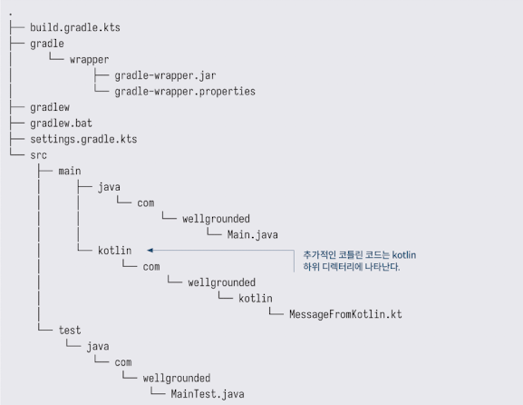

<!-- Date: 2025-01-28 -->
<!-- Update Date: 2025-01-28 -->
<!-- File ID: a348d523-17fe-4de7-9c1c-c0226278ed62 -->
<!-- Author: Seoyeon Jang -->

# 개요

다른 언어를 프로젝트에 추가하는 능력은 JVM상에서 실행하는 언어들의 큰 장점이다.

코틀린을 추가함으로써 그래들의 스크립트 기반 접근법이 메이븐의 정적인 XML 기반 구성보다 어떤 이점을 가지는지 살펴보자.



build.gradle.kts 파일에서 다음과 같이 그래들 플러그인을 통해 코틀린 지원을 활성화환다.

```groovy
plugins {
    application
    id("org.jetbrains.kotlin.jvm") version "1.6.10"
}
```

이게 전부다. 그래들의 유연성 덕분에 플러그인은 추가적인 단계를 수행하지 않고도 빌드 순서를 변경하고 필요한 `kotlin-stdlib`의존성을 추가할 수 있다.


# 정리


